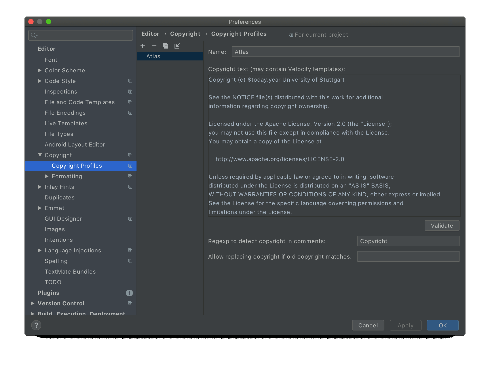

# IntelliJ Setup

1. At start of IntelliJ, browse to the root `pom.xml` and open it as project.
2. Enable checkstyle:
  - Install the [IntelliJ CheckStyle-IDEA Plugin](https://plugins.jetbrains.com/plugin/1065-checkstyle-idea). It can be found via plug-in repository  
  (File > Settings > Plugins > Marketplace; **Mac**: IntelliJ IDEA > Preferences > Plugins > Marketplace).  
    
    
  - Install the CheckStyle-IDEA Plugin, click "Apply" and restart the project upon request.
  - Repeat the previous steps for the Lombok Plugin
  - Open the Settings (by pressing <kbd>Ctrl</kbd> + <kbd>Alt</kbd> + <kbd>S</kbd>; **Mac**: <kbd>command</kbd> + <kbd>,</kbd>)
  - Go to "Other Settings > Checkstyle".
  - Click on "+" under Configuration File and add `checkstyle.xml`. It can be found [here](https://github.com/UST-QuAntiL/qc-atlas/blob/develop/docs/dev/config/IntelliJ%20IDEA/checkstyle.xml). Confirm.
  
    
    
  - Activate the settings and confirm:
  
      
   
3. Configure the code style (Source: <https://youtrack.jetbrains.com/issue/IDEA-61520#comment=27-1292600>)  
  - Open the Settings (by pressing <kbd>Ctrl</kbd> + <kbd>Alt</kbd> + <kbd>S</kbd>; **Mac**: <kbd>command</kbd> + <kbd>,</kbd>)  
  - Go to "Editor > Code Style"  
  - Click on the gear icon (right of "Scheme:")  
  - Click "Import Scheme"  
  - Choose "IntelliJ IDEA code style XML"
  - Navigate to `intellij-idea-code-style.xml`. It is located in [here](https://github.com/UST-QuAntiL/qc-atlas/blob/develop/docs/dev/config/IntelliJ%20IDEA/intellij-idea-code-style.xml).  
  - Click "Apply"
  - Click "OK"  
  - Click "Close"  
  
4. Setup code headers to be inserted automatically  
      
  - Open the Settings (by pressing <kbd>Ctrl</kbd> + <kbd>Alt</kbd> + <kbd>S</kbd>; **Mac**: <kbd>command</kbd> + <kbd>,</kbd>)  
  - Go to "Editor > Copyright > Copyright Profiles"  
  - Click the "+"  
  - Name "Atlas"  
  - Copyright text from [CodeHeaders](CodeHeaders.md)  
  - Click "Apply"
  - Go to "Editor > Copyright > Formatting"
  - Adjust copyright formatting settings
    
     
       - Change to `Use block comments` with `Prefix each line`
       - Set `Relative Location` to `Before other comments`
       - Set `Separator before`to `80` and `Separator after` to `81`
  - Go to "Editor > Copyright"
  - Set "Atlas" as Default project copyright
  - Click "Apply"
  
6. Configure Git to handle line endings
  - Insert the following commands in your console:  
  **For Windows**: `git config --global core.autocrlf true`  
  **For Mac/Linux**: `git config --global core.autocrlf input`

     
