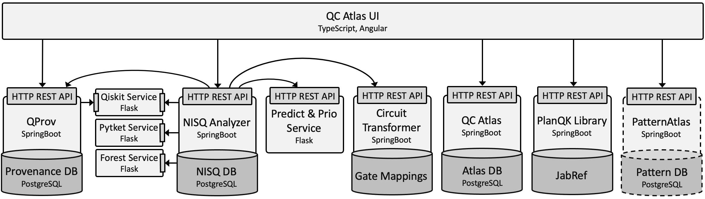

# Welcome to the QuAntiL Documentation!
{: style="height:100px" .center}

### Overview

[Quantum Application Lifecycle Management (QuAntiL)](https://github.com/UST-QuAntiL) offers tooling support for various aspects of the quantum application lifecycle, such as implementation, deployment, execution, and monitoring of quantum applications, see the [website](https://www.iaas.uni-stuttgart.de/forschung/projekte/quantil/). Currently QuAntiL provides tooling support in the following areas:

{: style="width:800px" .center}

The <strong>Information</strong> area contains tools that provide knowledge for quantum application developers about available technologies, patterns, and algorithms. The <strong>Application</strong> area contains tools and implementations of quantum algorithms to solve certain use cases.
In the <strong>Analysis & Execution</strong> area tools for translating circuits between different programming languages, selecting suitable quantum hardware, and for executing and deploying the quantum application are provided. In the last area, <strong>Provenance</strong>, a tool for collecting information about different quantum providers is listed. In the following the tools of each area are shortly introduced:

### Information

[QC Atlas](./user-guide/qc-atlas.md) is a platform for sharing quantum software and is part of the project [PlanQK](https://planqk.de/en/).
Thereby, it enables the collection of quantum algorithms and their specific properties, such as input and output parameters, their problem descriptions and solutions.
Further, available implementations, related other algorithms, patterns, and publications of them can be added and linked.
But also the execution part is considered.
QC Atlas enables collecting information about existing software platforms, cloud services, and their offered compute resources, such as quantum computers or quantum simulators.

[Pattern Atlas](https://pattern-atlas-readthedocs.readthedocs.io/en/latest/) is a pattern repository that provides tooling support for capturing best practices in the form of patterns for various domains.
It already contains several patterns for quantum algorithms and allows to include domain-specific aspects for quantum computing (quantum circuits, mathematical descriptions).

[Qverview](./user-guide/qverview.md) provides an overview of several technologies for quantum application development such as development kits, cloud services, programming languages, etc.
It enables to analyze and compare different technologies and identify their interoperability.

The [PlanQK Library](https://github.com/UST-QuAntiL/PlanQK-Library) is a simple REST API to use [JabRef](https://github.com/JabRef/jabref) as a service in order to manage bibTex entries and conduct systematic literature reviews.

### Application

[QHAna](./user-guide/qhana.md) - The **Q**uantum **H**umanities **Ana**lysis Tool is a toolset of Machine Learning techniques for classical and quantum hardware, designed for the use with the [MUSE Repository](https://www.iaas.uni-stuttgart.de/publications/INBOOK-2018-05-MUSE.pdf). It comprises a rich set of techniques, mostly for categorical data. The tools are split up into 4 different categories: **Data Preparation, Feature Engineering, Clustering,** and **Classification**. From each category various alternative methods can be selected to be used for the analysis.

!!! note
	QHAna is getting a new plugin based architecture.
	Individual algorithms will be available as microservices with their own API and can be used in workflows and by other projects.
	The user documentation for the new QHAna implementation will be updated soon.
	More information can be found [here](./user-guide/qhana-new.md).

### Analysis & Execution
The [Circuit Transformer](./user-guide/circuit-transformer.md) enables the translation of a given circuit into different languages.
Furthermore, it enables the modification of the given circuit by providing a simple modelling tool representing qubits and gates and supports the simulation of the resulting measurements.
The Circuit Transformer also supports the transpilation and export on general gate sets of Rigetti and IBMQ machines for different programming languages.
In addition, the depth, two-qubit gate depth, and the pulses depth is analyzed for the different gate sets.

The [NISQ Analyzer](./user-guide/nisq-analyzer.md) enables the selection of suitable implementations and quantum computers (QPUs) dependent on given input data and the selected quantum algorithm.
Therefore, Prolog rules are defined to determine which input data can be processed by a specific implementation and to determine which QPU can successfully execute suitable implementations.
Thereby, quantum compilers are used to determine the width and depth of a compiled circuit on a specific QPU.
These properties are, then, compared with the number of qubits and the estimated maximum depth of the QPU to determine the executability.
To gain up-to-date information about available QPUs, the provenance system [QProv](./user-guide/qprov.md) is accessed.
In addition, the NISQ Analyzer enables the comparison of the width and depth of compiled quantum circuits dependent on the selected quantum computer and the initially given quantum circuit.

The [Quantum Modeling Extension (QuantME)](./user-guide/quantme) is a technology-independent modeling extension for imperative workflow languages to model quantum computations in workflow models.
Thereby, it provides explicit modeling constructs for the execution of quantum circuits, as well as for different frequently occurring pre- and post-processing tasks, abstracting from the technical and mathematical details.
Thus, it eases the modeling of workflows executing quantum algorithms and increases the reusability of implementations for the various tasks.
To enable the practical application of QuantME, an extension of [BPMN 2.0](https://www.omg.org/spec/BPMN/2.0/PDF) that supports QuantME, called [Quantum4BPMN](https://github.com/UST-QuAntiL/QuantME-Quantum4BPMN) is available.
Furthermore, the [QuantME Transformation Framework](https://github.com/UST-QuAntiL/QuantME-TransformationFramework) supports the graphical modeling of Quantum4BPMN workflow models and their transformation to native workflow models to retain their portability.

The [OpenTOSCA Ecosystem](http://www.opentosca.org/) is an standard-based end-to-end toolchain for deploying and managing (cloud) applications. It is based on the OASIS Standard [TOSCA](https://www.oasis-open.org/committees/tc_home.php?wg_abbrev=tosca) and provides (i) the graphical modeling tool [Winery](https://winery.readthedocs.io/en/latest/) for specifying TOSCA-compliant deployment models, (ii) the provisioning engine [OpenTOSCA Container](https://opentosca.github.io/container/) that processes the deployment models, and (iii) the [self-service portal](https://github.com/OpenTOSCA/ui) for selecting and instantiating applications. The ecosystem can be used for modeling and deploying quantum applications on different quantum cloud providers.

### Provenance
[QProv](./user-guide/qprov.md) is a provenance system for quantum computing.
It periodically collects and analyzes important provenance attributes of accessible QPUs, such as the number of qubits, T1, T2, gate error rates, and current queue sizes.
Furthermore, it supports the calculation of calibration matrices of QPUs.
QProv builds the basis for, e.g., the NISQ Analyzer providing up-to-date information about accessible QPUs to support the selection of suitable QPUs.
It is, e.g., used by the [NISQ Analyzer](./user-guide/nisq-analyzer.md) for the selection of suitable quantum implementations and QPUs and for the comparison of available quantum compilers.

## Integrated components of QC Atlas and the QC Atlas UI
The following diagram illustrates the currently integrated components of the QC Atlas platform and its UI:

## Acknowledgements

Current development is supported by the [Federal Ministry for Economic Affairs and Energy] as part of the [PlanQK]
project (01MK20005N) and the DFG’s Excellence Initiative project [SimTech] (EXC 2075 - 390740016).

## Haftungsausschluss

Dies ist ein Forschungsprototyp.
Die Haftung für entgangenen Gewinn, Produktionsausfall, Betriebsunterbrechung, entgangene Nutzungen, Verlust von Daten
und Informationen, Finanzierungsaufwendungen sowie sonstige Vermögens- und Folgeschäden ist, außer in Fällen von grober
Fahrlässigkeit, Vorsatz und Personenschäden, ausgeschlossen.

## Disclaimer of Warranty

Unless required by applicable law or agreed to in writing, Licensor provides the Work (and each Contributor provides its
Contributions) on an "AS IS" BASIS, WITHOUT WARRANTIES OR CONDITIONS OF ANY KIND, either express or implied, including,
without limitation, any warranties or conditions of TITLE, NON-INFRINGEMENT, MERCHANTABILITY, or FITNESS FOR A PARTICULAR PURPOSE.
You are solely responsible for determining the appropriateness of using or redistributing the Work and assume any risks
associated with Your exercise of permissions under this License.

  [Federal Ministry for Economic Affairs and Energy]: http://www.bmwi.de/EN
  [PlanQK]: https://planqk.de
  [SimTech]: https://www.simtech.uni-stuttgart.de/
