#
## Create Algorithm

To create an algorithm the user has to navigate to the ``Algorithm List View`` by using the navigation sidebar.
This view displays all available algorithms in a table. Creating a new algorithm is done via the ``Plus Button`` which is located above the table.

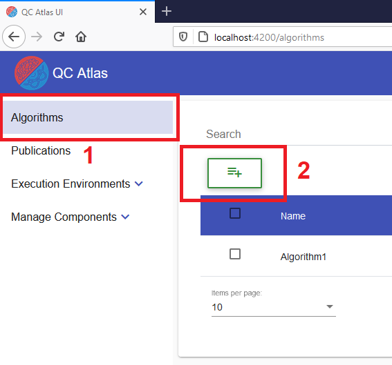

Clicking on the ``Plus Button`` will open the following ``Creation Dialog``, where the user has to type in all required information for creating a new algorithm.

!!! note 
    Depending on the selected ``Computational Model``, a third input field might show up, allowing the user to define the ``Quantum Computation Model``.

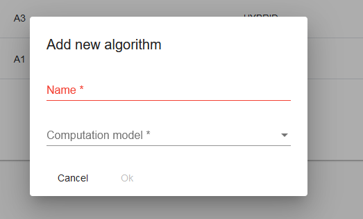

After entering all required information, the user has to confirm the creation of the algorithm by clicking on the ``OK Button``.

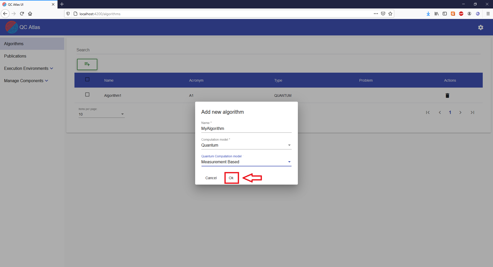

If the creation of the algorithm was successful, the user will be redirected to the detailed ``Algorithm view`` of the new algorithm.

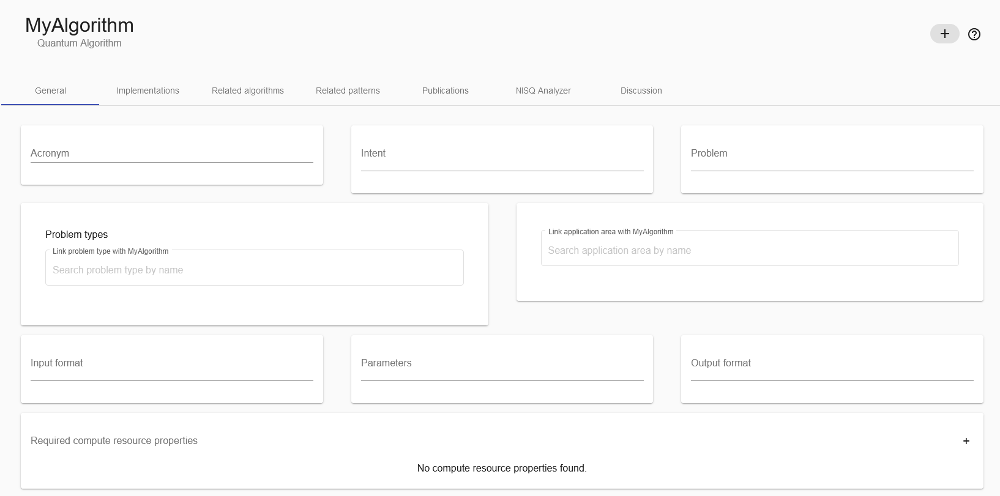

## Delete Algorithm

!!! info 
    To perform the deletion of an algorithm, the user has to be in the ``Algorithm List View``.

To remove a specific algorithm, the user has to simply click on the ``Delete Button`` in the ``Actions Column`` of the data table.

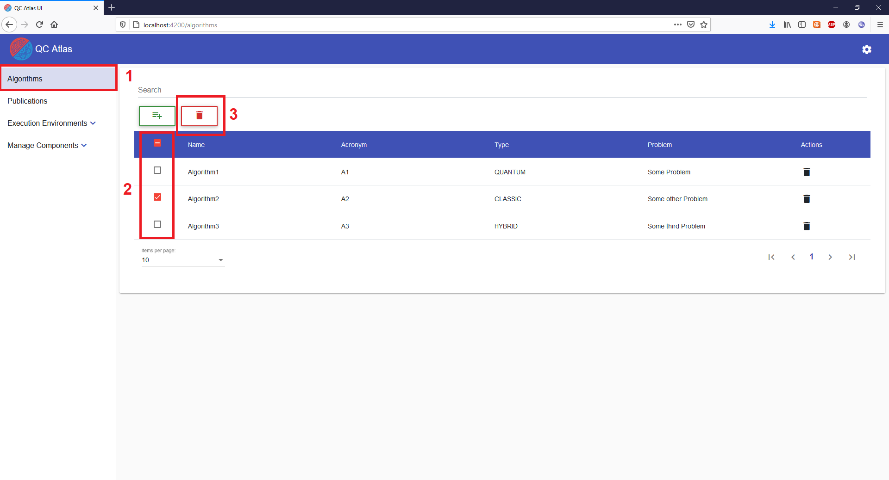

The user can also remove multiple algorithms at once by selecting them using the check-boxes of the data table. After the user has made his selection he can press the ``Master Delete Button`` at the top of the data table.

!!! note 
    The delete button will only appear after at least one algorithm has been selected by the user.


To confirm the deletion of the selected algorithm(s), the user has to click on the ``YES Button`` of the ``Confirmation Dialog``.

!!! note 
    **Names** of algorithms that will be deleted are displayed in the body of the dialog and should be checked before confirming the deletion.

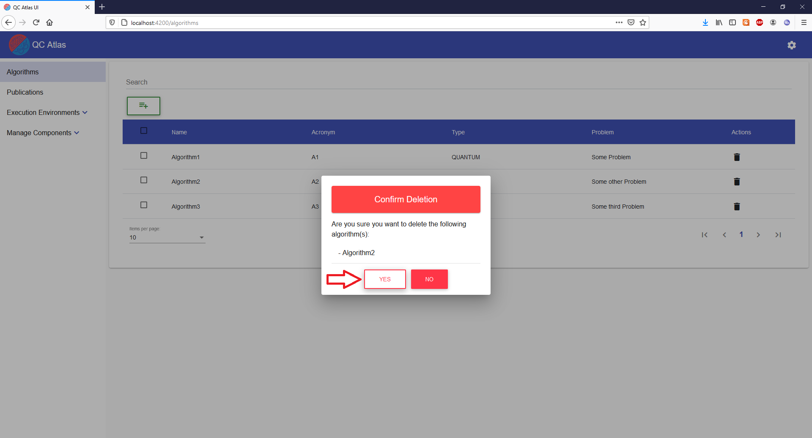

## Update Algorithm Information

!!! info 
    To update the information of an algorithm, the user has to be in the ``Algorithm View`` which can be reached by clicking on a algorithm in the ``Algorithm List View``.
	
Updating basic information is done in the ``General Tab`` of the ``Algorithm View``. To do that, the user has to simply use the ``Input fields``, ``Check-Boxes`` or ``Selection drop-downs`` to add new values or adjust existing ones.


If information is changed, a ``Save button`` will be displayed next that specific input field. Also, a ``Master Save button`` will appear at the right side of the screen. To save the changes of each input field individually, the user can click on the ``Save button`` next to any updated input field. Alternatively the user can save all changes by clicking the ``Master Save button``.

!!! note 
    The user can also hit ``Enter`` on the keyboard to save the changes of a single field in most cases. In some cases, it may be necessary to focus the ``Save button`` by hitting ``TAB`` on the keyboard and then confirming with ``Enter``.
	


!!! info 
	**Required Compute Resource Properties**, **Problem Types** and **Application Areas** are stored separately and therefor do not belong to the basic information of the algorithm. They are saved, deleted or updated instantly without the use of the mentioned ``Save buttons``.
	
## Create Compute Resource Properties

!!! info 
    To create a compute resource property for the algorithm, the user has to be in the ``Algorithm View`` which can be reached by clicking on a algorithm in the ``Algorithm List View``.

Creating properties for a compute resource is done in the ``General Tab`` of the ``Algorithm View``. To do that, the user has to simply click on the ``Plus button`` of the dedicated ``Required Compute Resource Property Field``.


This will open a separate ``Creation Dialog`` where the user will have to enter all important information of about the property he wants to create.

!!! note 
	The **Type Name** field supports auto-completion functionality. While typing a type name, the system will suggest existing types with that name in a drop-down. On click of an existing type, all necessary fields will be filled automatically.


After all fields have been filled, the user can finally add the property by confirming the creation via the existing ``OK button``.

!!! note 
	The **Property Value** needs to match the selected **Data Type**.


After the property has been successfully created, it will appear in the the dedicated ``Required Compute Resource Property Field`` of the ``Algorithm View``.


## Update Compute Resource Properties

!!! info 
    To update a compute resource property of the algorithm, the user has to be in the ``Algorithm View`` which can be reached by clicking on a algorithm in the ``Algorithm List View``.

Updating properties of an algorithm is done in the ``General Tab`` of the ``Algorithm View``. To do that, the user has to simply hover over a existing property in the dedicated ``Required Compute Resource Property Field`` and then click on the ``Edit button``.	
	


This will open a separate ``Update Dialog`` where the information of the property can be adjusted.

!!! note 
	The **Type Name** field supports auto-completion functionality. While typing a type name, the system will suggest existing types with that name in a drop-down. On click of an existing type, all necessary fields will be filled automatically.


After all fields have been adjusted, the user can finally update the property by confirming the update via the existing ``OK button``.

!!! note 
	The **Property Value** needs to match the selected **Data Type**.


## Delete Compute Resource Properties

!!! info 
    To delete a property for an algorithm, the user has to be in the ``Algorithm View`` which can be reached by clicking on a compute resource in the ``Algorithm List View``.
	
Deleting properties for a compute resource is done in the ``General Tab`` of the ``Algorithm View``. To do that, the user has to simply hover over a existing property in the dedicated ``Required Compute Resource Property Field`` and then click on the ``Delete button``.


!!! info 
	A successfully deleted property should disappear from the dedicated ``Required Compute Resource Property Field`` after deletion.

## Reference Application Areas

To reference application areas in an existing algorithm, the user has to navigate to the general view of the algorithm he wants to update. To do that, the user has to navigate to the "Algorithm" list view by using the navigation sidebar. In the list view, the user has to click on the algorithm he wants to reference application areas with.

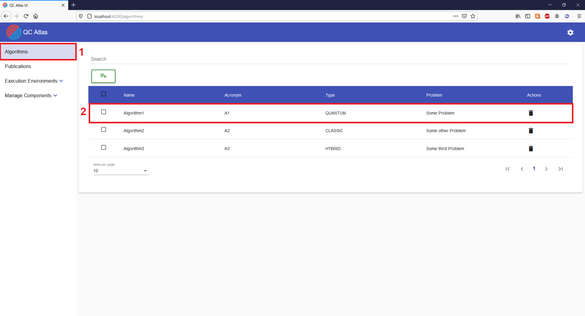

In the general view of the algorithm, there is a specific ``Application Areas`` field which is dedicated to referencing application areas.


To link a application area to the algorithm, the user has to use the input field to search for an application area by typing it's name. While typing, the system's auto-complete feature will display available application areas in a drop-down.
To finally link a application area, the user has to click on one of the available areas from the drop-down. Alternatively, the user can use the arrow buttons on the keyboard to select a application area and confirm the link with the "Enter" button on the keyboard.

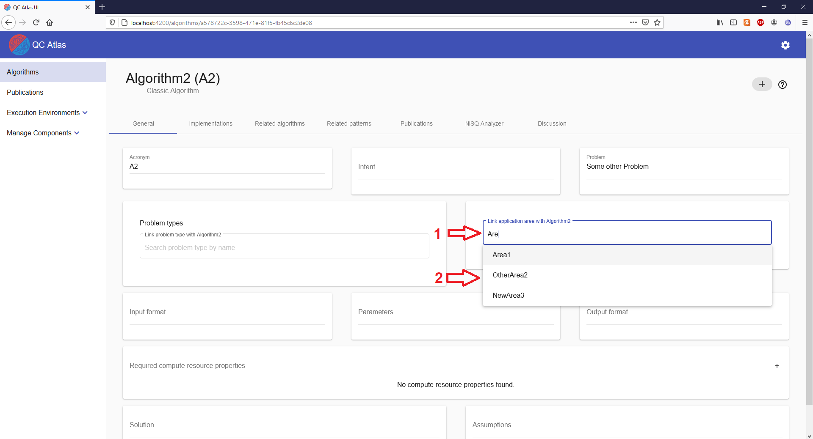

After the linking process has been successfully completed, the freshly linked application area will be displayed beneath the input field.


To remove the reference from a application area, the user simply has to click on the "X" button of the displayed application area.


## Reference Problem Types

To reference problem types in an existing algorithm, the user has to navigate to the general view of the algorithm he wants to update. To do that, the user has to navigate to the "Algorithm" list view by using the navigation sidebar. In the list view, the user has to click on the algorithm he wants to reference problem types with.


In the general view of the algorithm, there is a specific ``Problem types`` field which is dedicated to referencing problem types.

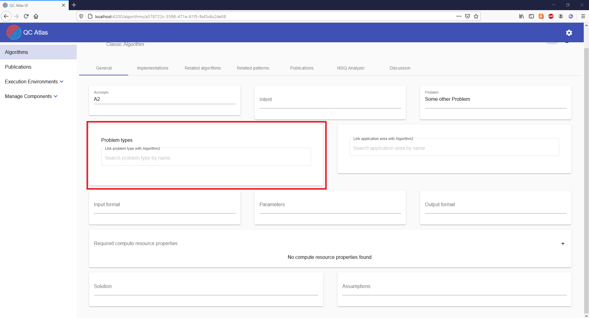

To link a problem type to the algorithm, the user has to use the input field to search for a problem type by typing it's name. While typing, the system's auto-complete feature will display available problem types in a drop-down.
To finally link a problem type, the user has to click on one of the problem types from the drop-down. Alternatively, the user can use the arrow buttons on the keyboard to select a problem type and confirm the link with the "Enter" button on the keyboard.

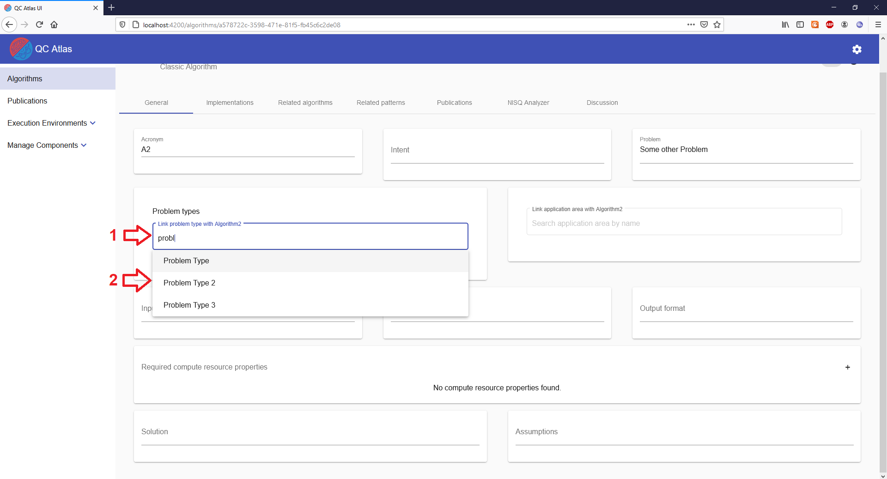

After the linking process has been successfully completed, the freshly linked problem type will be displayed beneath the input field.

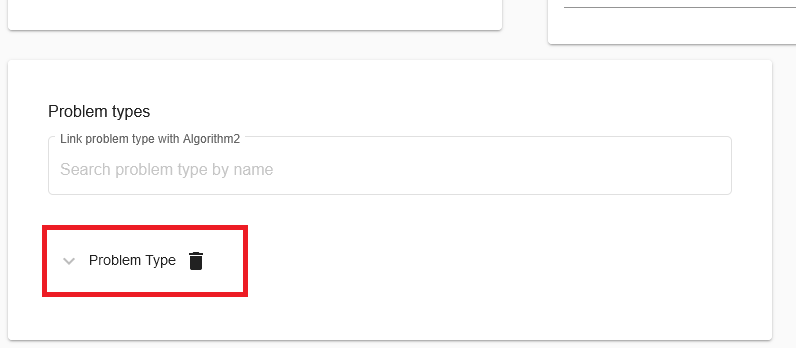

To remove the reference from a problem type, the user simply has to click on the "Delete" button which is located next to the displayed problem type.

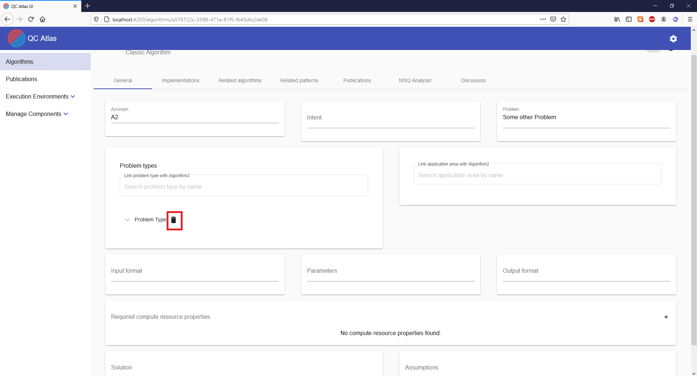

## Reference other Algorithms

To reference other algorithms in an existing algorithm, the user has to navigate to the general view of the algorithm he wants to update. To do that, the user has to navigate to the "Algorithm" list view by using the navigation sidebar. In the list view, the user has to click on the algorithm he wants to reference other algorithms with.


In the general view of the algorithm, the user has to switch to the tab ``Related Algorithms``.


To link some other algorithm with the currently selected algorithm, the user has to click on the "Plus" button at the top of the data table.


This will open a new dialog which is responsible for linking algorithms.

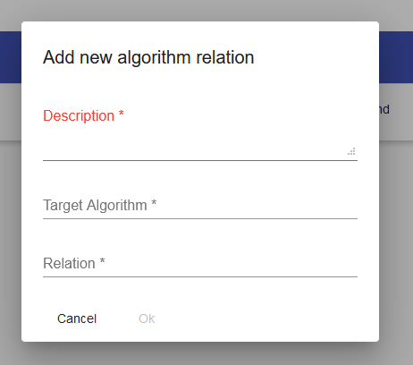

Within the dialog, the user has to enter the necessary data to create the relation between two algorithms. For that he needs to describe the relation by entering a description of the relationship between the two algorithms.

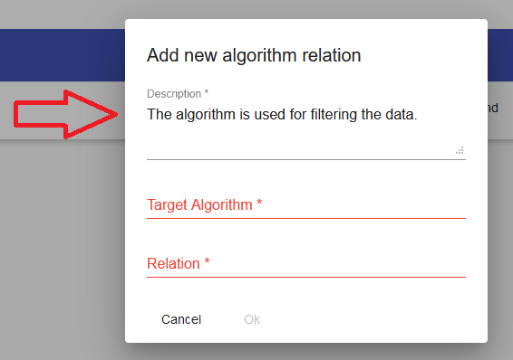

Also, the user has to select the other algorithm he wants to reference. For that he can use the input field to find algorithms by name. The auto-complete of the system will filter available algorithms and display them in a drop-down. The user can pick an algorithm by clicking on it or by using the arrow keys on the keyboard and confirming his selection with the "Enter" button.

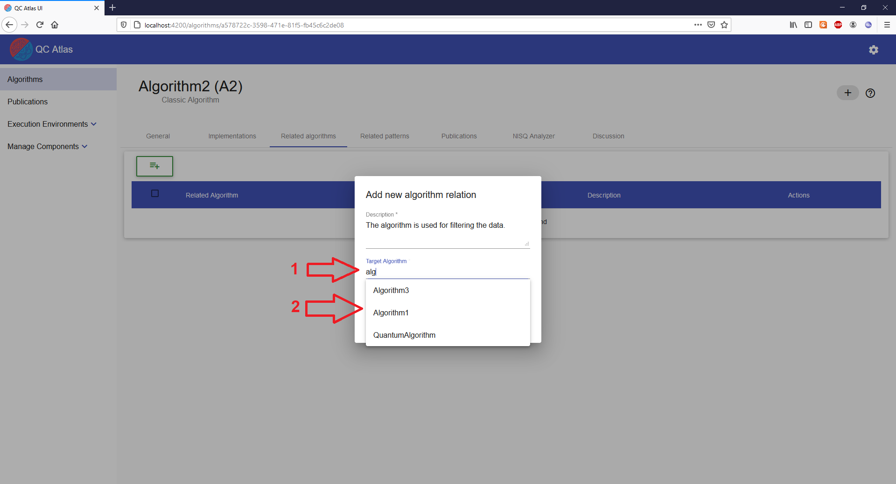

At last, the user needs to define the type of relation the two algorithms will have. For that he can use the given ``Relation`` input field. While typing, the auto-complete of the system will filter existing relation types while giving the user to ability to create a new one. The user can again select the relation type by clicking on it or by using the keyboard.

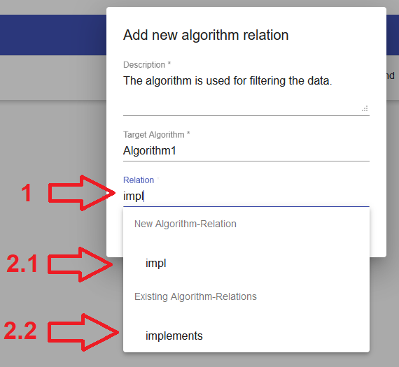

After all input data has been filled, the user can confirm the creation of a reference between the two algorithms by clicking on the ``OK`` button.

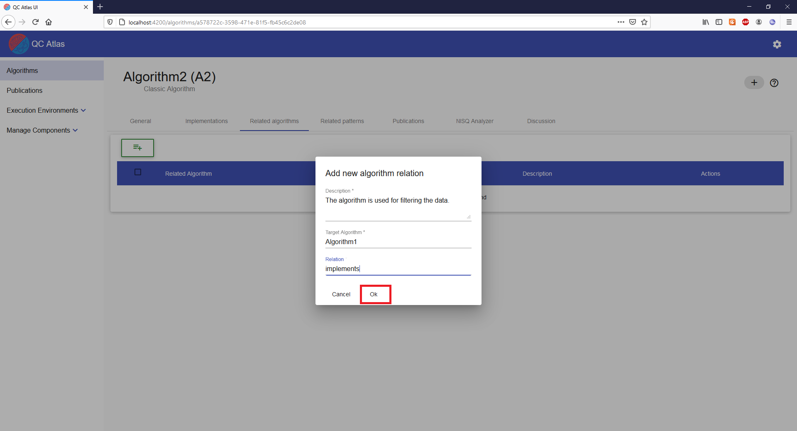

If the linking of the two algorithms was successful, the referenced algorithm will appear in the related algorithms list in the ``Related Algorithms`` tab of the algorithm view.

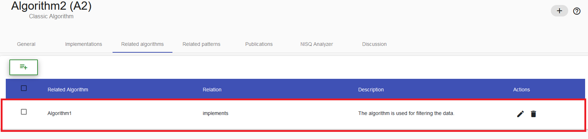

To update a algorithm relation, the user has to press the "Edit" button of the related algorithm in the ``Related Algorithms`` tab.

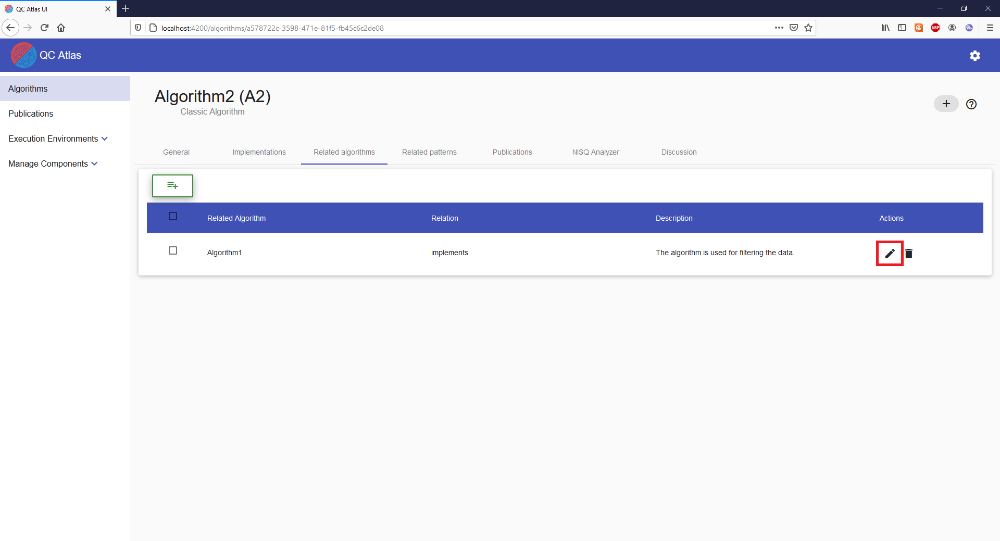

This will open a dialog where the used can adjust the relation information. Here the user can change the description and the type of the relation, before confirming the changes by clicking the "OK" button.

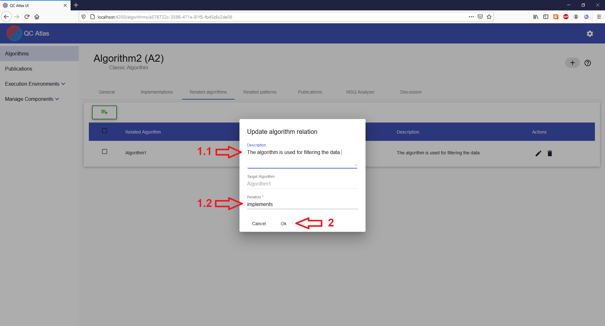

At last the users can also remove existing relations. This is also done in the ``Related Algorithms`` tab. To remove the relation, the user has to click on the ``Delete`` button of a relation.


Alternatively, the users can use the check-boxes of the first column of the table to select all related algorithms they want dereference. After at least one check-box is checked, a ``Master-Delete`` button will appear on top of the table which can be used to delete all selected relations.

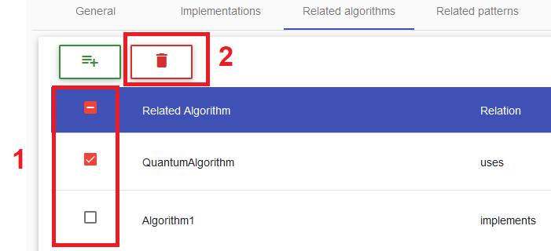

If a ``Delete`` button is pressed, a confirmation dialog will appear listing all relations that will be deleted. To confirm the deletion of the relationship to all displayed algorithms, the user has to click on the ``YES`` button.

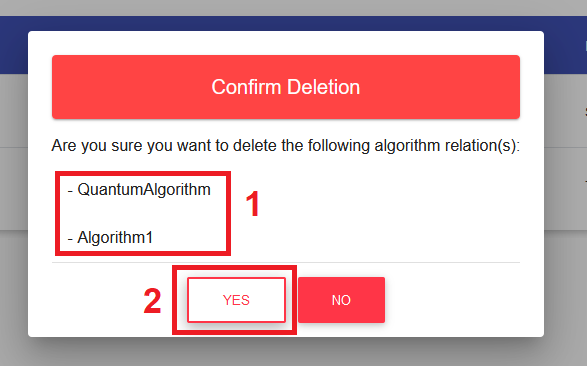

## Reference Publications

To reference publications in an existing algorithm, the user has to navigate to the general view of the algorithm he wants to update. To do that, the user has to navigate to the "Algorithm" list view by using the navigation sidebar. In the list view, the user has to click on the algorithm he wants to reference publications with.


In the general view of the algorithm, the user has to switch to the tab ``Publications``.


To link some publication with the currently selected algorithm, the user has to click on the "Plus" button at the top of the data table.


This will open a dialog with a separate data list of existing publications.

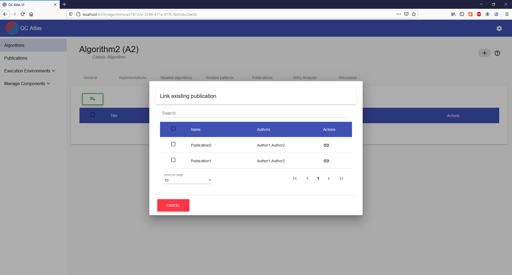

For referencing publications the user can now search the table and click on the ``Link`` button of a publication he wants to reference.

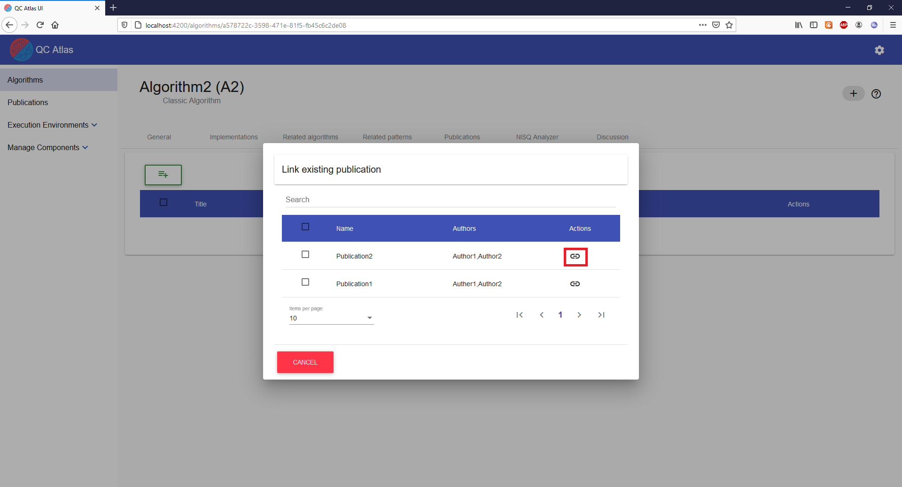

Alternatively, the users can use the check-boxes of the first column of the table to select all publications they want reference. After at least one check-box is checked, a ``Master-Link`` button will appear at the top of the table which can be used to link all selected publications with the algorithm.


If the linking was successful, the referenced publication(s) will appear in the publications list of the ``Publications`` tab of the algorithm view.


The user can also remove existing references. This is also done in the ``Publications`` tab. To remove the reference, the user has to click on the ``Delete`` button of a publication reference.


Alternatively, the users can use the check-boxes of the first column of the table to select all publications they want dereference. After at least one check-box is checked, a ``Master-Delete`` button will appear at the top of the table which can be used to unlink all selected publications from the algorithm.


## Manage Tags

To add a tag to an existing algorithm, the user has to navigate to that algorithms general view. To do that, the user has to navigate to the "Algorithm" list view by using the navigation sidebar. In the list view, the user has to click on the algorithm he wants to add tags to.


In the header of the general view of the algorithm, the user has to click on the ``Plus Button`` which is used to add tags.

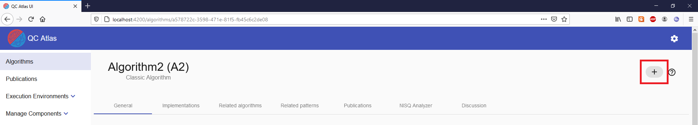

This will open a new dialog. In this dialog the user has to fill in the required data like ``Tag Category`` and ``Tag Value`` to describe the Tag that will be added to the algorithm.


The ``Tag Value`` field is equipped auto-complete functionalities. While writing, it will recommend existing values to the user. The user can then either pick one of the existing values by clicking on it or by using the arrow keys on the keyboard and confirming the selection with the ``Enter Button`` on the keyboard. Alternatively the user can ignore the recommendations and fill the input field with a new tag value.


The ``Tag Category`` field is also equipped auto-complete functionalities which works the same way as the ``Tag Value`` field from the previous step.


To finally add a new tag to the algorithm, the user has to confirm his selection by clicking on the ``OK button``. 


If the addition of the tag was successful, the tag will appear in the header of the algorithm view.


To remove a tag from the algorithm, the user can click on the ``X`` button of an existing tag.


## Manage Implementations

To create a new implementation for an existing algorithm, the user has to navigate to that algorithms general view. To do that, the user has to navigate to the "Algorithm" list view by using the navigation sidebar. In the list view, the user has to click on the algorithm he wants to create implementations for.


In the general view of the algorithm, the user has to switch to the tab ``Implementations``.


To add a implementation, click on the ``Add button`` located above the data table.


This will open a dialog where the user can enter information that is required for creating a new implementation.


Enter the name of the new implementation and then click on the ``OK button`` to confirm the creation of the implementation. If the creation of the implementation was successful, the user will be redirected to the ``Implementation View`` of the created implementation where he can define further properties.


The user can also remove existing implementations. This is also done in the ``Implementations`` tab. To remove a implementation, the user has to click on the ``Delete`` button of a implementation.

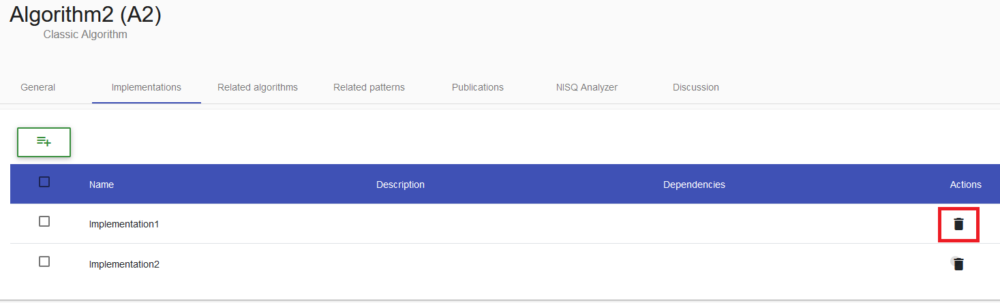

Alternatively, the user can use the check-boxes of the first column of the table to select all implementations they want remove. After at least one check-box is checked, a ``Master-Delete`` button will appear at the top of the table which can be used to delete all selected implementations of the algorithm.

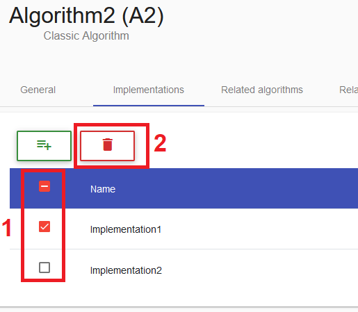

If a ``Delete`` button is pressed, a confirmation dialog will appear listing all implementations that will be deleted. To confirm the deletion of the displayed implementations, the user has to click on the ``YES`` button.


## Reference Patterns

To reference pattern in an existing algorithm, the user has to navigate to that algorithms general view. To do that, the user has to navigate to the "Algorithm" list view by using the navigation sidebar. In the list view, , the user has to click on the algorithm he wants to reference patterns with.


In the general view of the algorithm, the user has to switch to the tab ``Related Patterns``.

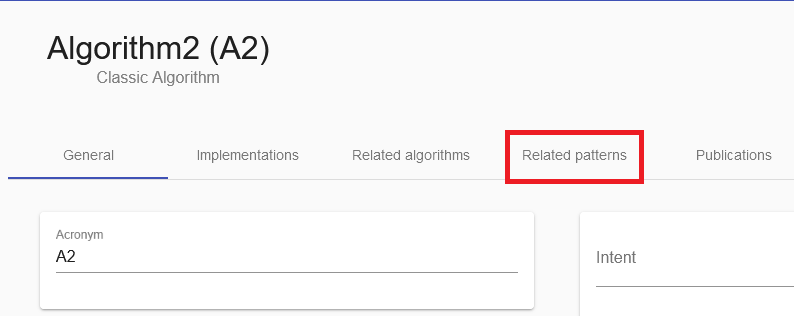

To link a new pattern with the currently selected algorithm, the user has to click on the "Plus" button at the top of the data table.


This will open a new dialog containing multiple steps that need to be performed.

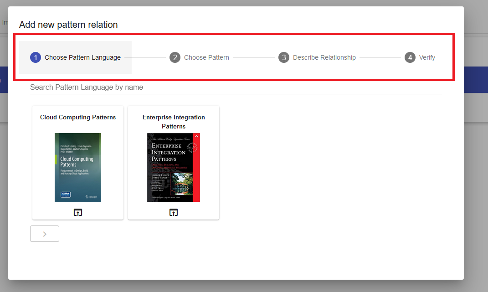

In the first step, a pattern language needs to be selected by simply clicking on it. To filter specific pattern languages, the user can use the input field to filter them by their name.

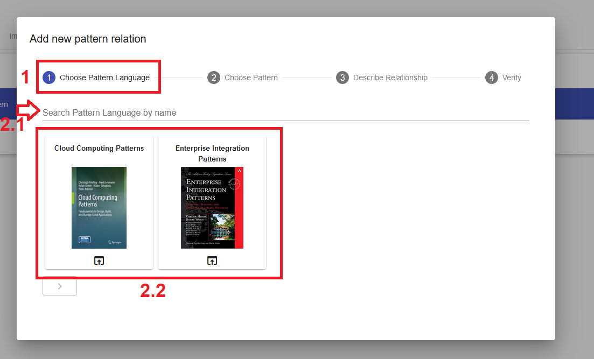

After a specific pattern language has been selected, the user has to move the the next step by either clicking on the ``Next`` button or by clicking on the second step.


In the second step the user has to pick the pattern of the selected pattern language he wants to link with the algorithm. To do that, he again only has to click on that specific pattern. Like in the first step, he can use the input field to filter the patterns by their names and he also can use the scrollbar to scroll through all patterns.


After a specific pattern has been selected, the user has to move the the next step by either clicking on the ``Next`` button or by clicking on the second step.

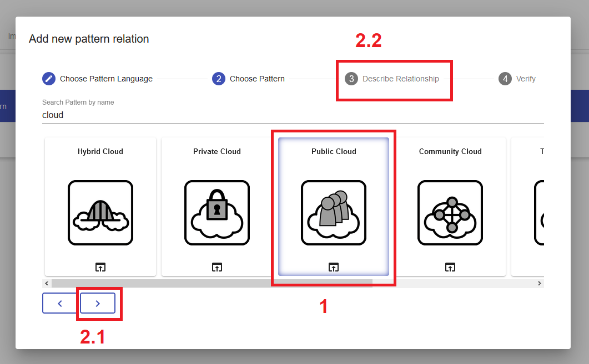

In the third step the user has to describe the relation between the selected pattern and the algorithm. To do that, he has to specify a ``Relation Type`` and add a ``Description``.


To specify the relation type, the user simply has to use the existing input field. The auto-complete functionality of the system will filter all existing relation types while still providing the user the option to create a new one. To confirm a relation type, the user has to simply click on it. Alternatively the arrow keys of the keyboard can be used to navigate through all the options and confirm the selection with the press on the "Enter" button.


At last the user has to add a description by using the existing input field. After that, the user can proceed to the last step by clicking on the ``Next`` button or by clicking directly on the step itself.


The last step is used for verifying all the important selections from the previous steps. To finally link the pattern with the algorithm, the user can press the ``Confirm`` button.


If the linking was successful, the referenced pattern will appear in the data list.

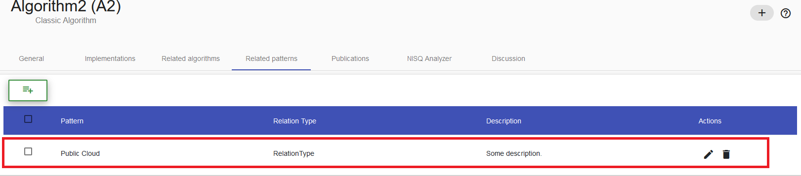

The reference to a pattern can also be edited. For this, the user has to click on the ``Edit Button`` of a related pattern. This is also located in the ``Related Patterns`` tab of the ``Algorithm View``.

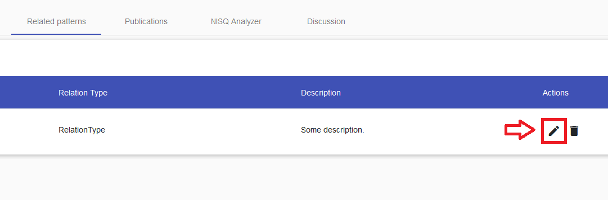

This will open a dialog containing two steps that need to be performed to successfully update the reference.


In the first step, the user can adjust the ```Relation Type`` and the ``Description``.


To adjust the ``Relation Type``, the user simply has to use the existing input field to change the current type. The auto-complete functionality of the system will filter all existing relation types while still providing the user the option to create a new one. To confirm a relation type, the user has to simply click on it. Alternatively the arrow keys of the keyboard can be used to navigate through all the options and confirm the selection with the press on the "Enter" button.

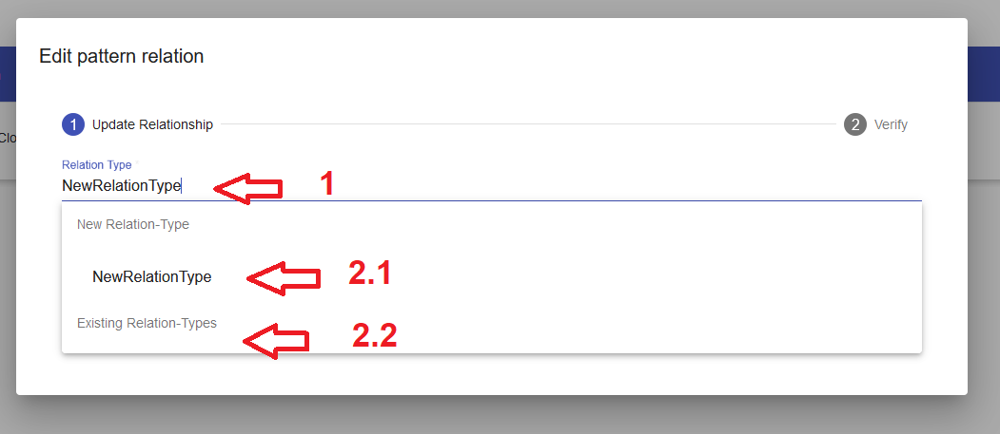

To adjust the ``Description``, the user can existing input field. After that, the user can proceed to the second step by clicking on the ``Next`` button or by clicking directly on the step itself.

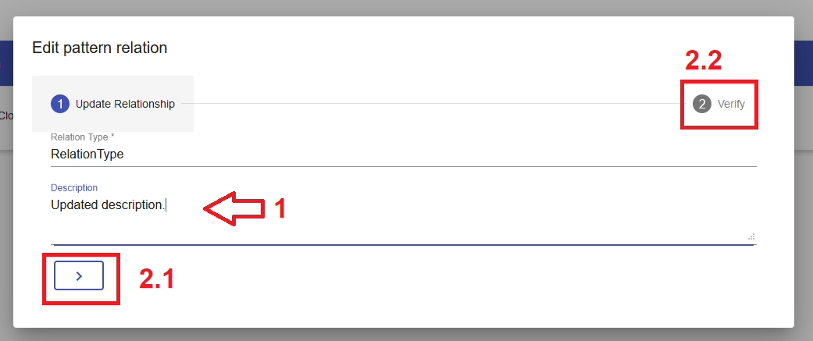

The second and last step is used for verifying all the important selections from the first step. To finally adjust the reference between the pattern and the algorithm, the user has to press the ``Confirm`` button.


At last, the user can also remove existing references to patterns. For this, the user has to click on the ``Delete Button`` of a related pattern. This is also located in the ``Related Patterns`` tab of the ``Algorithm View``.


Alternatively, the user can use the check-boxes of the first column of the table to select all pattern relation he wants to remove. After at least one check-box is checked, a ``Master-Delete`` button will appear at the top of the table which can be used to delete all selected pattern relations from the algorithm.


If a ``Delete`` button is pressed, a confirmation dialog will appear listing all patterns that will be removed from the algorithm. To confirm the deletion of the displayed patterns, the user has to click on the ``YES`` button.

