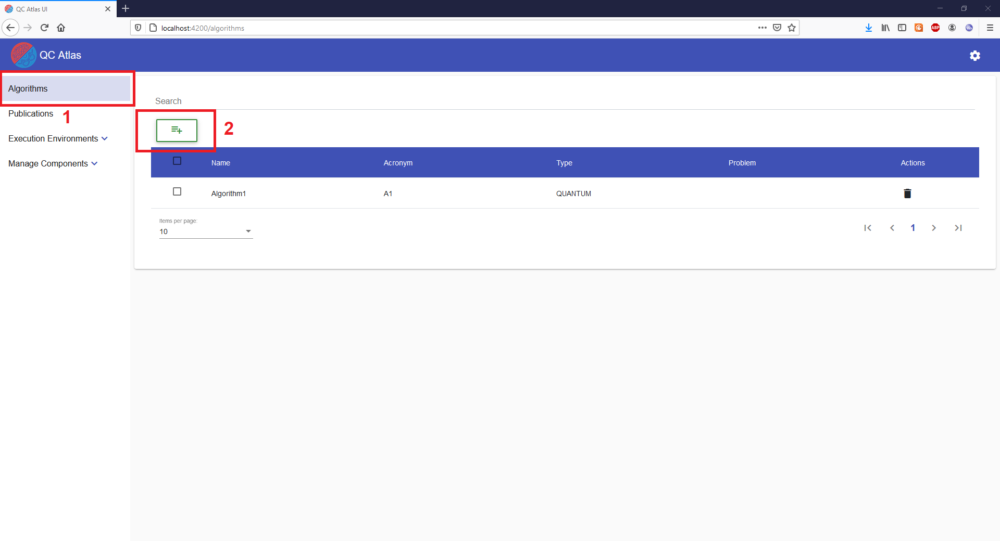
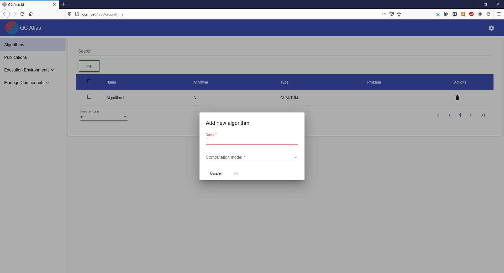
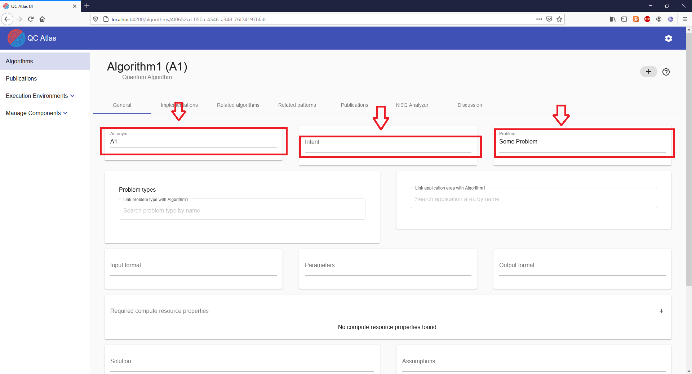
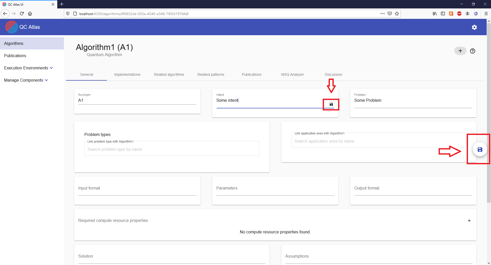
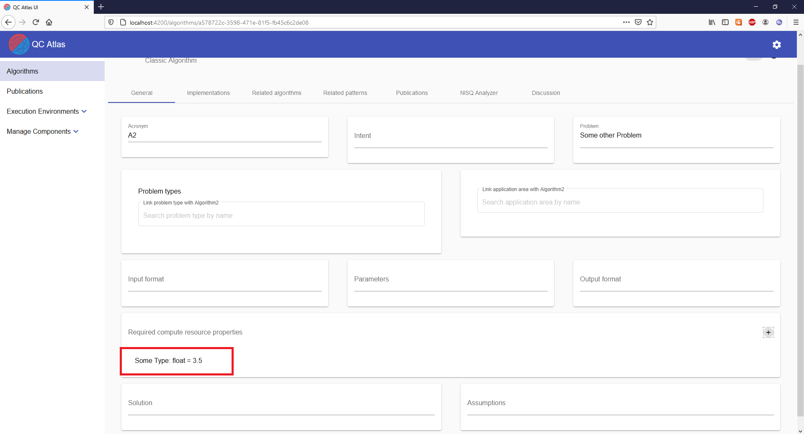
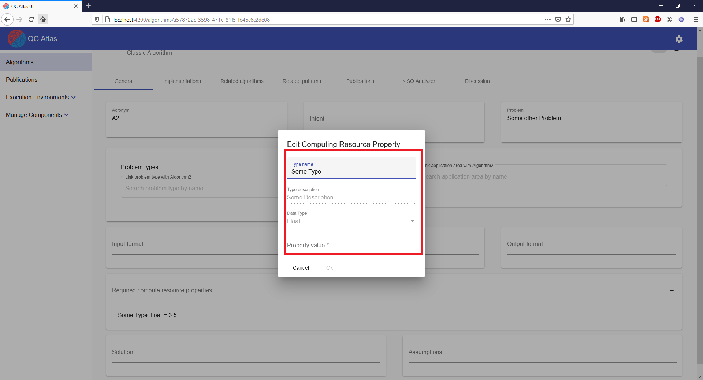

#
## Create Algorithm

To create an algorithm the user has to navigate to the "Algorithm" list view by using the navigation sidebar.
This view displays a list of all available algorthms. Creating a new algorithm is done via the "Plus" button which is located above the list.

Clicking on the „Plus“ Button will open the following dialog.

In the dialog it is possible to give the new algotihm a name.

Besides the name it is also necessary to assign a type to the new algorithm. 
There are three types to choose from: "Classic", "Quantum" and "Hybrid".

If a quantum algorithm has been selected, a suitable quantum computation model must also be selected.
Again there are three types to choose from: "Gate Based", "Measurement Based" and "Quantum Annealing".

After all necessary fields have been filled in, the creation of the algorithm can be confirmed by clicking on the "OK" button. After a successfull creation, the user will be navigated to the detailed view of the new algorithm.

## Delete Algorithm

To delete an algorithm the user has to navigate to the "Algorithm" list view by using the navigation sidebar.

To delete single algorithms, the user can just press the delete button in the actions column of the table.

It is also possible to delete multiple algorithms at once by selecting them one by one using the check-boxes within the table. When at least one algorithm is selected, a master delete button will show up above the table. To delete the selected algorithms at once, this button must be pressed.

Both ways of deleting algorithm will lead to a confirmation dialog. This dialog will list all the previously selected algorithms that will be deleted. To finally confirm the deletion, the "OK" button at the bottom of the dialog has to be pressed. After a successful deletion the deleted algorithms will disappear from the table.

## Update Algorithm Properties

To update basic properties of an existing algorithm, the user has to navigate to the general view of the algorithm he wants to update. To do that, the user has to navigate to the "Algorithm" list view by using the navigation sidebar. In the list view, the user has to simply click on the algorithm he wants to update.

After the user selects an algorithm from the list, he will be navigated to the general view of the selected algorithm. In the "General" tab of the view, the user can adjust all basic properties of the algorithm.

To adjust these properties the user has to simply click on the properties input field, check box or selection drop down and adjust the current value by selecting or typing.

The user has two possible ways to save the changes of the algorithm. 

The first option is to save the changes on a field by field basis. For that the user has to click on the "Save" button located next to the field that was edited. Alternatively the user can confirm the changes by pressing "Enter" on the keyboard. On some fields, the save button needs to be focused first using the "TAB" button on the keyboard before using the "Enter" button to save the changes. This is because some fields are using the "Enter" button for other activities like performing line-breaks in the text.

The user can also save all changes he has performed on the algorithm at once. This can be done by clicking on the big "Save" button which is located at the right side of the screen. In this case, all changes regarding the basic properties of the algorithm are changed at once.

## Manage Compute Resource Properties

To manage computing resource properties of an existing algorithm, the user has to navigate to the general view of the algorithm he wants to update. To do that, the user has to navigate to the "Algorithm" list view by using the navigation sidebar. In the list view, the user has to simply click on the algorithm for which he wants for manage the compute resources for.

In the general view of the algorithm, the user can also manage the compute resource of the selected algorithm. For that the user has to go to the "Required Compute Resource Properties" field and click on the "Plus" button, which will open up a new dialog for the creation of a new compute resource property.

In the creation dialog, the user has to fill in all necessary data for the new property. Here it is important that the "Property Value" matches the given "Data Type".

After all data has been provided by the user, the new property can finally be created using the "OK".

In case of a successful creation, the created compute resource property will be directly visible in the general view of the selected algorithm. 
NOTE: Compared to the basic properties of the algorithm, the management of the compute resource properties will be performed directly and does not have to be confirmed by clicking on a save button.

Updating an existing property is initiated by hovering over it in the general view of the algorithm. Then the "Edit" button will appear. By pressing the "Edit" button, a dialog will be opened for updating the selected property.

In the dialog, the user can adjust the data of the selected compute resource property.

After the user is happy with the changes, he has to confirm them using the "OK" button which is located at the bottom of the dialog.

Finally, the user can also delete a compute resource property. This can also be done by hovering over the property in the general view of the algorithm and then pressing on the "Delete" button which will show up when the property is hovered.

