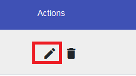
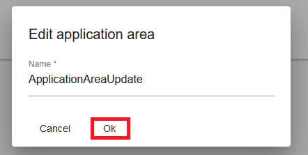
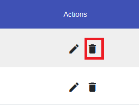
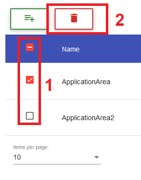
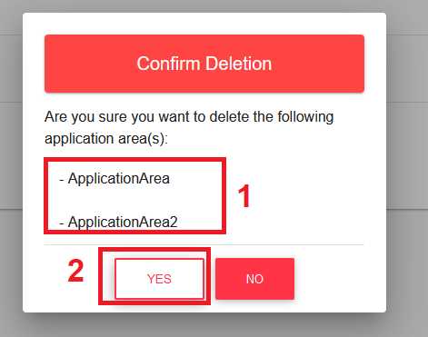

#
## Create Application Area

!!! info 
    To create a application area, the user has to be in the ``Application Area List View`` which can be found in the ``Manage Components Menu``.
	
Inside the ``Application Area List View``, the user can click on the ``Plus Button`` to initiate the creation of a new application area inside a separate ``Creation Dialog``.

Within the ``Creation Dialog``, the user will have to enter all important information about the application area he wants to create.

!!! note 
    Currently the only required information is the **name** of the application area.
	

	
After entering the name of the application area, the user has to confirm the creation by clicking on the ``OK Button``.

!!! info 
    In case of a successful creation, the data table will switch to the last page (if not already) to show the created application area.
	
## Update Application Area

!!! info 
    To update a application area, the user has to be in the ``Application Area List View``, which can be found in the ``Manage Components Menu``.
	
Inside the ``Application Area List View``, the user can choose a application area he wants to update by clicking on it's ``Edit Button`` which can be found in the ``Actions Column`` of the data table.
This will open a ``Edit Dialog``.

Within the ``Update Dialog``, the user can adjust the information of the application area.

!!! note 
    Currently the only required information is the **name** of the application area.
	

	
After adjusting all information, the user has to confirm the changes by clicking on the ``OK Button``.

## Delete Application Area

!!! info 
    To perform the deletion of a application area, the user has to be in the ``Application Area List View``, which can be found in the ``Manage Components Menu``.
	
To delete a specific application area, the user has to simply click on it's ``Delete Button`` in the ``Actions Column`` of the data table.

The user can also remove multiple application areas at once by selecting them using the check-boxes of the data table. After the user has made his selection he can press the ``Master Delete Button`` at the top of the data table.

!!! note 
    The ``Master Delete Button`` button will only appear if at least one application area is selected.
	

	
To confirm the deletion of the selected application area(s), the user has to click on the ``YES Button`` of the ``Confirmation Dialog``.

!!! note 
    **Names** of the application area(s) that will be deleted are displayed in the body of the dialog and should be checked before confirming the deletion.

