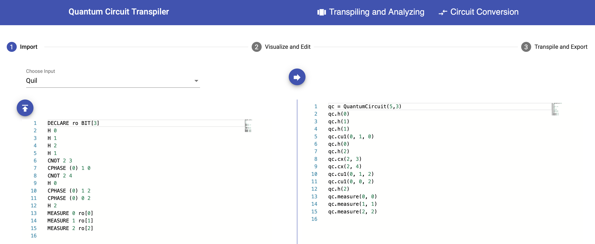
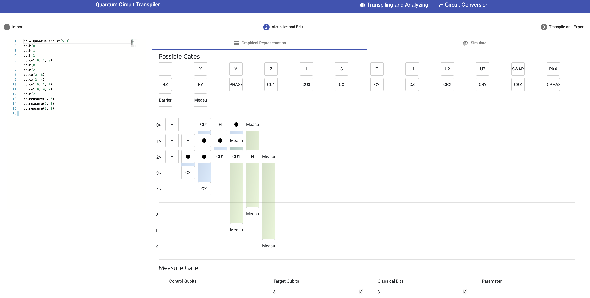
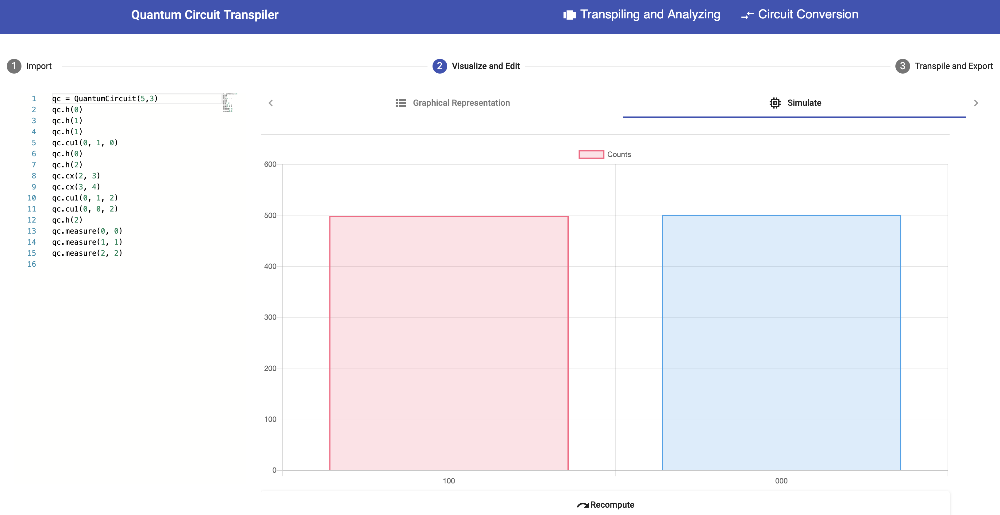

# Circuit Transformer

The [Circuit Transformer](https://github.com/UST-QuAntiL/QuantumTranspiler) is a translation and transpiling framework for quantum circuits.
The framework enables importing, translating, visualizing, modifying, simulating, transpiling, and exporting a given quantum circuit by its independent frontend.
Thereby the general gate sets of Rigetti and IBMQ QPUs and the programming languages Quil and OpenQASM as well as the Python libraries PyQuil and Qiskit are supported. 

## Transpiling and Analyzing
For the transpilation and analysis of a certain quantum circuit, select the ``Transpiling and Analyzing`` tab at the top of the UI.

In the ``1 Import`` step, copy your circuit into the left field or click the import button on the left.
Then, select the programming language or Python library the circuit is written in.
Currently, OpenQASM, Qiskit, Quil, and PyQuil are supported.  

Next, click the arrow button in the middle to transform the given circuit into the Python library Qiskit, shown on the right side.

Click the ``2 Visualized and Edit`` step at the top.
The imported and transformed circuit can now be modified by simply drag and drop further gates onto the wires representing used qubits or move existing gates by clicking on the edit pencil on them and redefining the qubits and bits at the bottom of the UI.

In the ``2 Visualized and Edit`` context, the resulting measurements can be simulated by clicking on the `Simulate` sub tab.

Click the ``3 Transpile and Export`` step at the top to transpile the transformed circuit onto the general gate set of IBMQ or Rigetti QPUs.
The Circuit Transformer displays the depth, tow-qubit depth and pulses depth for the two different gate sets.
Select one of the gate sets by clicking the respective arrow button on the right side and enable the `Expert Mode` to select the export language of the circuit.
Then the transformed and translated circuit is displayed.
It can also be exported by clicking the export button on the right.

## Circuit Conversion
For the translation of a certain quantum circuit into another programming language, select the ``Circuit Converion`` tab at the top of the UI.

Copy or import a given circuit into the left side of the UI and select the programming language or library the circuit is written in.
Then, select the target language or library the circuit should be translated into.
Next, click the arrow button in the middle to trigger the translation.
The translated circuit can also be exported by clicking the export button on the right side.
The translation feature is used by the [NISQ Analyzer](./nisq-analyzer.md) to support the compiler comparison.