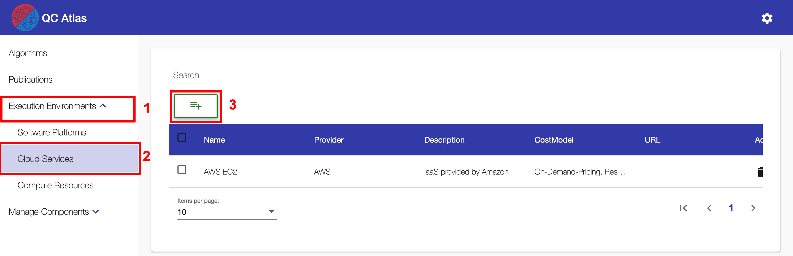

#
## Create Cloud Service

To create a cloud service the user has to navigate to the ``Cloud Services List View`` by using the navigation sidebar. 
This will be done by first clicking on the ``Execution Environments`` menu in the navigation sidebar, which makes the ``Cloud Services`` submenu visible.
In general, the ``Cloud Service List View`` displays a list of all available cloud services. Creating a new cloud service is done via the ``Plus Button`` which is located above the list.

Clicking on the ``Plus Button`` will open the following dialog.
In the dialog it is possible to give the new cloud service a name.

!!! note 
    To create a new cloud service only a ``name`` is required.

After all necessary fields have been filled in, the creation of the cloud service can be confirmed by clicking on the ``OK Button``. After a successfull creation, the user will be navigated to the detailed view of the new cloud service.

## Delete Cloud Service

!!! info 
    To perform the deletion of a cloud service, the user has to be in the ``Cloud Service List View``.
	
To remove a specific cloud service, the user has to simply click on the ``Delete Button`` in the ``Action Column`` of the data table.

It is also possible to delete mulitple cloud services at once by selecting them one by one using the checkboxes within the table. When at least one cloud service is selected, a ``Master Delete Button`` will show up above the table. To delete the selected cloud services at once, this button must be pressed.

Both ways of deleting cloud services will lead to a confirmation dialog. This dialog will list all the previously selected algorthims that will be deleted. To finally confirm the deletion, the ``OK Button`` at the bottom of the dialog has to be pressed. After a successfull deletion the deleted cloud services will disappear from the table.

## Update Cloud Service Properties

!!! info 
    To update the properties of a software platform, the user has to be in the ``Cloud Service View`` which can be reached by clicking on a cloud service in the ``Cloud Service List View``.

The ``General`` tab of the view, allows to adjust all basic properties of the cloud service.

!!! note 
    To save any changes to the properties of a cloud service there are two options:

    * Save the changes on a field by field basis. For that the user has to click on the ``Save Button`` located next to the field that was edited. Alternatively the user can confirm the changes by pressing ``Enter`` on the keyboard. 

    * Save all changes at once by clicking on the round  ``Save Button`` button which appears at the right side of the screen.

## Reference Software Platform

!!! info
    To reference software platform in an existing cloud service, the user has to be in the ``General View``

## Reference Compute Resource
