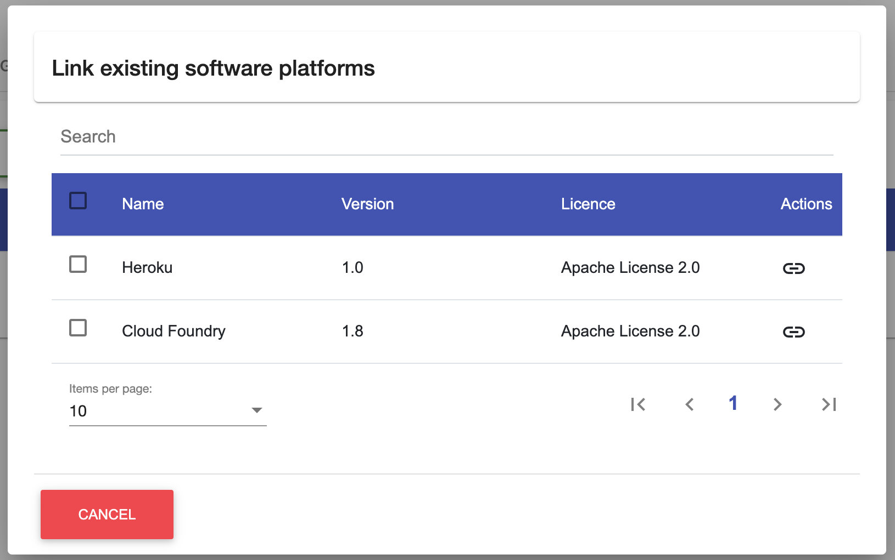
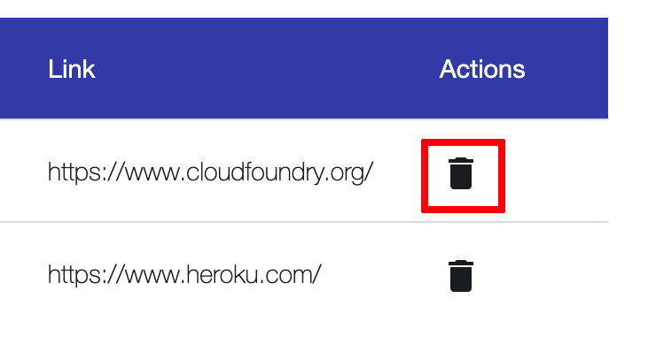
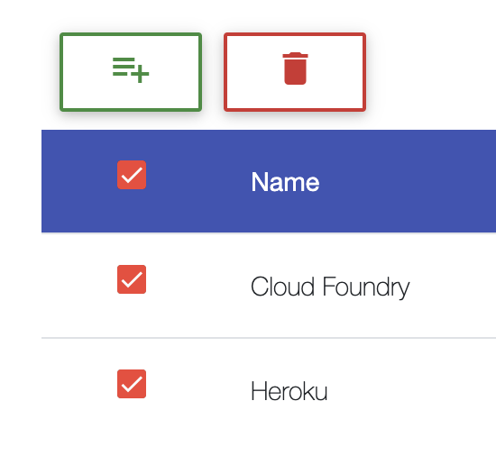
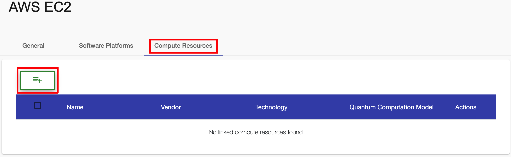
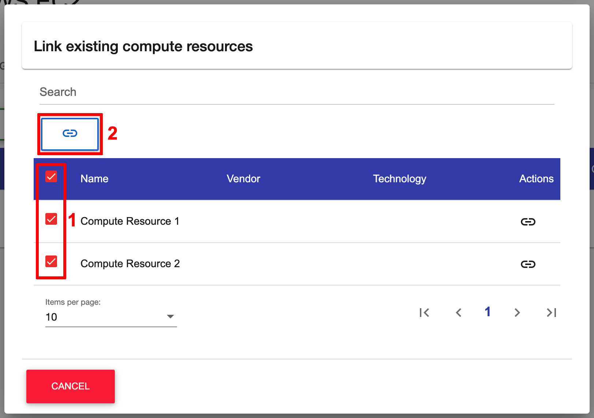
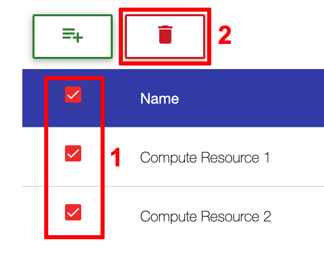

#
## Create Cloud Service

To create a cloud service the user has to navigate to the ``Cloud Services List View`` by using the navigation sidebar. 
This will be done by first clicking on the ``Execution Environments`` menu in the navigation sidebar, which makes the ``Cloud Services`` submenu visible.
In general, the ``Cloud Service List View`` displays a list of all available cloud services. Creating a new cloud service is done via the ``Plus Button`` which is located above the list.

Clicking on the ``Plus Button`` will open the following dialog.
In the dialog it is possible to give the new cloud service a name.

!!! note 
    To create a new cloud service only a ``name`` is required.

After all necessary fields have been filled in, the creation of the cloud service can be confirmed by clicking on the ``OK Button``. After a successfull creation, the user will be navigated to the detailed view of the new cloud service.

## Delete Cloud Service

!!! info 
    To perform the deletion of a cloud service, the user has to be in the ``Cloud Service List View``.
	
To remove a specific cloud service, the user has to simply click on the ``Delete Button`` in the ``Action Column`` of the data table.

It is also possible to delete mulitple cloud services at once by selecting them one by one using the checkboxes within the table. When at least one cloud service is selected, a ``Master Delete Button`` will show up above the table. To delete the selected cloud services at once, this button must be pressed.

Both ways of deleting cloud services will lead to a confirmation dialog. This dialog will list all the previously selected algorthims that will be deleted. To finally confirm the deletion, the ``OK Button`` at the bottom of the dialog has to be pressed. After a successfull deletion the deleted cloud services will disappear from the table.

## Update Cloud Service Information

!!! info 
    To update the information of a cloud service, the user has to be in the ``Cloud Service View`` which can be reached by clicking on a publication in the ``Cloud Service List View``.

Updating basic information is done in the ``General Tab`` of the ``Cloud Service View``. To do that, the user has to simply use the ``Input fields``, ``Check-Boxes`` or ``Selection drop-downs`` to add new values or adjust existing ones.

If information is changed, a ``Save button`` will be displayed next that specific input field. Also, a ``Master Save button`` will appear at the right side of the screen. To save the changes of each input field individually, the user can click on the ``Save button`` next to any updated input field. Alternatively the user can save all changes by clicking the ``Master Save button``.

!!! note 
    The user can also hit ``Enter`` on the keyboard to save the changes of a single field in most cases. In some cases, it may be necessary to focus the ``Save button`` by hitting ``TAB`` on the keyboard and then confirming with ``Enter``.

## Reference Software Platform

!!! info
    To reference software platforms in an existing cloud service, the user has to be in the ``General View``

In the ``General View`` of the cloud service, the user as to switch to the tab ``Software Platforms``, which is dedicated to referencing software platforms.
To link software platform with the currently selected cloud service, the user has to click on the ``Plus Button`` at the top of the data table.

This will open a dialog with a separate data table containing existing software platforms.
The table can be searched or sorted using the given input fields.
For referencing software platforms the user has to click on the ``Link Button`` of a selected software platform.

Alternatively, the users can use the check-boxes of the first column of the table to select all software platforms to reference. 
After at least one check-box is checked, a ``Master Link Button`` will appear at the top of the table which can be used to link all selected algorithms with the cloud service.

## Dereference Software Platform

!!! info 
    To dereference software platforms, the user has to be in the ``Software Platforms Tab`` of the ``Cloud Service View``, which can be reached by clicking on a cloud service in the ``Cloud Service List View``.
	
To remove a reference from a cloud service, the user has to simply click on the ``Delete Button`` in the ``Actions Column`` of the data table.

Alternatively use the check-boxes to select multiple software platforms and then click on the ``Master Delete button`` to unlink multiple software platforms .

!!! note 
    ``Master Delete button`` will only appear if at least one software platform has been selected.
	

## Reference Compute Resource

!!! info
    To reference compute resources in an existing cloud service, the user has to be in the ``General View``

In the ``General View`` of the cloud service, the user as to switch to the ``Compute Resource Tab``, which is dedicated to referencing software platforms.
To link compute resource with the currently selected cloud service, the user has to click on the ``Plus Button`` at the top of the data table.

This will open a dialog with a separate data table containing existing software platforms.
The table can be searched or sorted using the given input fields.
For referencing compute resources the user has to click on the ``Link Button`` of a selected compute resource.

Alternatively, the users can use the check-boxes of the first column of the table to select all compute resources to reference. 
After at least one check-box is checked, a ``Master Link Button`` will appear at the top of the table which can be used to link all selected compute resources with the cloud service.

## Dereference Compute Resource

!!! info 
    To dereference compute resources, the user has to be in the ``Compute Resource Tab`` of the ``Cloud Service View``, which can be reached by clicking on a cloud service in the ``Cloud Service List View``.
	
To remove a reference from a cloud service, the user has to simply click on the ``Delete Button`` in the ``Actions Column`` of the data table.

Alternatively use the check-boxes to select multiple compute resources and then click on the ``Master Delete button`` to unlink multiple compute resources.

!!! note 
    ``Master Delete button`` will only appear if at least one compute resource has been selected.
	
