# NISQ Analyzer User Guide
The [NISQ Analyzer](https://github.com/UST-QuAntiL/nisq-analyzer) is a research prototype based on the work by [Salm et al.](https://link.springer.com/chapter/10.1007/978-3-030-64846-6_5). 
It automatically analyzes implementations of quantum algorithms and recommends compilation results for suitable Quantum Processing Units (QPUs). 
Thereby, the analysis and selection of suitable QPUs can be initiated for a specific implementation, see [here](#running-the-nisq-analyzer-for-qpu-selection).
Based on the work by [Salm et al.](https://link.springer.com/chapter/10.1007/978-3-030-87568-8_4), the NISQ Analyzer also enables the automated comparison of available quantum compilers for a specific QPU to support the selection of the most suitable compilation result, see [below](#running-the-nisq-analyzer-for-compiler-comparison).
Besides the selection of compilation results and QPUs, it also enables the selection of suitable quantum algorithm implementations based on a given problem instance, see [here](#running-the-nisq-analyzer-for-implementation-and-qpu-selection).
Furthermore, the content of the PlanQK platform can be accessed to apply the NISQ Analyzer, see [below](#accessing-the-planqk-platform).
  
An overview about the NISQ Analyzer and its used components can be viewed in the [Home Section](../index.md).

## Starting Point and Prerequisites

When the docker-compose is up and running, open a browser window under <http://localhost:80>.
The following screen should be presented showing a sample list of quantum algorithms.
A docker-compose only containing components required by the NISQ Anlyzer can be viewed [here](https://github.com/UST-QuAntiL/nisq-analyzer-content/tree/paper/pre-selection/pre-selection/Docker).
Therefore, copy the file [`_docker-compose.override.yml`](https://github.com/UST-QuAntiL/nisq-analyzer-content/blob/paper/pre-selection/pre-selection/Docker/_docker-compose.override.yml) remove the `_` and insert you Qiskit token under `QPROV_IBMQ_TOKEN`.

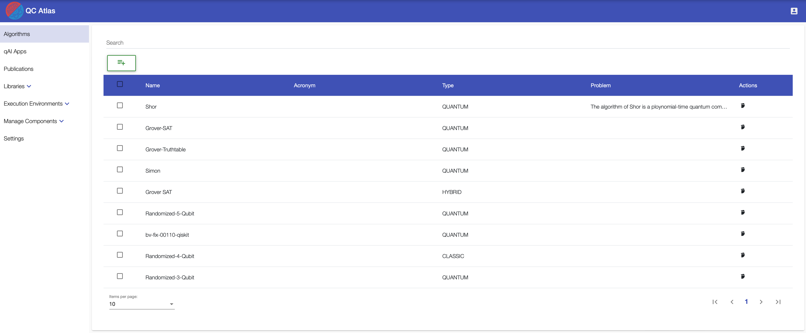

### Execution Environments: QPUs and Cloud Services
Available QPUs are automatically retrieved by [QProv](https://github.com/UST-QuAntiL/qprov), a provenance system for quantum computing by [Weder et al.](https://ietresearch.onlinelibrary.wiley.com/doi/10.1049/qtc2.12012). 
A description of how to view actual QPU data is presented under the [QProv](qprov.md) section.
Currently, only real QPUs of the cloud service `IBMQ` are supported.

!!! note 
    If available, sample data is automatically added to the environment on start-up, thus, the cloud service `IBMQ` does not need to be added, and the following information can be ignored.

`Cloud Services` (under `Execution Environments` in the menu on the left side), e.g. IBMQ, are required and need to be added to run the [Implementation and QPU Selection](#running-the-nisq-analyzer-for-implementation-and-qpu-selection), see the [Cloud Service](../user-guide/qc-atlas/cloud-service.md) section to add new cloud services. 

### Algorithms
To add a new algorithm, see the [Algorithm](../user-guide/qc-atlas/algorithm.md) section. In short, click on the green add button in the top left corner of the starting screen (displayed above), select the type of the algorithm, and define its name.

### Implementations
To add a new implementation, see the [Implementation](../user-guide/qc-atlas/implementation.md) section. In short, starting from the starting screen, select an algorithm and go to the `Implementations` tab. Click the green add button in the top left corner and define the name of the implementation. 

### Required Implementation Properties 

In the following the required information and conditions of implementations for the recommendation via the NISQ Analyzer are presented.

#### **Prerequisites of Implementations**
To support the insertion of various input parameters for the [implementation and QPU selection](#running-the-nisq-analyzer-for-implementation-and-qpu-selection), the Python source code, i.e., Qiskit code of the defined implementation requires a `get_circuit` method, see this [example](https://raw.githubusercontent.com/UST-QuAntiL/nisq-analyzer-content/master/example-implementations/Shor/shor-general-qiskit.py).  
Such general implementations are currently not supported by the [automated compiler comparison](#running-the-nisq-analyzer-for-compiler-comparison) and [QPU selection](#running-the-nisq-analyzer-for-qpu-selection). Therefore, concrete circuits are required, see this [example](https://raw.githubusercontent.com/UST-QuAntiL/nisq-analyzer-content/master/compiler-selection/Shor/shor-fix-15-qasm.qasm). In case of Qiskit code, the implementation should either also define a `get_circuit` method, see this [example](https://raw.githubusercontent.com/UST-QuAntiL/nisq-analyzer-content/master/example-implementations/Grover-SAT/grover-fix-sat-qiskit.py), or be called `qc`, as shown [here](https://raw.githubusercontent.com/UST-QuAntiL/nisq-analyzer-content/master/compiler-selection/Shor/shor-fix-15-qiskit.py). Implementations in PyQuil for the Forest SDK should define the Program as `p`, see this [example](https://raw.githubusercontent.com/UST-QuAntiL/nisq-analyzer-content/master/compiler-selection/Shor/shor-fix-15-pyquil.py).

Implementation properties specific to the NISQ Analyzer are inside the `Selection Criteria` tab of a selected implementation.

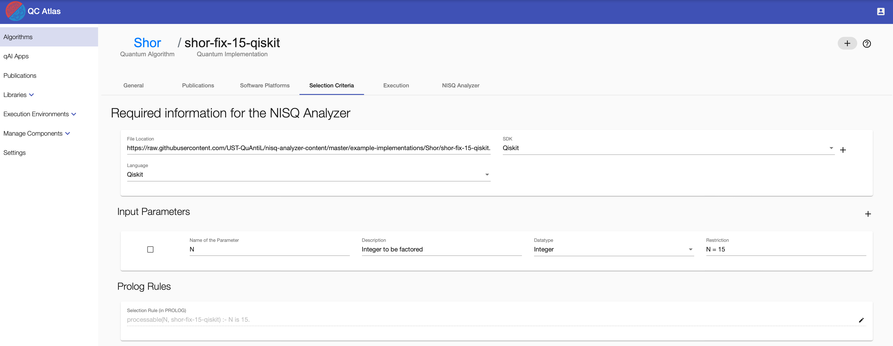

Define the `File Location` as URL where the raw implementation is placed.
Select (or add) the `SDK` and select the `Language` of the implementation. 

!!! note 
    `Input Parameters` and `Selection Rule` are only required for the [Implementation and QPU Selection](#running-the-nisq-analyzer-for-implementation-and-qpu-selection) to define constraints about processable input values of the related implementation. Based on the [settings](../user-guide/qc-atlas/settings.md), both fields are hidden.  

To add new input parameters, press the `+` button on the right side of `Input Parameters`. Afterwards, insert the necessary data into the fields of the created input parameter.
To delete an input parameter, select the card on the left side and press the `-` button on the right, next to the heading `Input Parameters`.
The Prolog Rule, i.e., `Selection Rule` can be changed as well. Make sure that the rules follow correct Prolog Syntax, examples can be viewed in the work of [Salm et al.](https://link.springer.com/chapter/10.1007/978-3-030-64846-6_5).

To save all changes, press the round button on the right side.

## Running the NISQ Analyzer for QPU Selection
To receive recommendations for compilation results and related QPUs based on a specific implementation, go to the `NISQ Analyzer` tab in context of an implementation.  
A demo video can be viewed [here](https://vimeo.com/773722924).
Currently, the SDKs and compilers [t|ket>](https://github.com/CQCL/pytket), [Quilc](https://github.com/rigetti/quilc), and [Qiskit Transpiler](https://github.com/Qiskit) are supported wrapped by Compilation & Execution Services [pytket-service](https://github.com/UST-QuAntiL/pytket-service), [forest-service](https://github.com/UST-QuAntiL/forest-service), and [qiskit-service](https://github.com/UST-QuAntiL/qiskit-service).
To support SDKs not supporting the initial programming language of the given quantum circuit, the backend of the [Circuit Transformer](./circuit-transformer.md) is used to translate the circuit into the required language.
The [Predict & Prio Service](https://github.com/UST-QuAntiL/nisq-analyzer-prio-service) enables the pre-selection and prioritization of compilation results.

### Overview of Analysis Jobs

Initially, an overview about previous analysis jobs for the specific implementation is given.

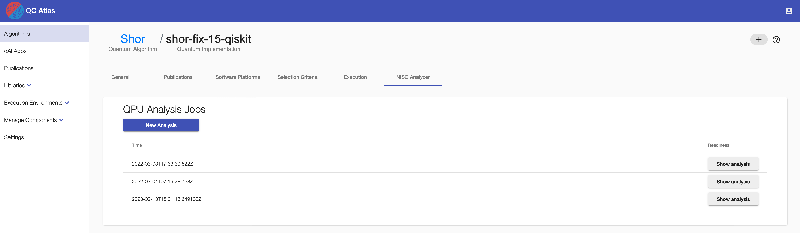

### New Analysis

To start a new analysis, click the `New Analysis` button.
Then, select `IBMQ` and insert your Qiskit token for authentication purposes of the IBMQ service.
In addition, pre-defined preferences about the execution can be defined, such as short waiting times or precise/stable execution results. If stable execution results are selected, advanced settings are shown up, enabling the selection of Machine Learning methods estimating the precision of future execution results. Based on case studies, the best performing method is selected as default. If stable execution results and short waiting times are selected, the importance ratio can be defined.
Furthermore, the maximum number of compilation results can be selected and the SDK to be considered for compilation can be chosen.

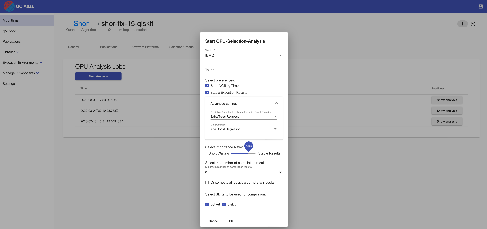

### Analysis Result

The analysis job is finished if the ``Show analysis`` button occurs on the right side.
When clicking on it, pre-selected compilation results with their related QPUs (and simulators), properties, QPU characteristics, and used compilers are listed.

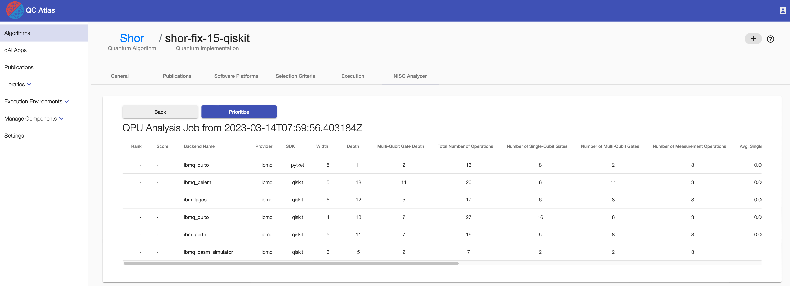

### Prioritization

The list of compilation results can be ranked, based on the work of [Salm et al.](https://ieeexplore.ieee.org/document/9825780) and [Salm et al.](https://link.springer.com/chapter/10.1007/978-3-031-18304-1_9) by clicking the `Prioritize` button.
Again, pre-defined preferences can be selected. When selected, advanced settings are shown up, enabling the selection of a given MCDA method calculating the ranking. Additionally, when stable execution results are desired, a weight learning method, i.e., optimizer can be selected, that calculates the importance, i.e., weights of the individual compilation result and QPU properties for future precise execution results. Based on case studies, the best performing optimizer is selected as default. If both preferences are selected, the importance ratio can be defined.

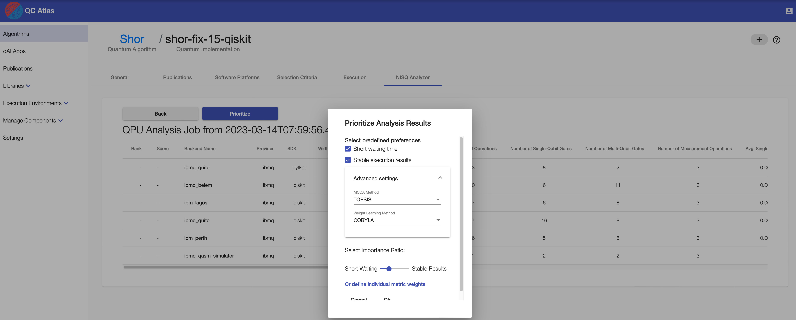

Alternatively, own weights can be defined by clicking `Or define individual metric weights`.

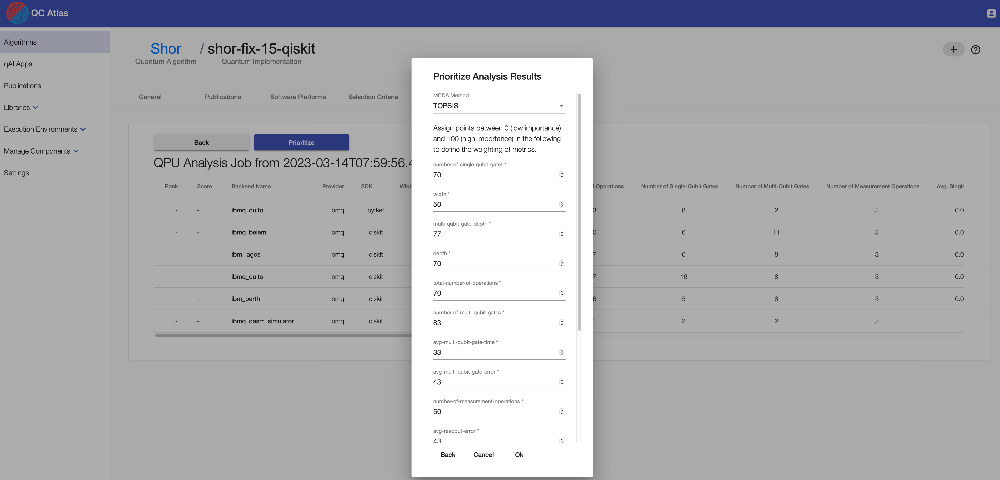

The pop-up enables to select an available MCDA method that calculates the ranking and to adjust the importance of the individual properties, i.e., metrics used for prioritization.

In case, stable results are desired, after clicking `Ok`, the weights are first learned.

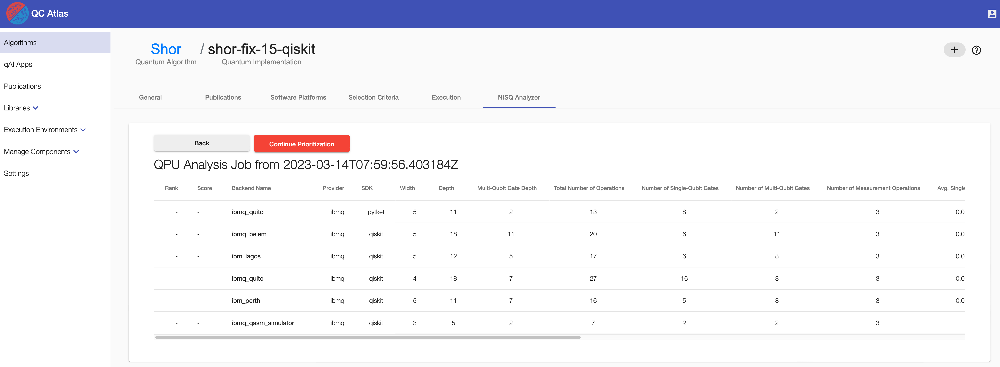

As soon as the learning process is completed, the weights can be viewed, adapted, and the ranking can be calculated. The weights are normalized between 0 and 1. Thus, a weight close to 1 is high, i.e., the metric has high importance, whereas a weight close to 0 is small, i.e., the metric has less importance.

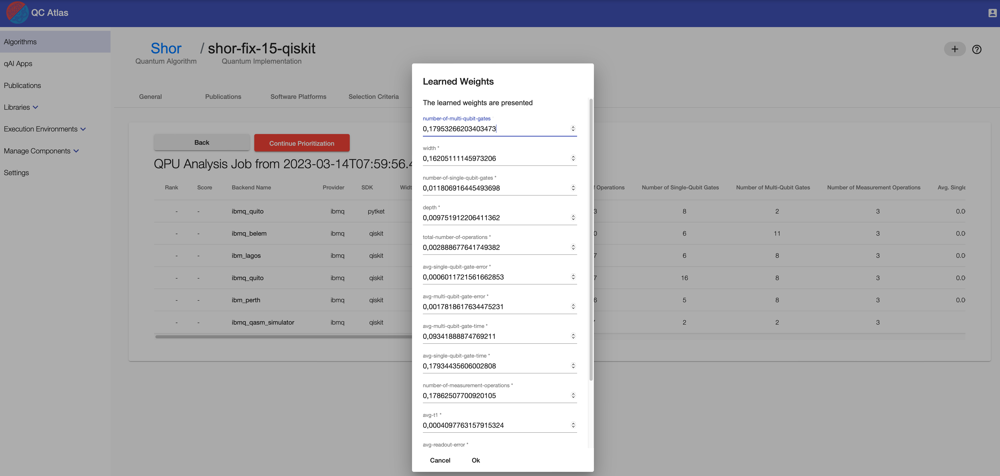

After the prioritization process completes, the table is sorted by the resulting rank.

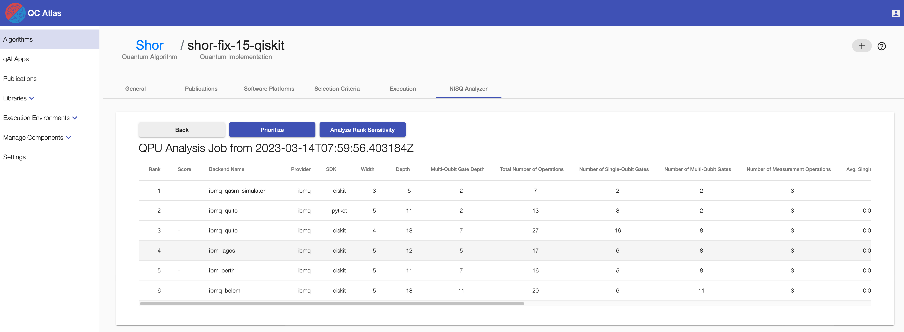

Furthermore, the sensitivity of the calculated ranking can be analyzed by clicking the `Analyze Rank Sensitivity` button. Thereby, the weights of the individual metrics are slightly adapted by a specified range of factors, and it is checked, if the ranking has changed.

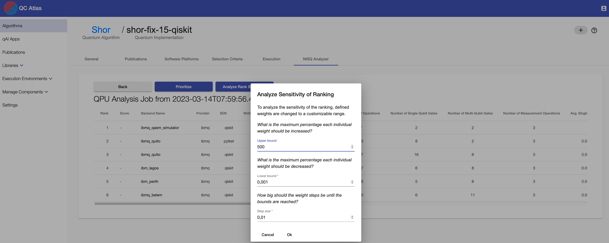

As soon as the sensitivity analysis is finished, a `Sensitivity Analysis Results` button occurs.
When clicking it, a new tab opens presenting two diagrams. Points in the diagram show if for the adaption of a specific metric a change in the ranking was observed. When hovering over these points, the changed ranking can be seen. Significant changes, thus, order changes in the first half of the original ranking are marked with a star.

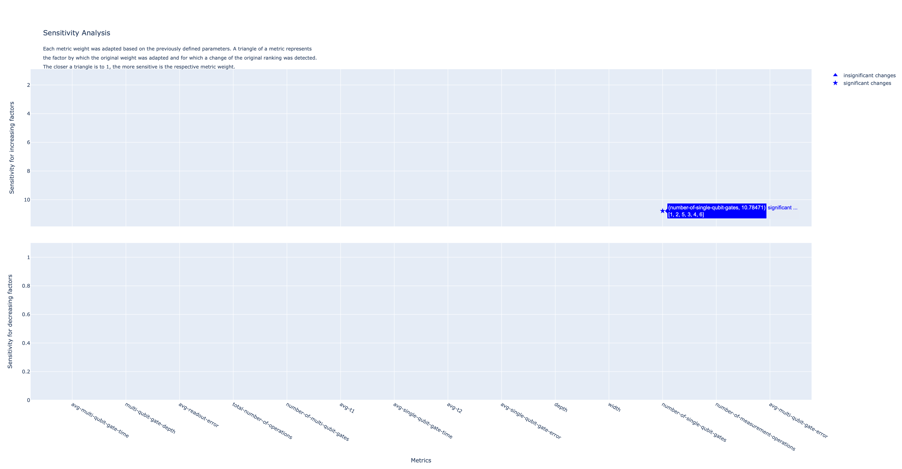

### Execution

In the overview of analysis results, scroll to the right of the table and press the button `Execute` to run a compilation result on the selected QPU.

By clicking `Show result` the result of the executed compilation result on the selected QPU is shown.

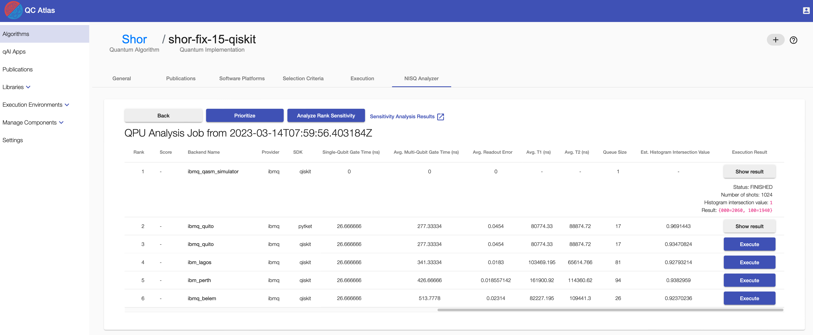

## Running the NISQ Analyzer for Compiler Comparison
To compare the compilation results of several compilers for a specific QPU, go to the `Execution` tab of a specific implementation (next to `Selection Criteria`). 
A video demonstrating the compiler comparison process can be found [here](https://www.youtube.com/watch?v=I5l8vaA-zO8&feature=youtu.be).
Currently, the quantum compilers [t|ket>](https://github.com/CQCL/pytket), [Quilc](https://github.com/rigetti/quilc), and [Qiskit Transpiler](https://github.com/Qiskit) are supported.
To support quantum compilers not supporting the initial programming language of the given quantum circuit, the backend of the [Circuit Transformer](./circuit-transformer.md) is used to translate the circuit into the required language.

### Start new Compilation

To start a new compilation, click the `New Compilation` button and insert the vendor name, qpu name, and your token.

!!! note 
    Currently, only real quantum computers of `IBMQ` are supported, thus, in this case, your IBMQ token is required.  
    For using the simulator of Forest (e.g. QPU = `9q-qvm`), insert anything else as token.

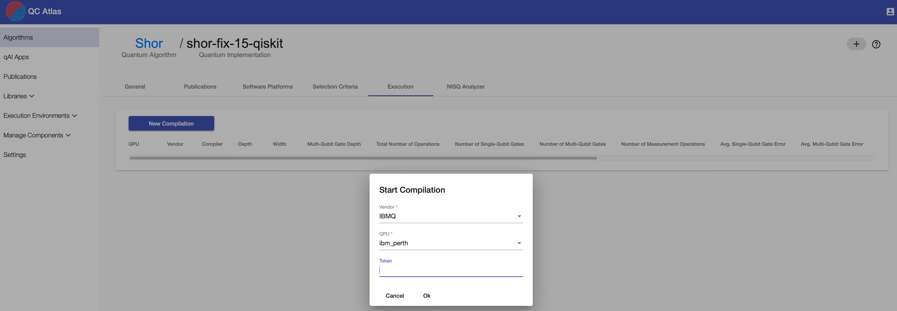

As soon as the compilation processes are finished, the list of compilation results, the related QPU, and their properties are presented.

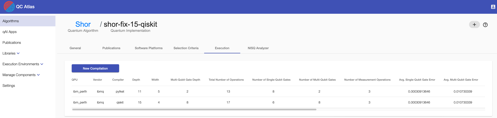

### Execute a Compiled Circuit

Click the `Execute` button of the desired compilation result scrolling to the right side of the table to start the execution.   
Click the `Show result` button on the chosen compilation result and click on it to display the execution result.

## Running the NISQ Analyzer for Implementation and QPU Selection

### Prerequisites

* The cloud service `IBMQ` exists
* The algorithm contains at least one implementation

To enable the recommendation of implementations and QPUs based on given input data and a selected quantum algorithm, go to the `NISQ Analyzer` tab of an algorithm.

### New Analysis

Initially, an overview about previous analysis jobs is given. Click the `New Analysis` button to start a new analysis. Define the input value to be processed, select `IBMQ` as cloud service in the dropdown menu and insert your Qiskit token for authentication purposes of the IBMQ service. 

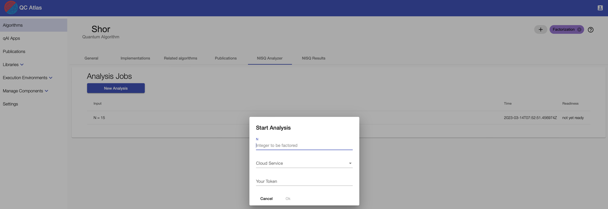

If the analysis is finished, a `Show analysis` button appears, that can be clicked to see the analysis results.

### Analysis Result

After clicking `Show analysis`, all results of the specific analysis are shown. 
Furthermore, the compilation result and properties of the suitable simulators and QPUs are shown.
Press the button `Execute` to run the selected QPU/implementation combination.
All analysis results are stored and can also be viewed on the `NISQ Results` tab.

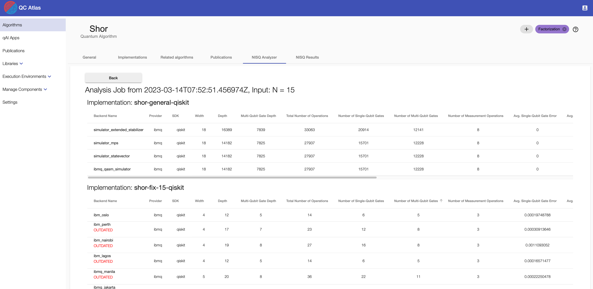

Additionally, it is checked if the QPUs were re-calibrated after the analysis (marked as `OUTDATED`), changing their error rates and, thus, the compilation results might be outdated as well, such that a new analysis is recommended for execution.

### Execution Result

Click the `Execute` button of the desired compilation result of a recommended implementation scrolling to the right side of the table to start the execution.   
Click the `Show result` button on the chosen compilation result and click on it to display the execution result.
Keep in mind that the execution itself can take quite long time.

### Historical data about Implementation and QPU Selection

Previous analysis and execution results can be found on the `NISQ Results` tab.

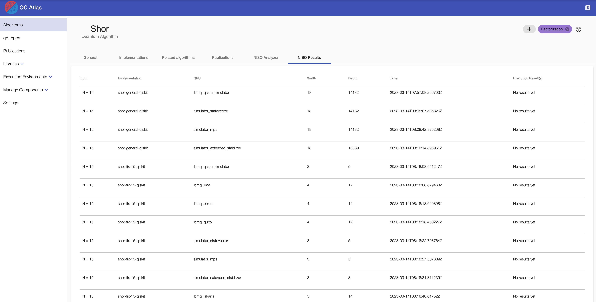

If the respective analysis result has been executed, the outcome of said execution can be viewed as well.

## Accessing the PlanQK Platform

Algorithms and implementations available via the PlanQK platform, can be accessed for the QC Atlas and NISQ Analyzer by clicking the login button in the top right corner of the UI. Insert your PlanQK platform username and password.

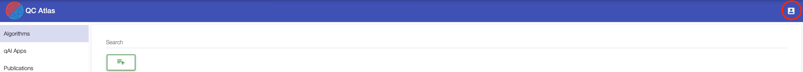

As soon as the platform content is available, the NISQ Analyzer can be applied to implementations fulfilling the required conditions, as described above.