# NISQ Analyzer User Guide
The [NISQ Analyzer](https://github.com/UST-QuAntiL/nisq-analyzer) is a research prototype based on the work by [Salm et. al](https://link.springer.com/chapter/10.1007/978-3-030-64846-6_5). 
It automatically analyzes implementations of quantum algorithms. 
The results indicate if a quantum algorithm can be executed on a Quantum Processing Unit (QPU) or simulator, see [below](#running-the-nisq-analyzer-for-implementation-and-qpu-selection).  
It also enables the analysis and selection of suitable QPUs based on a specific quantum algorithm implementation, see [below](#running-the-nisq-analyzer-for-implementation-and-qpu-selection).  
Furthermore, it enables the automated comparison of available quantum compilers to support the selection of the most suitable compiled quantum circuit, see [below](#running-the-nisq-analyzer-for-compiler-comparison).  
An overview about the NISQ Analyzer and its used components can be viewed in the [Home Section](../index.md).

### SDKs, QPUs, and Cloud Services

QC Atlas' `Software Platforms` get mapped to SDKs. 
This mapping happens automatically when opening a Software Platform in the UI.   
QPUs are automatically retrieved by [QProv](https://github.com/UST-QuAntiL/qprov) a provenance system for quantum computing.   
`Cloud Services` are required to run the [Implementation and QPU Selection](#running-the-nisq-analyzer-for-implementation-and-qpu-selection).  
Currently, only real quantum computers of the cloud service `IBMQ` are supported.

### Implementations

`Implementations` in QC Atlas are mapped to Implementations in the NISQ Analyzer DB.
Again, this mapping happens automatically when opening an Implementation in the UI.

Implementation properties specific to the NISQ Analyzer are inside the `Selection Criteria` tab.

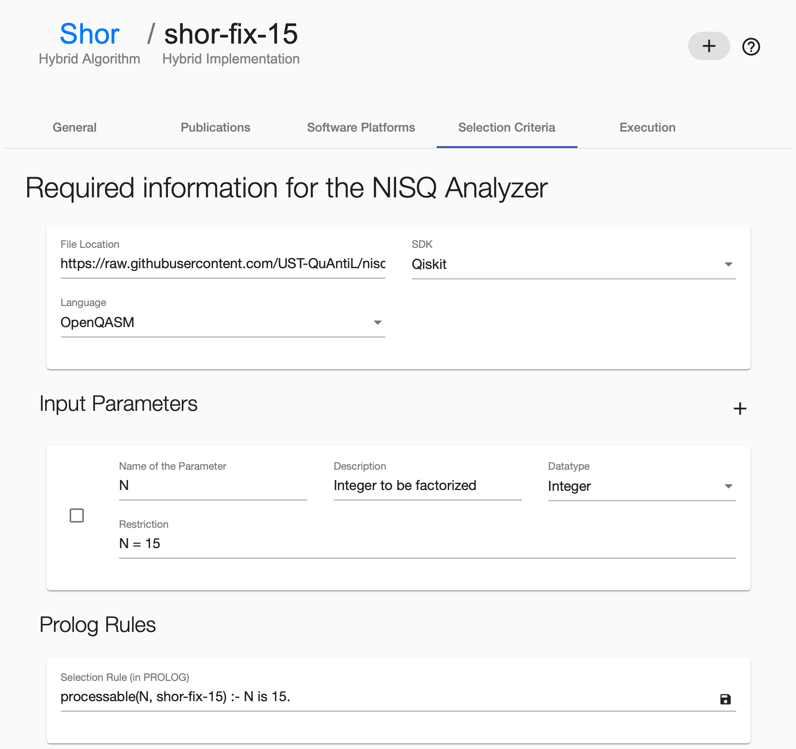

Define the `File Location` as URL where the raw implementation is placed.
Select the previously added `Software Platform` and select the `Language` of the implementation. 

To add new input parameters press the `+` button on the right side of `Input Parameters`. Afterwards, insert the necessary data into the fields of the created Input Parameter.
To delete an Input Parameter, select the card on the left side and press the `-` button on the right, next to the heading `Input Parameters`.
Prolog Rules, e.g. `Selection Rule` can be changed as well. Make sure that the rules follow correct Prolog Syntax.

To save all changes press the round button on the right side.

!!! note 
    `Input Parameters` and `Selection Rule` are only required for the [Implementation and QPU Selection](#running-the-nisq-analyzer-for-implementation-and-qpu-selection).  
    
!!! note 
    To support the insertion of various input parameters, the source code of the defined general implementation requires a `get_circuit` method, see [example](https://raw.githubusercontent.com/UST-QuAntiL/nisq-analyzer-content/master/example-implementations/Shor/shor-general-qiskit.py). Further, such general implementations are currently not supported by the [automated compiler comparison](#running-the-nisq-analyzer-for-compiler-comparison). Therefore, concrete circuits are required, see [example](https://raw.githubusercontent.com/UST-QuAntiL/nisq-analyzer-content/master/compiler-selection/Shor/shor-fix-15-qiskit.py).

### Prerequisites

* The cloud service `IBMQ` exists
* The software platform of the implementation exists
* The algorithm contains at least one implementation

## Running the NISQ Analyzer for Implementation and QPU Selection

The UI can be found at the `NISQ Analyzer` tab in the algorithm page.

### Overview of Analysis Jobs

Initially, an overview about previous analysis jobs is given.

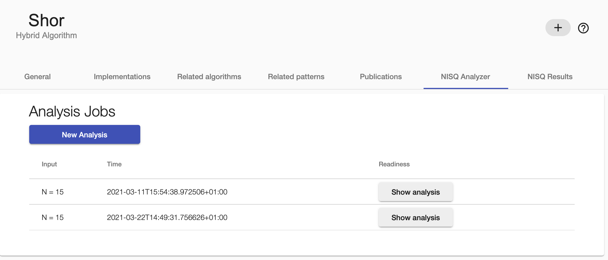

### New Analysis

To start a new analysis, click the `New Analysis` button.
Then, specify the input values. Afterwards, select `IBMQ` in the dropdown menu and insert your Qiskit token for authentication purposes of the IBMQ service.

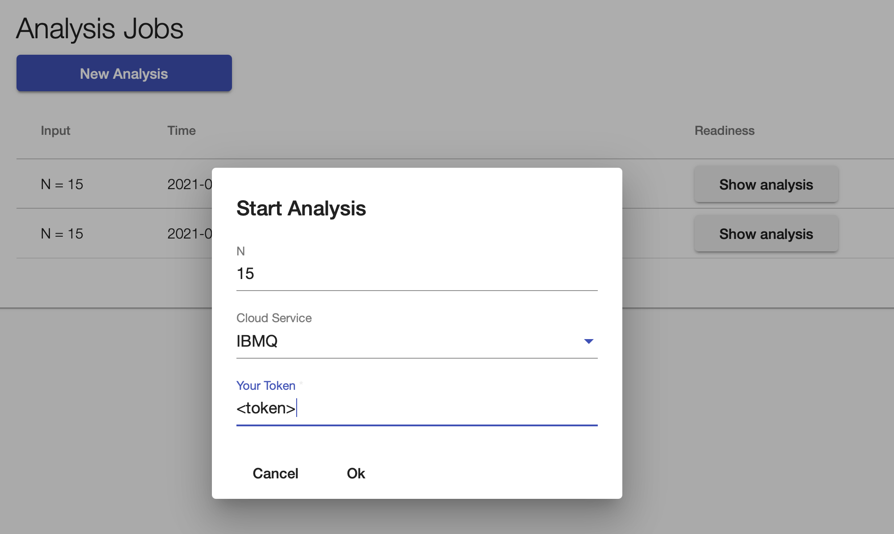

If the analysis is finished, a `Show analysis` button appears, that can be clicked to see more details.

### Analysis Result

After clicking `Show analysis`, all results of the specific analysis are shown. 
Furthermore, the current queue sizes of the suitable simulators and QPUs are shown.
Press the button `Execute` to run the selected QPU/implementation combination.
All analysis results are stored and can also be viewed on the `NISQ Results` tab.

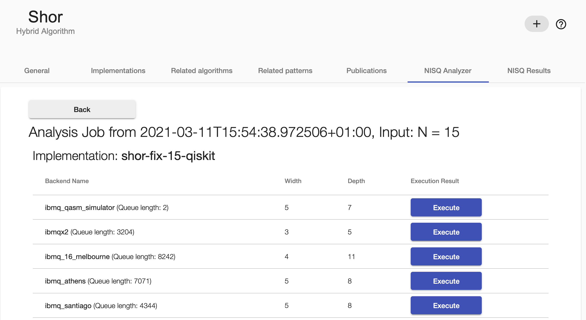

### Execution Result

By clicking `Show result` the result of the executed input/QPU/implementation tuple is shown.
Keep in mind that the execution itself can take quite long time.

All execution results are stored and can also be reviewed on the `NISQ Results` tab.

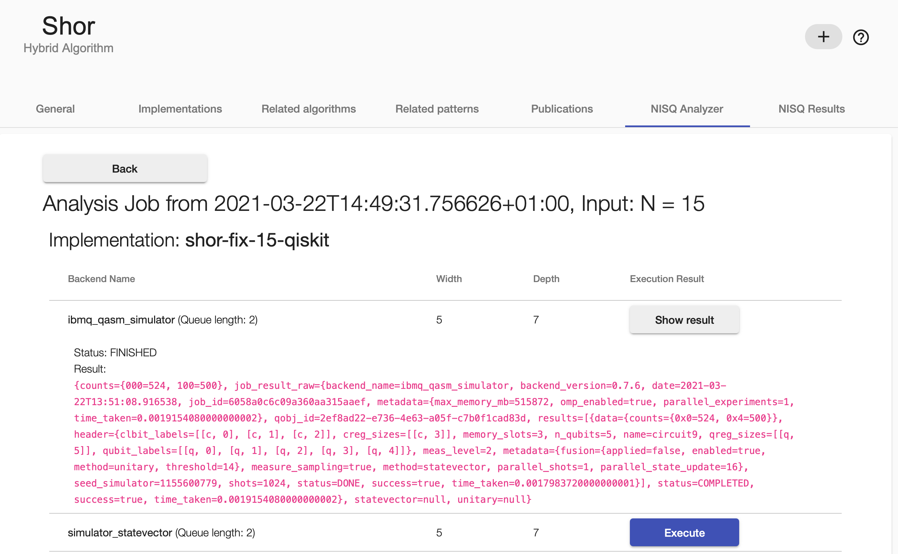

### Historical data about Implementation and QPU Selection

Previous analysis and execution results can be found on the `NISQ Results` tab.

If the respective analysis result has been executed, the outcome of said execution can be viewed as well.

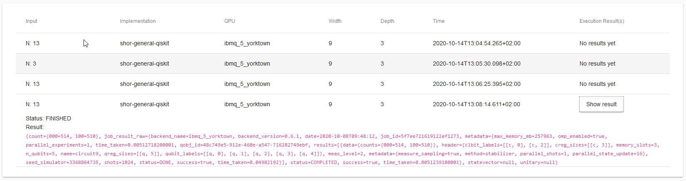

## Running the NISQ Analyzer for QPU Selection

The UI can be found at the `NISQ Analyzer` tab in context of the implementation page.

### Overview of Analysis Jobs

Initially, an overview about previous analysis jobs for the specific implementation is given.

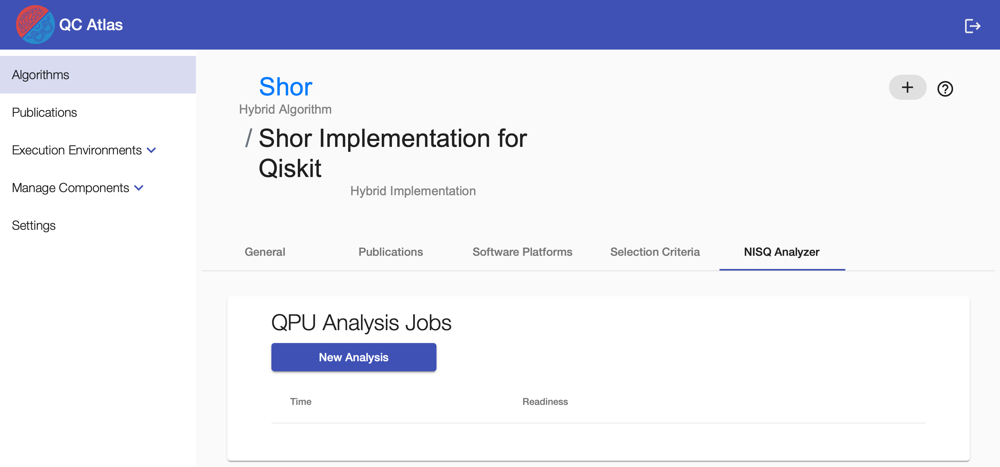

### New Analysis

To start a new analysis, click the `New Analysis` button.
Then, select `IBMQ` and insert your Qiskit token for authentication purposes of the IBMQ service.
You can also select if simulators should be included in the analysis.

### Analysis Result

The analysis job is finished if the ``Show analysis`` button occurs on the right side.
When clicking on it, suitable QPUs (and simulators) are listed.

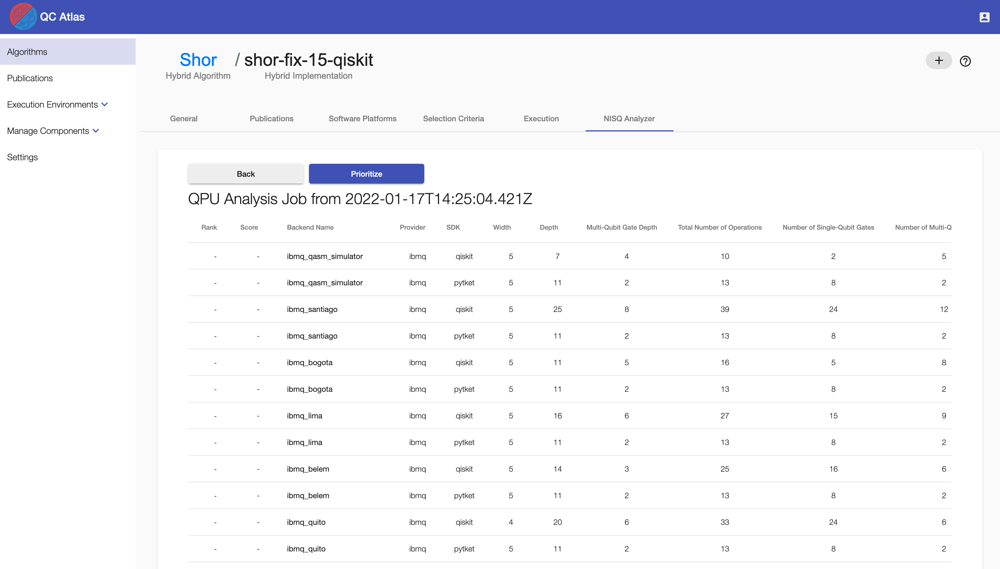

Press the button `Execute` to run the implementation on the selected QPU.

### Execution Result

By clicking `Show result` the result of the executed implementation on the selected QPU is shown.

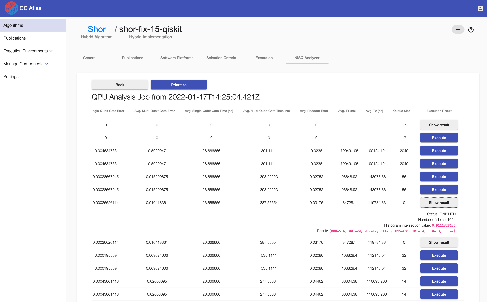

## Running the NISQ Analyzer for Compiler Comparison

The UI can be found at the `Execution` tab in the implementation page (next to `Selection Crietia`).  
A video demonstrating the compiler comparison process can be found [here](https://www.youtube.com/watch?v=I5l8vaA-zO8&feature=youtu.be).
Currently, the quantum compilers [t|ket>](https://github.com/CQCL/pytket), [Quilc](https://github.com/rigetti/quilc), and [Qiskit Transpiler](https://github.com/Qiskit) are supported wrapped by Compilation & Execution Services [pytket-service](https://github.com/UST-QuAntiL/pytket-service), [forest-service](https://github.com/UST-QuAntiL/forest-service), and [qiskit-service](https://github.com/UST-QuAntiL/qiskit-service).
To support quantum compilers not supporting the initial programming language of the given quantum circuit, the backend of the [Circuit Transformer](./circuit-transformer.md) is used to translate the circuit into the required language.

The `Execution` tab shows previous compilation results and enables the further compilations and executions of the given implementation.

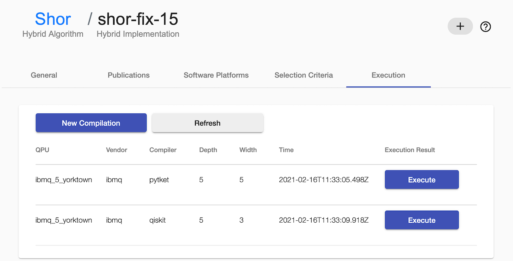

### Start new Compilation

To start a new compilation, click the `New Compilation` button and insert the vendor name, qpu name, and your token.

!!! note 
    Currently, only real quantum computers of `IBMQ` are supported, thus, in this case, your IBMQ token is required.  
    For using the simulator of Forest (e.g. QPU = `9q-qvm`), insert anything else as token.

Click `Refresh` a few times until the new compilation results are presented.

### Execute a Compiled Circuit

Click the `Execute` button of the desired compilation result to start the execution.   
Click the `Refresh` button to see the `Show result` button on the chosen compilation result and click on it to display the execution result.

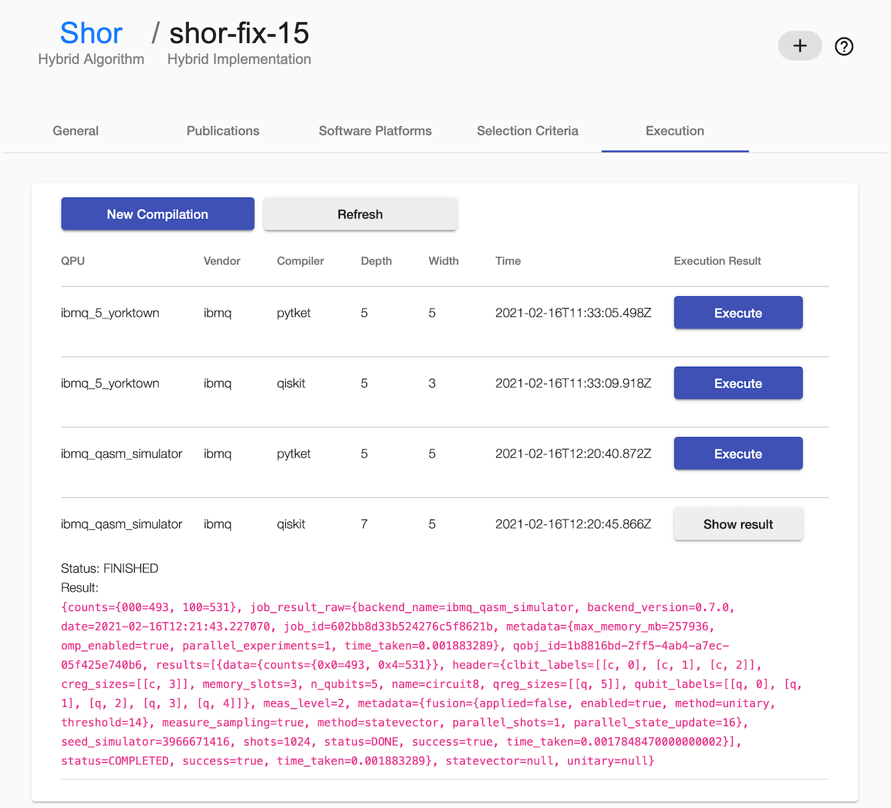

