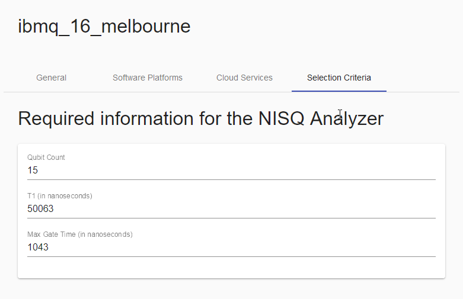
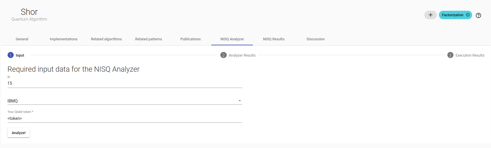
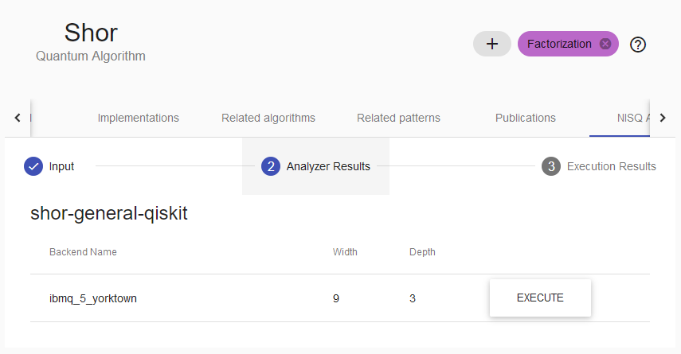

# NISQ Analyzer User Guide
The NISQ Analyzer is a research prototype based on the work by [Salm et. al](https://arxiv.org/abs/2003.13409). It automatically analyzes implementations of quantum algorithms. The results indicate if a quantum algorithm can be exectuted on a Quantum Computing Unit (QPU) or simulator.

## Adding selection criteria

### QPUs and SDKs

Atlas' `Compute Resources` are mapped to NISQ Analyzer QPUs, while `Software Platforms` get mapped to SDKs. This mapping happens automatically when opening a Compute Resource in the UI.

The NISQ Analyzer-specific properties can be found inside the `Selection Criteria` tab.

### Implementations

Implementations in Atlas are mapped to Implementations in the NISQ Analyzer DB.
Again, this mapping happens automatically when opening an Implementation in the UI.

Implementation properties specific to the NISQ Analyzer are inside the `Selection Criteria` tab.

To add new input parameters press the `+` button on the right side of `Input Parameters`. Afterwards, insert the necessary data into the fields of the created Input Parameter.

To delete an Input Parameter, select the card on the left side and press the `-` button on the right, next to the heading `Input Parameters`.

Prolog Rules, e.g. `Selection Rule` can be changed as well. Make sure that the rules follow correct Prolog Syntax.

To save all changes press the round button on the right side.

### Cloud Services

Cloud Services are not directly mapped to NISQ Analyzer objects but are required to run the selection process.

Currently, only the cloud service `IBMQ` is supported.

## Running the NISQ Analyzer

The UI can be found at the `NISQ Analyzer` tab in the algorithm page.

### Prerequisites

* The cloud service `IBMQ` exists
* The algorithm contains at least one Implementation
* At least one Compute Resource supporting an Implementation's SDK/Software Platform exists.

### Step 1: Input

Specify the input values below the heading. Afterwards, select `IBMQ` in the dropdown menu and insert your Qiskit token for authentification purposes of the IBMQ service.

### Step 2: Analyzer Results

The table shows all results of the analysis process. Press the button `Execute` to run the selected QPU/implementation combination.

All analysis results are stored and can be viewed on the `NISQ Results` tab.

### Step 3: Execution Results

This step shows the outcome and result of the executed input/QPU/implementation tuple.
Keep in mind that the execution itself can take q long time during which the UI only shows a progress spinner.

All execution results are stored and can be viewed on the `NISQ Results` tab.

## Historical data

Previous analysis and execution results can be found on the `NISQ Results` tab.

If the respective analysis result has been executed, the outcome of said execution can be viewed as well.

