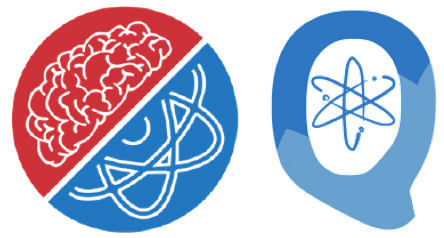

# Welcome to The QC Atlas User Guide
{: style="height:100px" .center}

## QC Atlas
QC Atlas is a platform for sharing quantum software as part of the [Quantum Application Lifecycle Management](https://github.com/UST-QuAntiL).

## Content
* [Overview](../user-guide/overview.md)
* [Algorithm](../user-guide/algorithm.md)
* [Publication](../user-guide/publication.md)
* [Implementation](../user-guide/implementation.md)