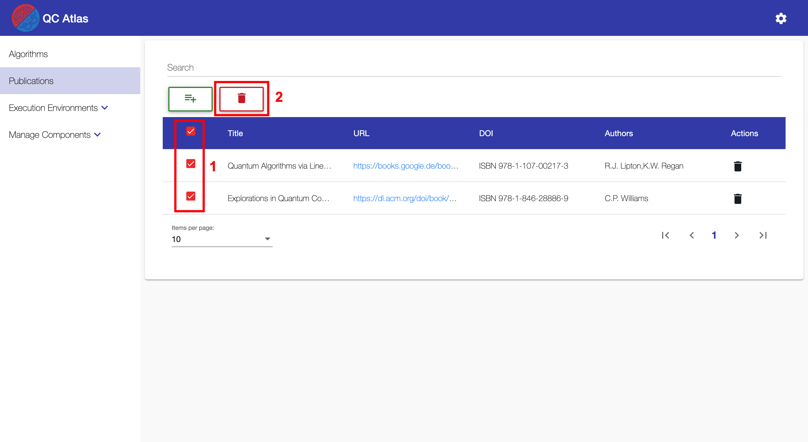
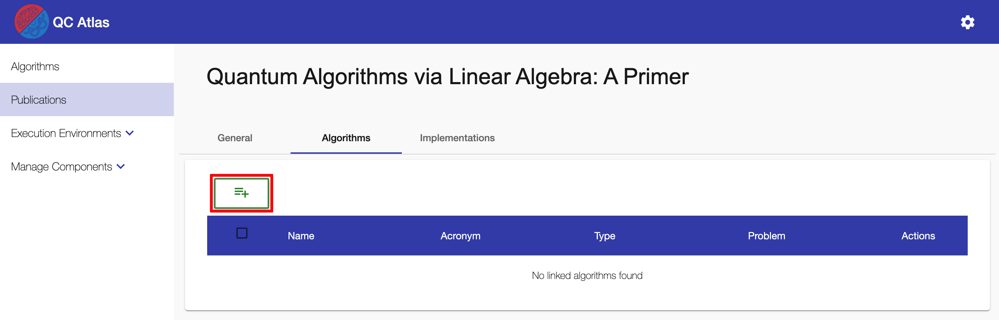

#
## Create Publication

To create a publication the user has to navigate to the ``Publication List View`` by using the navigation sidebar. This view displays a list of all available algorithms. Creating a new algorithm is done via the ``Plus Button`` which is located above the list.

Clicking on the ``Plus Button`` will open the following dialog.
In the dialog it is possible to give the new publication a title and assign multiple authors to the publication. A new author will be added by using the ``Add Author Button`` on the right side. An existing author will be removed using the ``Delete Author Button`` on the same side.

!!! note 
    To create a new publication a ``title`` and at least one ``author`` is required.

After all necessary fields have been filled in, the creation of the publication can be confirmed by clicking on the ``OK Button``. After a successfull creation, the user will be navigated to the detailed view of the new publication.

## Delete Publication

!!! info 
    To perform the deletion of a publication, the user has to be in the ``Publication List View``.

To remove a specific publication, the user has to simply click on the ``Delete Button`` in the ``Actions Column`` of the data table.

The user can also remove multiple publications at once by selecting them using the check-boxes of the data table. After the user has made his selection he can press the ``Master Delete Button`` at the top of the data table.

!!! note 
    The delete button will only appear after at least one publication has been selected by the user.
	

To confirm the deletion of the selected publication(s), the user has to click on the ``YES Button`` of the ``Confirmation Dialog``.

!!! note 
    **Titles** of publications that will be deleted are displayed in the body of the dialog and should be checked before confirming the deletion.
	

## Update Publication Information

!!! info 
    To update the information of a publication, the user has to be in the ``Publication View`` which can be reached by clicking on a publication in the ``Publication List View``.

Updating basic information is done in the ``General Tab`` of the ``Publication View``. To do that, the user has to simply use the ``Input fields``, ``Check-Boxes`` or ``Selection drop-downs`` to add new values or adjust existing ones.

If information is changed, a ``Save button`` will be displayed next that specific input field. Also, a ``Master Save button`` will appear at the right side of the screen. To save the changes of each input field individually, the user can click on the ``Save button`` next to any updated input field. Alternatively the user can save all changes by clicking the ``Master Save button``.

!!! note 
    The user can also hit ``Enter`` on the keyboard to save the changes of a single field in most cases. In some cases, it may be necessary to focus the ``Save button`` by hitting ``TAB`` on the keyboard and then confirming with ``Enter``.

## Reference Algorithms

!!! info
    To reference algorithms in an existing publication, the user has to be in the ``Publication View``.

In the ``Publication View`` of the publication, the user as to switch to the ``Algorithms Tab``, which is dedicated to referencing algorithms.
To link algorithms with the currently selected publication, the user has to click on the ``Plus Button`` at the top of the data table.

This will open a dialog with a separate data list of existing algorithms.
For referencing publications the user can now search the table and click on the ``Link`` button of an algorithm he wants to reference.

Alternatively, the users can use the check-boxes of the first column of the table to select all algorithms to reference. 
After at least one check-box is checked, a ``Master-Link`` button will appear at the top of the table which can be used to link all selected algorithms with the publication.

## Reference Implementations

!!! info
    Implementations can not be referenced from within the ``Publication View``.
    To reference implementations in an existing publication, the user has to navigate to the ``Publications Tab`` of the ``Implementation View`` of an algorithm.

