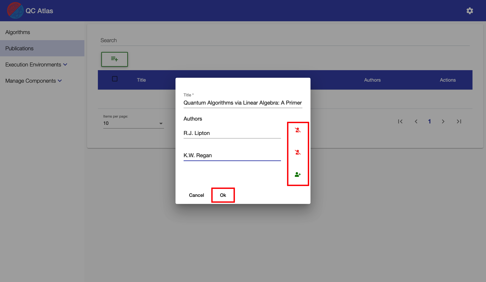
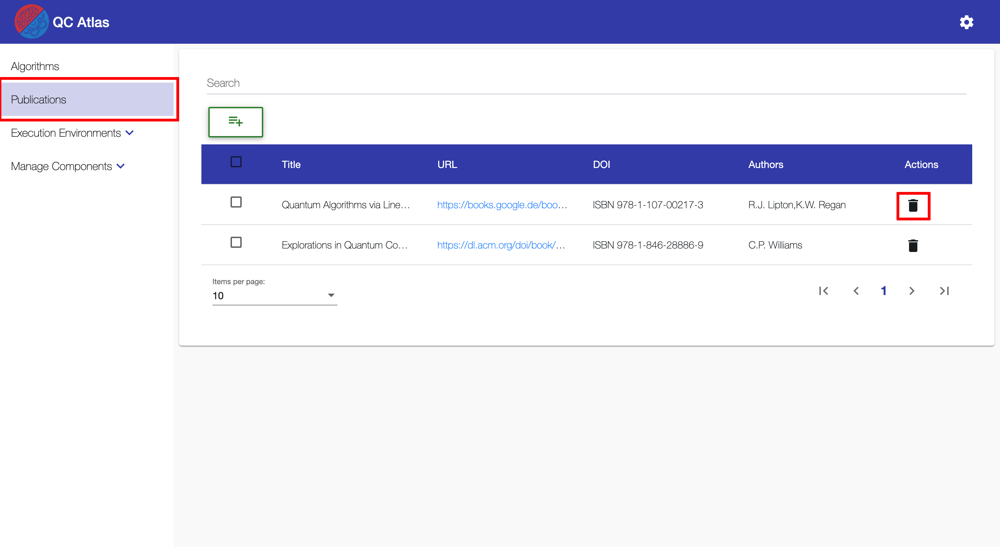
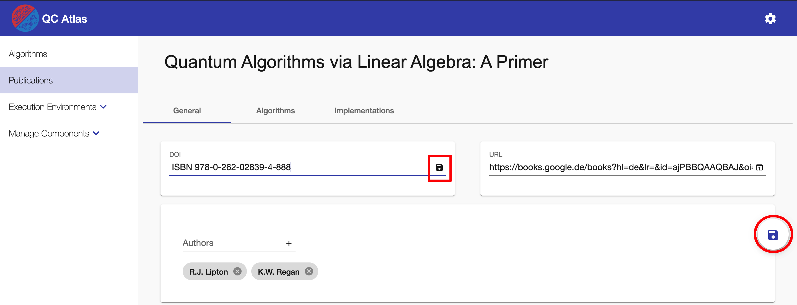

#
## Create Publication

To create a publication the user has to navigate to the ``Publication List View`` by using the navigation sidebar. This view displays a list of all available algorithms. Creating a new algorithm is done via the ``Plus Button`` which is located above the list.

Clicking on the ``Plus Button`` will open the following dialog.
In the dialog it is possible to give the new publication a title and assign multiple authors to the publication. A new author will be added by using the ``Add Author Button`` on the right side. An existing author will be removed using the ``Delete Author Button`` on the same side.

!!! note 
    To create a new publication a ``title`` and at least one ``author`` is required.

After all necessary fields have been filled in, the creation of the publication can be confirmed by clicking on the ``OK Button``. After a successfull creation, the user will be navigated to the detailed view of the new publication.

## Delete Publication

To delete a publication the user has to navigate to the ``Publication List View`` by using the navigation sidebar. A single publication will be deleted by pressing the ``Delete Button`` in the ``Actions``column of the table.

It is also possible to delete mulitple algorithms at once by selecting them one by one using the checkboxes within the table. When at least one algorithm is selected, a ``Master Delete Button`` will show up above the table. To delete the selected algorithms at once, this button must be pressed.

Both ways of deleting algorithm will lead to a confirmation dialog. This dialog will list all the previously selected algorthims that will be deleted. To finally confirm the deletion, the ``OK Button`` at the bottom of the dialog has to be pressed. After a successfull deletion the deleted algorithms will disappear from the table.

## Update Publication Properties

Updating the basic properties of an existing publication is achieved by navigating to the ``General Publication View``. 
To do this, you have to navigate to the ``Publication List View`` using the sidebar and click on the specific publication in the table.

After clicking the specific algorithm from the list, the ``General View``of the selected publication will be opened.
The ``General`` tab of the view, allows to adjust all basic properties of the publication.
A new author is assigned by typing the name into the input field and pressing the plus sign.

!!! note 
    To save any changes to the properties of a publication there are two options:

    * Save the changes on a field by field basis. For that the user has to click on the ``Save Button`` located next to the field that was edited. Alternatively the user can confirm the changes by pressing ``Enter`` on the keyboard. 

    * Save all changes at once by clicking on the round  ``Save Button`` button which appears at the right side of the screen.

## Reference Algorithms