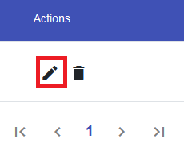
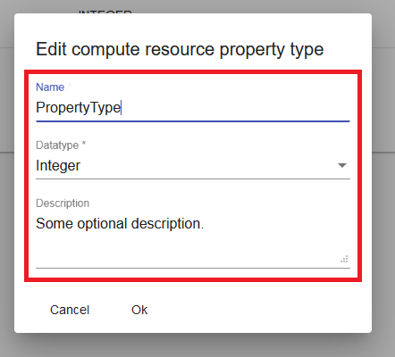
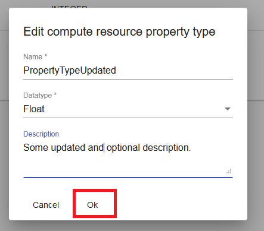
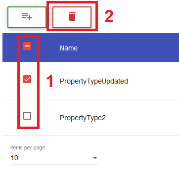

## Compute Resource Property Type 
### Create Compute Resource Property Type

!!! info 
    To create a compute resource property type, the user has to be in the ``Compute Resource Property Type List View`` which can be found in the ``Manage Components Menu``.
	
Inside the ``Compute Resource Property Type List View``, the user can click on the ``Plus Button`` to initiate the creation of a new compute resource property type inside a separate ``Creation Dialog``.

Within the ``Creation Dialog``, the user will have to enter all important information about the compute resource property he wants to create.

!!! note 
    * Currently the only required information is the **name** and the **data type** of the compute resource property type.
	* The **Data Type Field** is a drop-down that contains all existing data types that can be set.

	
After entering all required information, the user has to confirm the creation by clicking on the ``OK Button``.

!!! info 
    In case of a successful creation, the data table will switch to the last page (if not already) to show the created compute resource property type.
	
### Update Compute Resource Property Type

!!! info 
    To update a compute resource property type, the user has to be in the ``Compute Resource Property Type List View``, which can be found in the ``Manage Components Menu``.
	
Inside the ``Compute Resource Property Type List View``, the user can choose a compute resource property type he wants to update by clicking on it's ``Edit Button`` which can be found in the ``Actions Column`` of the data table.
This will open a ``Edit Dialog``.

Within the ``Update Dialog``, the user can adjust the information of the compute resource property type.

!!! note 
    * Currently the only required information is the **name** and the **data type** of the compute resource property type.
	* The **Data Type Field** is a drop-down that contains all existing data types that can be set.

	
After adjusting all information, the user has to confirm the changes by clicking on the ``OK Button``.

### Delete Compute Resource Property Type

!!! info 
    To perform the deletion of a compute resource property type, the user has to be in the ``Compute Resource Property Type List View``, which can be found in the ``Manage Components Menu``.
	
To delete a specific compute resource property type, the user has to simply click on it's ``Delete Button`` in the ``Actions Column`` of the data table.

The user can also remove multiple compute resource property types at once by selecting them using the check-boxes of the data table. After the user has made his selection he can press the ``Master Delete Button`` at the top of the data table.

!!! note 
    The ``Master Delete Button`` button will only appear if at least one compute resource property type is selected.

	
To confirm the deletion of the selected compute resource property type(s), the user has to click on the ``YES Button`` of the ``Confirmation Dialog``.

!!! note 
    **Names** of the compute resource property type(s) that will be deleted are displayed in the body of the dialog and should be checked before confirming the deletion.

