# 
## Create Implementation

!!! info 
    To create an implementation, the user has to be in the ``Algorithm View`` of a specific algorithm.

In the ``Algorithm View`` the user has to click on the ``Implementation Tab``, which opens the ``Implementation List View``.
This view contains all implementations of that algorithm. Within this view, a new implementation will be created via the ``Plus Button`` which is located above the list.

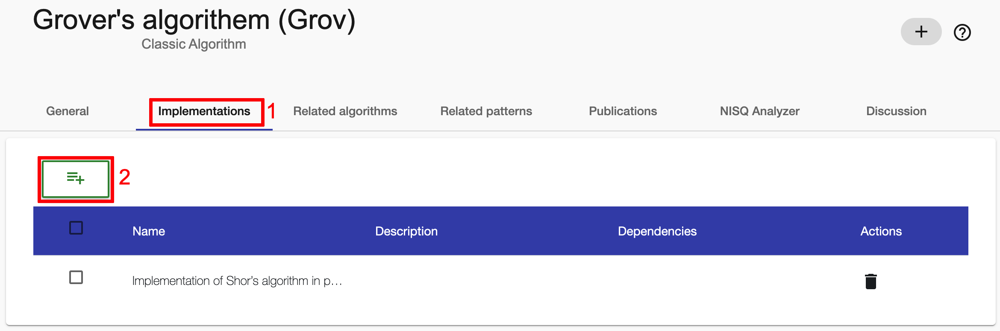

Clicking on the ``Plus Button`` will open the following dialog.
In the dialog it is possible to give the new implementation a name.

!!! note 
    To create a new implementation only a ``name`` is required.

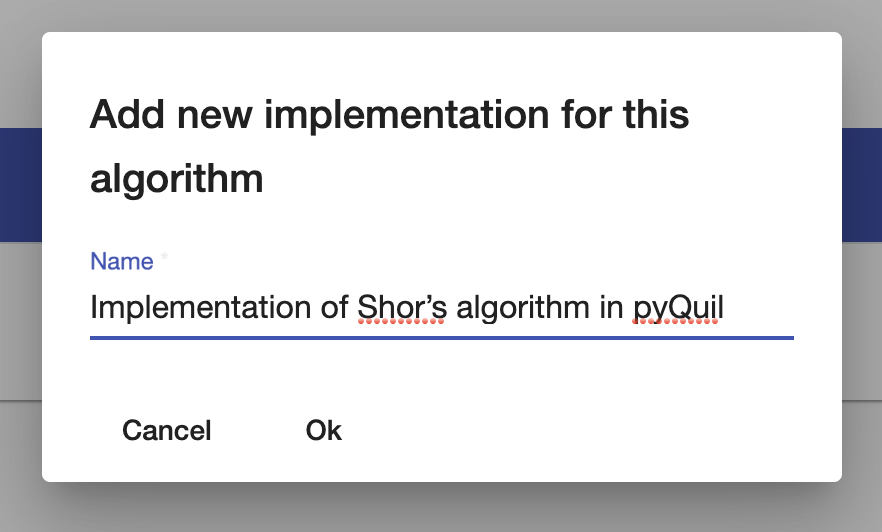

After all necessary fields have been filled in, the creation of the implementation can be confirmed by clicking on the ``OK Button``. After a successful creation, the user will be navigated to the ``Implementation View`` of the new implementation.

## Delete Implementation

!!! info 
    To delete an implementation, the user has to be in the ``Implementation Tab`` of the ``Algorithm View`` of a specific algorithm.

To delete a specific implementation, the user has to simply click on the ``Delete Button`` in the ``Action Column`` of the data table.

It is also possible to delete multiple implementations at once by selecting them one by one using the check-boxes within the table. When at least one implementation is selected, a ``Master Delete Button`` will show up above the table. To delete the selected implementations at once, this button must be pressed.

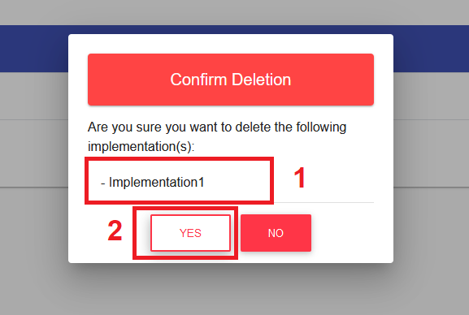

Both ways of deleting implementations will lead to a confirmation dialog. This dialog will list all implementations that were selected to be deleted. To finally confirm the deletion, the ``OK Button`` at the bottom of the dialog has to be pressed. A successfully deleted implementation will disappear from the ``Implementation List View``.

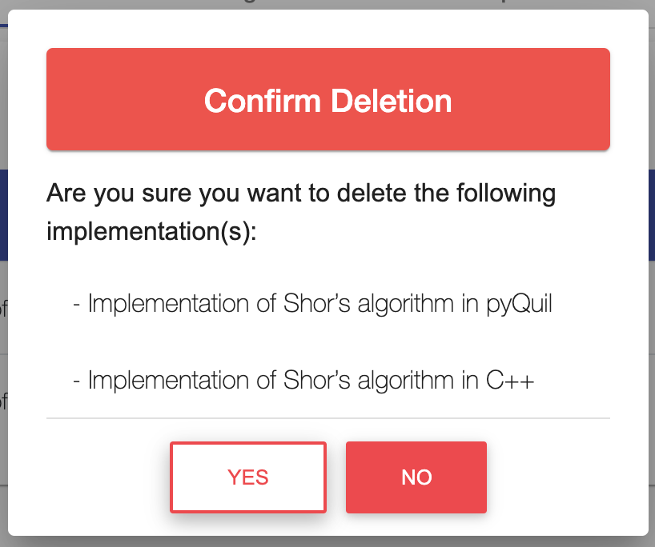

## Update Implementation Information

!!! info 
    To update the information of a implementation, the user has to be in the ``Implementation View``.

Updating basic information is done in the ``General Tab`` of the ``Implementation View``. To do that, the user has to simply use the ``Input fields``, ``Check-Boxes`` or ``Selection Drop-Downs`` to add new values or adjust existing ones.

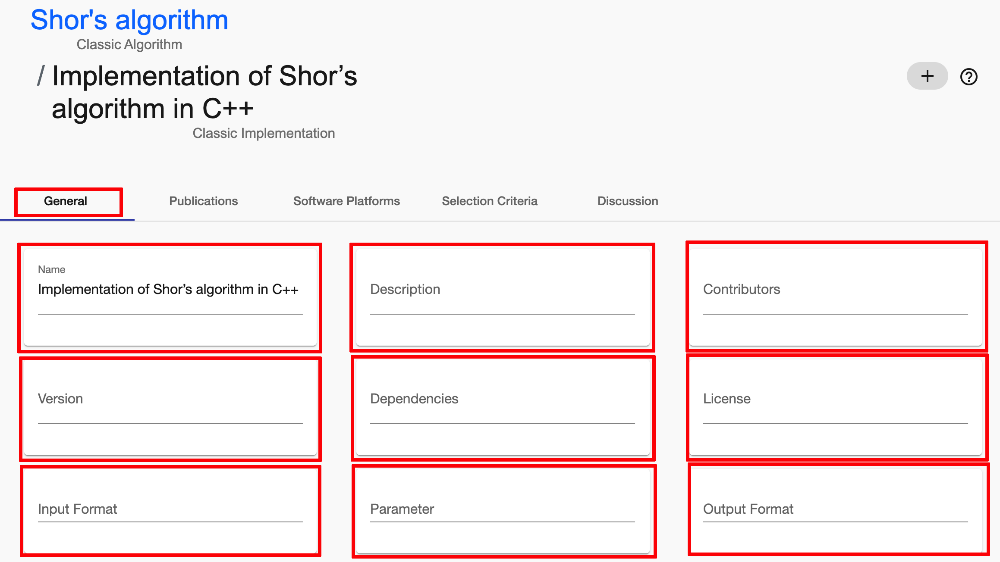

If information is changed, a ``Save Button`` will be displayed next that specific input field. Also, a ``Master Save Button`` will appear at the right side of the screen. To save the changes of each input field individually, the user can click on the ``Save Button`` next to any updated input field. Alternatively the user can save all changes by clicking the ``Master Save Button``.

!!! note 
    The user can also hit ``Enter`` on the keyboard to save the changes of a single field in most cases. In some cases, it may be necessary to focus the ``Save Button`` by hitting ``TAB`` on the keyboard and then confirming with ``Enter``.

## Create Compute Resource Properties

!!! info 
    To create a compute resource property for the implementation, the user has to be in the ``Implementation View`` which can be reached by clicking on an implementation in the ``Implementation List View``.

Creating properties for a compute resource is done in the ``General Tab`` of the ``Implementation View``.
To do that, the user has to simply click on the ``Plus Button`` of the dedicated ``Required Compute Resource Property Field``.

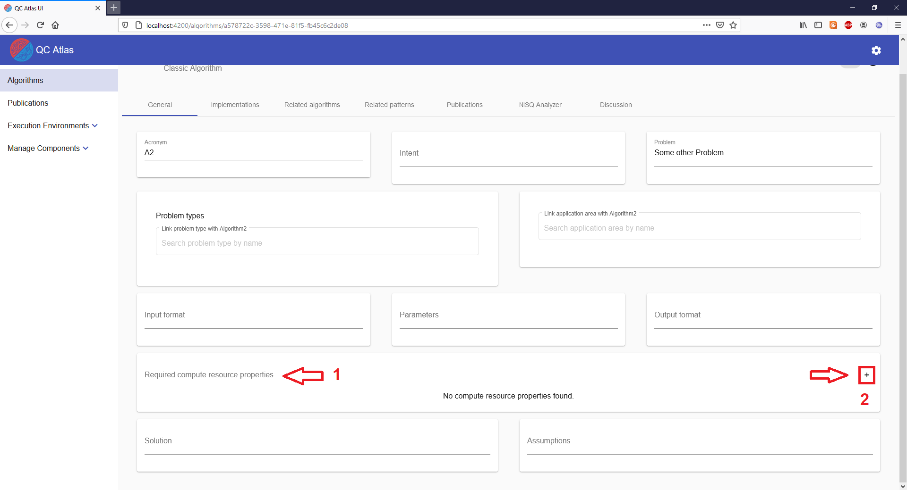

This will open a separate ``Creation Dialog`` where the user will have to enter all important information of about the property he wants to create.

!!! note 
	The **Type Name** field supports auto-completion functionality. While typing a type name, the system will suggest existing types with that name in a drop-down. If the user clicks on an existing type, all necessary fields will be filled automatically.

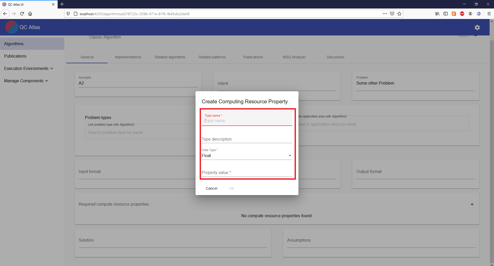

After all fields have been filled, the user can finally add the property by confirming the creation via the existing ``OK Button``.

!!! note 
	The **Property Value** needs to match the selected **Data Type**.

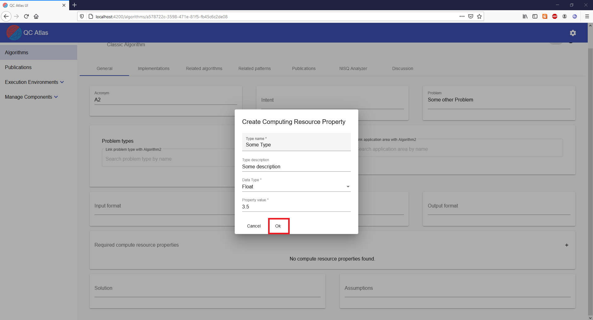

After the property has been successfully created, it will appear in the the dedicated ``Required Compute Resource Property Field`` within the``General Tab``.

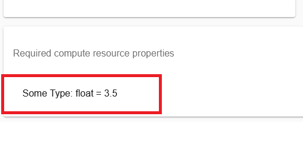

## Update Compute Resource Properties

!!! info 
    To update a compute resource property of an implementation, the user has to be in the ``Implementation View``, which can be reached by clicking on a algorithm in the ``Implementation List View``.

Updating existing compute resource properties of an implementation is done in the ``General Tab`` of the ``Implementation View``. To do that, the user has to simply hover over a existing property in the dedicated ``Required Compute Resource Property Field`` and then click on the ``Edit Button``.	
	
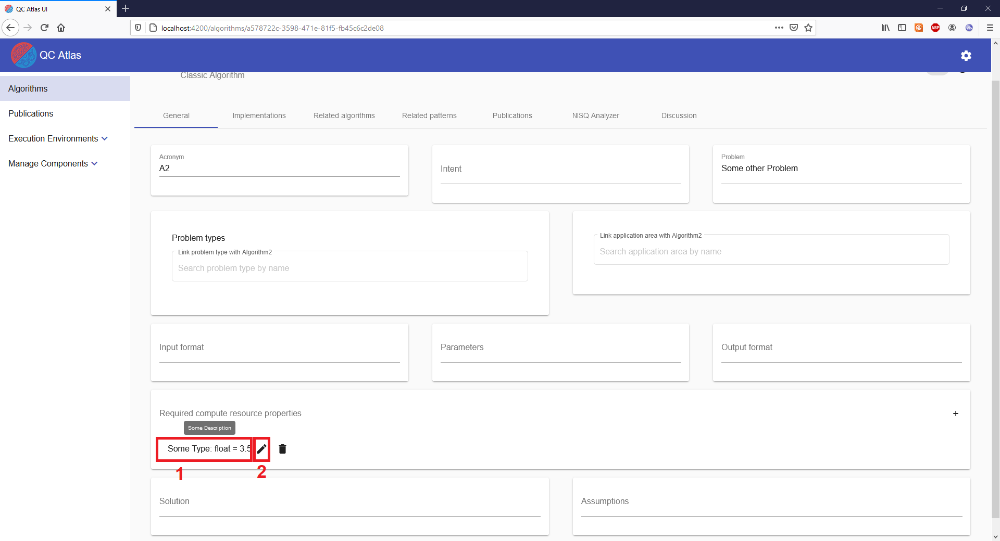

This will open a separate ``Update Dialog`` where the information of the property can be adjusted.

!!! note 
	The **Type Name** field supports auto-completion functionality. While typing a type name, the system will suggest existing types with that name in a drop-down. On click of an existing type, all necessary fields will be filled automatically.

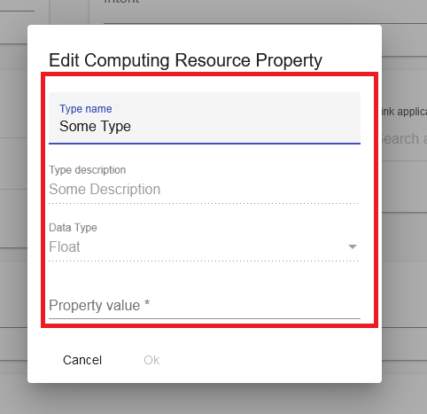

After all fields have been adjusted, the user can finally update the property by confirming the update via the existing ``OK Button``.

!!! note 
	The **Property Value** needs to match the selected **Data Type**.

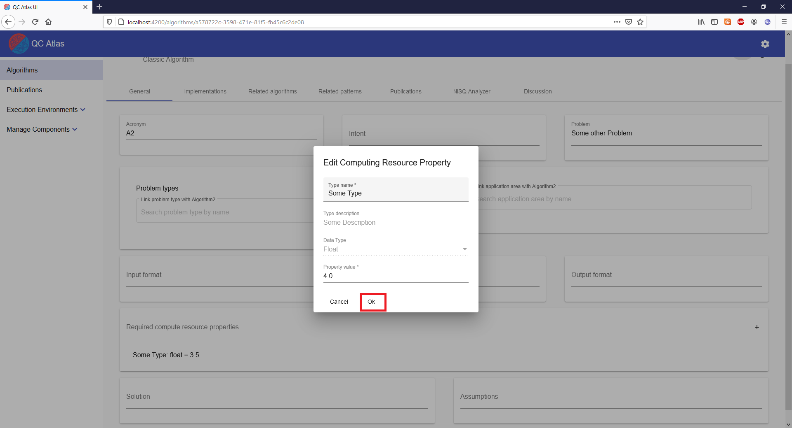

## Delete Compute Resource Properties

!!! info 
    To delete a property for an implementation, the user has to be in the ``Implementation View`` which can be reached by clicking on a compute resource in the ``Implementation List View``.
	
Deleting compute resource properties of an implementation is done in the ``General Tab`` of the ``Implementation View``.
To do that, the user has to simply hover over a existing property in the dedicated ``Required Compute Resource Property Field`` and then click on the ``Delete Button``.

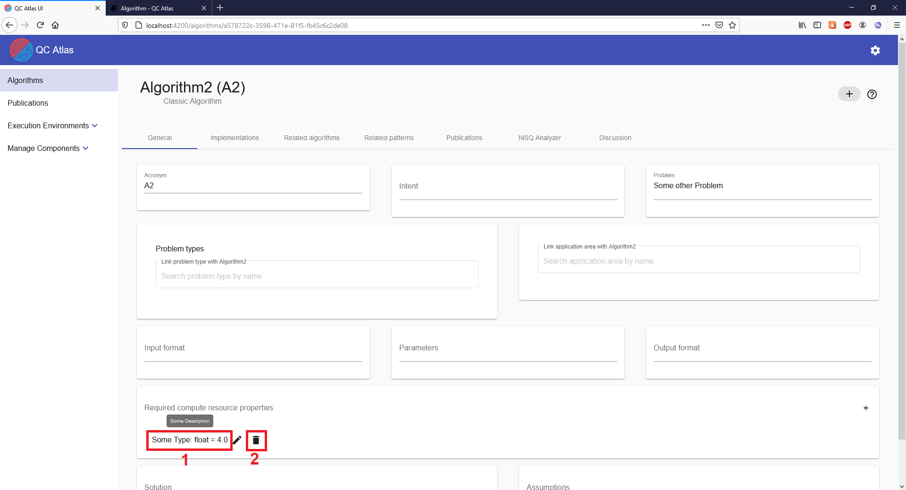

!!! info 
	A successfully deleted property should disappear from the dedicated ``Required Compute Resource Property Field``.

## Reference Publications

!!! info 
    To reference publications in an implementation, the user has to be in the ``Publications Tab`` of the ``Implementation View``, which can be reached by clicking on an implementation in the ``Implementation List View``.
	
To initiate the linking of a publication, the user has to click on the ``Plus Button`` in the ``Publications Tab``.

This will open a new dialog containing a page-able table of available publications. This table can be searched or sorted using the given input fields and buttons.

To reference a publication simply click on the ``Link Button`` in the ``Actions Column``.

Alternatively, use the check-boxes to select multiple publications and then click on the ``Master Link Button`` to link all of them at once.

!!! note 
    ``Master Link Button`` will only appear if at least one publication is selected.
	
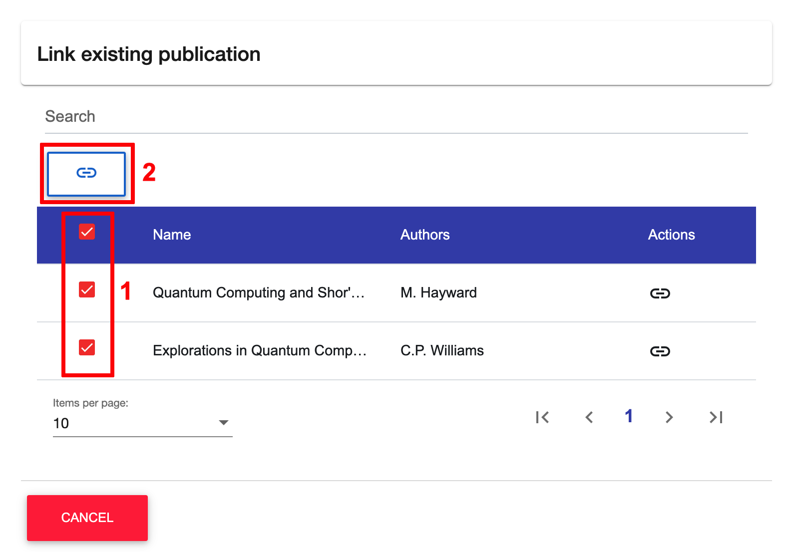

!!! info 
    Successfully referenced publications(s) will now be visible in the ``Publications Tab`` of the ``Implementation View``.

## Dereference Publications

!!! info 
    To dereference publications, the user has to be in the ``Publications Tab`` of the ``Implementation View``, which can be reached by clicking on an implementation in the ``Implementation List View``.
	
To remove a reference to a publication, the user has to simply click on the ``Delete Button`` of a publication in the ``Actions Column``.

Alternatively, use the check-boxes to select multiple publications and then click on the ``Master Delete Button`` to unlink all of them at once.

!!! note 
    ``Master Delete Button`` will only appear if at least one publication is selected.
	

## Reference Software Platforms

!!! info 
    To reference software platforms in an implementation, the user has to be in the ``Software Platforms Tab`` of the ``Implementation View``, which can be reached by clicking on an implementation in the ``Implementation List View``.
	
To initiate the linking of a software platform, the user has to click on the ``Plus Button`` in the ``Software Platforms Tab``.

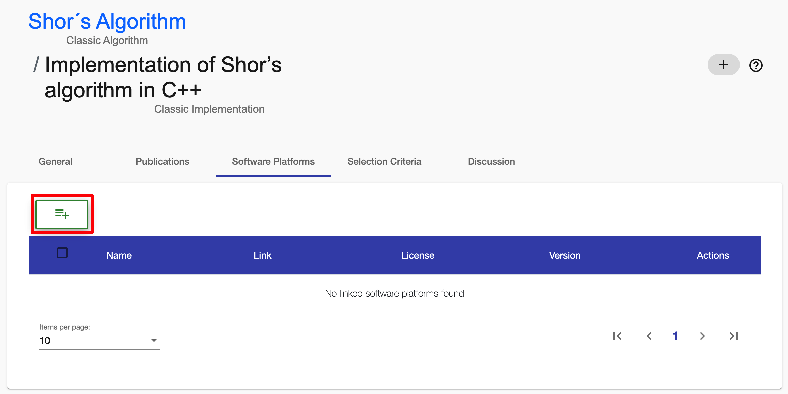

This will open a new dialog containing a page-able table of available software platforms. This table can be searched or sorted using the given input fields and buttons.

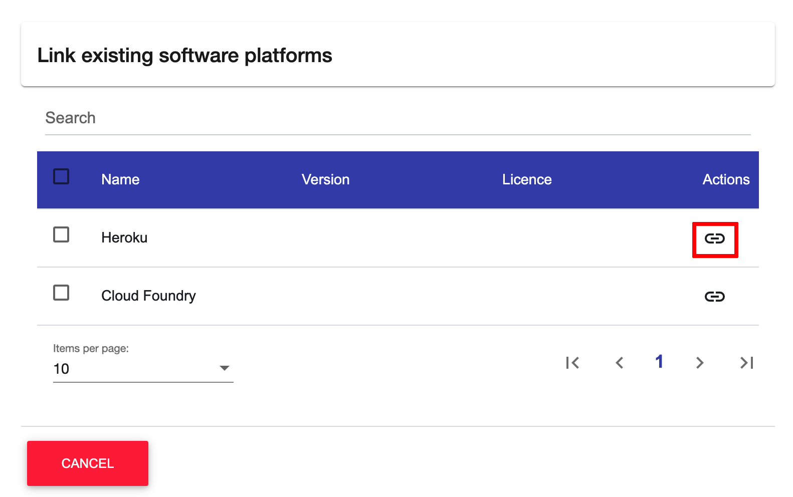

To reference a software platform simply click on the ``Link Button`` in the ``Actions Column``.

Alternatively, use the check-boxes to select multiple software platforms and then click on the ``Master Link Button`` to link all of them at once.

!!! note 
    ``Master Link Button`` will only appear if at least one software platform is selected.
	

!!! info 
    Successfully referenced software platform(s) will now be visible in the ``Software Platforms Tab`` of the ``Implementation View``.

## Dereference Software Platforms

!!! info 
    To dereference software platforms, the user has to be in the ``Software Platforms Tab`` of the ``Implementation View``, which can be reached by clicking on an implementation in the ``Implementation List View``.
	
To remove a reference from a software platform, the user has to simply click on the ``Delete Button`` of a software platform in the ``Actions Column``.

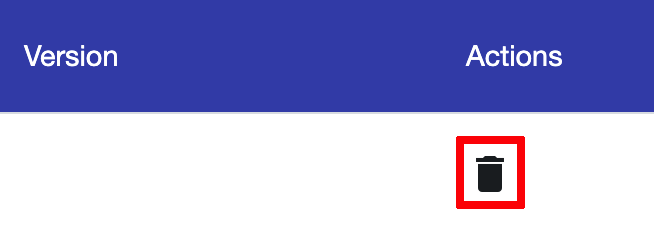

Alternatively, use the check-boxes to select multiple software platforms and then click on the ``Master Delete Button`` to unlink all of them at once.

!!! note 
    ``Master Delete Button`` will only appear if at least one software platform is selected.
	
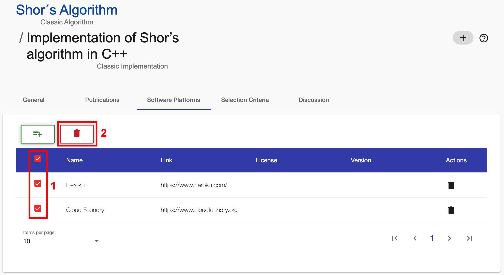

## Add Tags

!!! info 
    To add tags to an implementation, the user has to be in the ``Implementation View``, which can be reached by clicking on an implementation in the ``Implementation List View``.

In the ``Header`` of the ``Implementation View``, the user has to click on the ``Plus Button`` which is used to add tags.

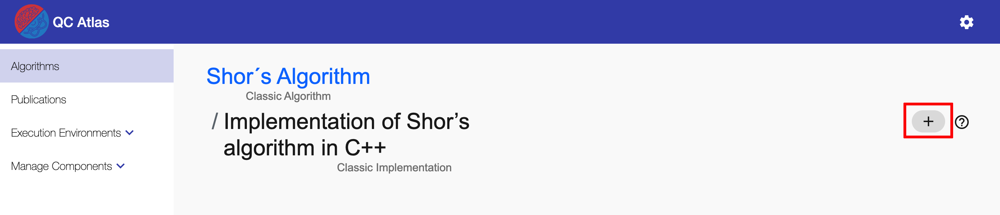

A ``Add Tag Dialog`` will open that contains fields for ``Tag Category`` and ``Tag Value`` that need to be defined for creating a new tag.

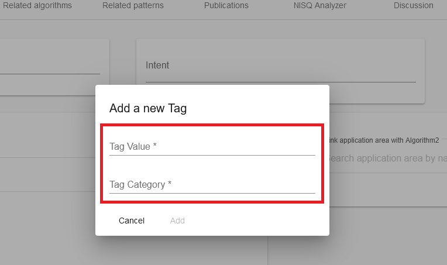

The ``Tag Value Field`` is equipped auto-complete functionalities. While typing, it will recommend existing values to the user. The user can then either pick one of the existing values by clicking on it. Alternatively, the user can ignore the recommendations and fill the input field with a new tag value.

!!! note
    Alternatively, the user can use the arrow buttons on the keyboard to select an existing tag value and then confirm it by hitting ``Enter``.

The ``Tag Category Field`` is equipped auto-complete functionalities. While typing, it will recommend existing categories to the user. The user can then either pick one of the existing categories by clicking on it. Alternatively, the user can ignore the recommendations and fill the input field with a new tag category.

!!! note
    Alternatively, the user can use the arrow buttons on the keyboard to select an existing tag category and then confirm it by hitting ``Enter``.

To finally add a new tag to the implementation, the user has to confirm his selection by clicking on the ``OK Button``. 

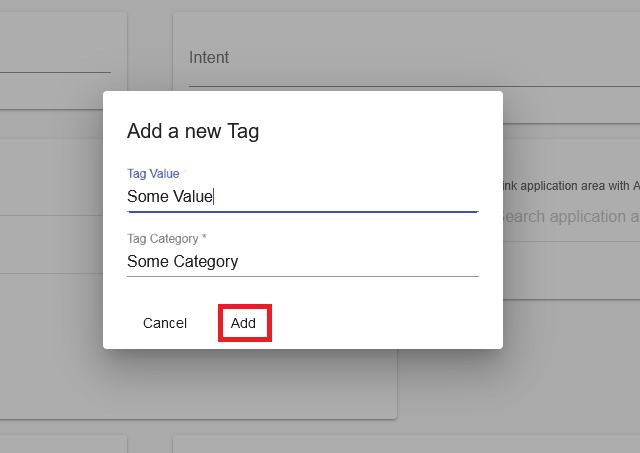

If the tag was added successfully, it will appear in the ``Header`` of the ``Implementation View``.

## Remove Tags

!!! info 
    To remove tags from an implementation, the user has to be in the ``Implementation View``, which can be reached by clicking on an implementation in the ``Implementation List View``.

Removing tags is done by clicking on their ``Delete Buttons``, which are located in the ``Header`` of the ``Implementation View``.

