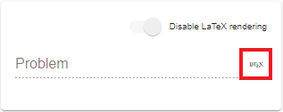
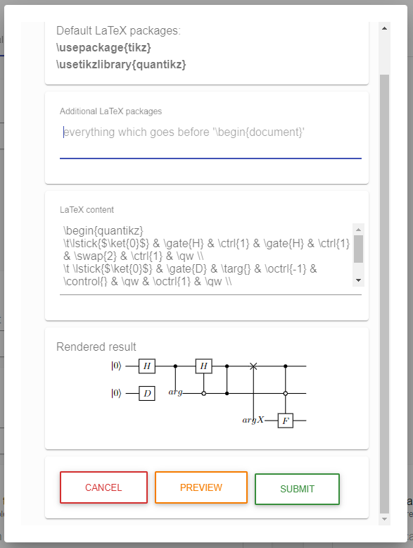

## Latex Renderer 

### Description

The generic component ``src/app/components/generics/property-input/text-input.component.ts`` contains a flag ``latexActive``, which is disabled by default.
On activation via input properties, ``text-input`` components are extended with a toggle slider to enable or disable Latex rendering for the respective input field.

### Usage

When activated, the respective ``text-input`` field will provide a ``LaTeX`` button to open an editor with two text areas and a preview section.

The ``Additional LaTeX packages`` field takes all statements, which have to be declared before the \begin{document} instruction in Latex.
The ``LaTeX content`` field takes every input which should be rendered within the document.

 will send a render request to the latex-rendering service on port ``8083`` and display the result in the appropriate section.

 will close the dialog and discard any modifications made.

 will cache all modifications to the packages and content input fields and close the dialog.

Whenever the dialog closes with a modified text to render, the ``text-input`` component requests a rendering and displays the response as a ``svg`` snippet. The ``text-input`` signals modified content with a displayed ``save`` button.

### Drawbacks

The [Latex renderer service](https://github.com/UST-QuAntiL/latex-renderer) has been extended by OpenAPI's RESTful interface and has successfully been tested locally, but runs into a rendering error when executed in a docker container using the project's ``Dockerfile``.

Once the docker container works as intended, the ``latex-renderer`` feature can be enabled and leveraged for ``text-input`` components.