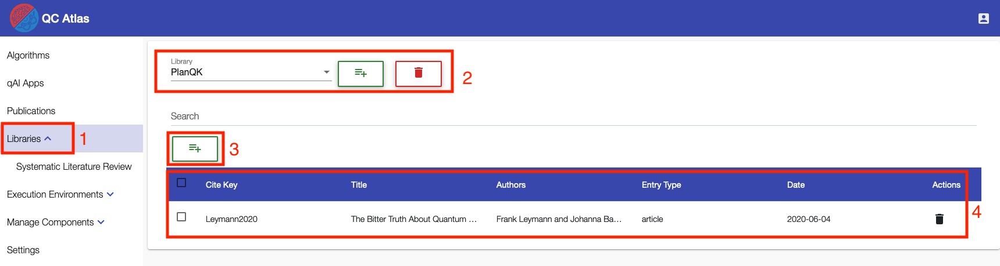

## Libraries

The UI component `Libraries` has two main features:
    
1. the creation and management of bibTeX libraries
2. the creation and execution of systematic literature reviews

In the follwoing, these two main features are explained.

### bibTeX Libraries

### Systematic Literature Reviews
#### Systematic Literature Review