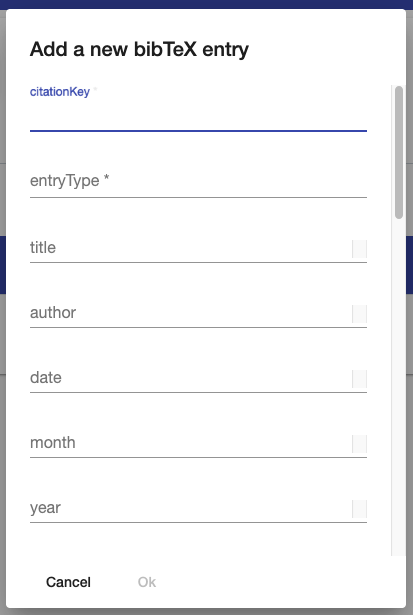

## Libraries

The component `Libraries` is the UI counterpart of the [PlanQK Library](https://github.com/UST-QuAntiL/PlanQK-Library) service, and it has two main features:
    
1. the creation and management of BibTeX libraries
2. the creation and execution of systematic literature reviews

In the following, these two main features are explained.

### BibTeX Libraries

#### Overview
1. The BibTeX libraries can be found directly under the `Libraries` tab in the navigation bar
2. The component allows to select existing libraries, create new libraries, and delete libraries
3. New entries can be added to the selected library using the green add button
4. Existing entries are listed in a table with the known functionality of the `Data-Tables`:
    * Searching the entries 
    * Sorting the entries by clicking on a label of the table
    * Updating the BibTeX information by clicking on an entry
    * Deleting one or multiple entries

#### Add new BibTeX entry
A new BibTeX entry can be created via a dialog.
Required fields are `citationKey` and `entryType`.

### Systematic Literature Review

#### Overview
1. The `Systematic Literature Review` component can be found in the sub-menu of the `Libraries` tab in the navigation bar
2. The component allows the selection of existing studies and the creation of new studies

#### Create a new study

The following dialog appears if a user clicks on the green button to create a study.
For inputs where the user can specify multiple values, the UI allows the user to add further input fields via the green plus button.
Unnecessarily created fields can be deleted via the red trash button.
However, at least one value has to be provided per requested input.

#### Study definition and crawling

After creating a study, the study definition is shown, and crawling the specified databases starts automatically.
At the top of the page, the user can switch via the selection to other studies, create a new study (green button), delete the selected study (red button), or manually start the crawling process (yellow button).
A spinner on the left indicates that a crawling process is running for the selected study.

#### Results
After the crawling is finished, the user can see the results in the `Results` tab.
The results are presented to the users in the same way as their libraries.
Again a user can search and sort the results and manually add, update, and delete entries in the usual way.

