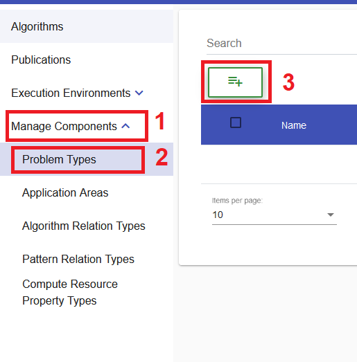
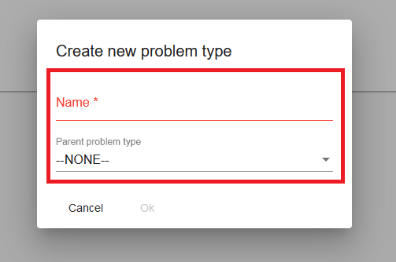
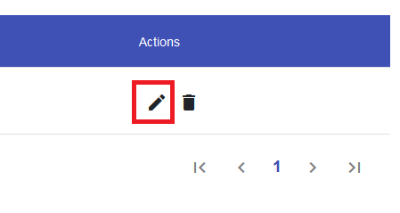
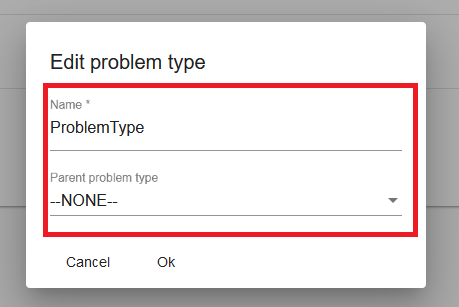
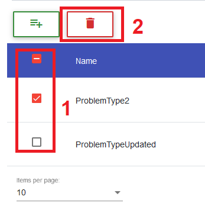
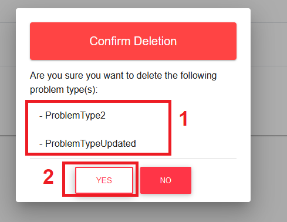

## Problem Type 
### Create Problem Type

!!! info 
    To create a problem type, the user has to be in the ``Problem Type List View`` which can be found in the ``Manage Components Menu``.
	
Inside the ``Problem Type List View``, the user can click on the ``Plus Button`` to initiate the creation of a new problem type inside a separate ``Creation Dialog``.

Within the ``Creation Dialog``, the user will have to enter all important information about the problem type he wants to create.

!!! note 
    * Currently the only required information is the **name** of the problem type.
	* The **Parent Problem Type Field** is a drop-down that contains all existing problem types that can be optionally set as the parent.

	
After entering the name of the problem type, the user has to confirm the creation by clicking on the ``OK Button``.

!!! info 
    In case of a successful creation, the data table will switch to the last page (if not already) to show the created problem type.
	
### Update Problem Type

!!! info 
    To update a problem type, the user has to be in the ``Problem Type List View``, which can be found in the ``Manage Components Menu``.
	
Inside the ``Problem Type List View``, the user can choose a problem type he wants to update by clicking on it's ``Edit Button`` which can be found in the ``Actions Column`` of the data table.
This will open a ``Edit Dialog``.

Within the ``Update Dialog``, the user can adjust the information of the problem type.

!!! note 
    * Currently the only required information is the **name** of the problem type.
	* The **Parent Problem Type Field** is a drop-down that contains all existing problem types that can be optionally set as the parent.

	
After adjusting all information, the user has to confirm the changes by clicking on the ``OK Button``.

### Delete Problem Type

!!! info 
    To perform the deletion of a problem type, the user has to be in the ``Problem Type List View``, which can be found in the ``Manage Components Menu``.
	
To delete a specific problem type, the user has to simply click on it's ``Delete Button`` in the ``Actions Column`` of the data table.

The user can also remove multiple problem types at once by selecting them using the check-boxes of the data table. After the user has made his selection he can press the ``Master Delete Button`` at the top of the data table.

!!! note 
    The ``Master Delete Button`` button will only appear if at least one problem type is selected.

	
To confirm the deletion of the selected problem type(s), the user has to click on the ``YES Button`` of the ``Confirmation Dialog``.

!!! note 
    **Names** of the problem type(s) that will be deleted are displayed in the body of the dialog and should be checked before confirming the deletion.

