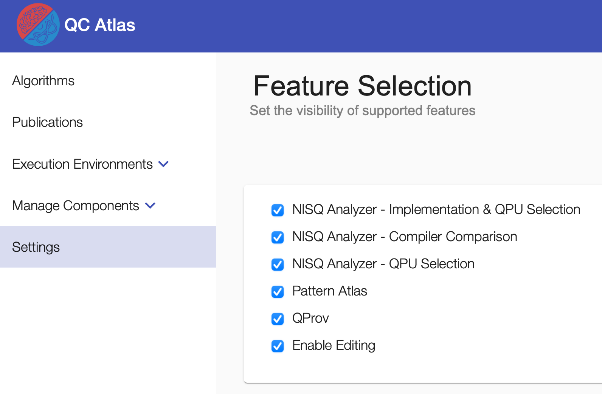

## Settings
Settings can be found by navigating to `Settings` in the navigation sidebar.

{: style="width:300px"}

!!!note 
    The visibility of `Settings` and related functionalities can be en-/disabled by adapting `showSettings` under `config/default-config.json` in the cloned [quantil-docker repository](https://github.com/UST-QuAntiL/quantil-docker) before running the docker-compose.
### Feature Toggling

For hiding/showing the UI components offering the features of [NISQ Analyzer](../user-guide/nisq-analyzer.md), [Pattern Atlas](../user-guide/qc-atlas/pattern-relation-type.md), and [QProv](../user-guide/qprov.md), click the related checkboxes.

{: style="width:600px"}