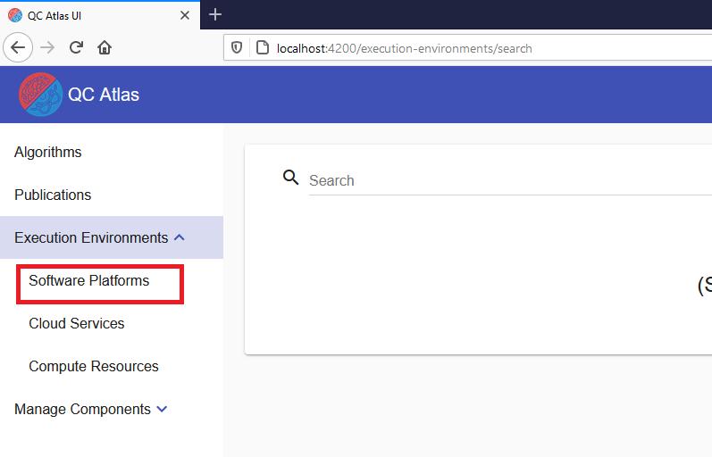
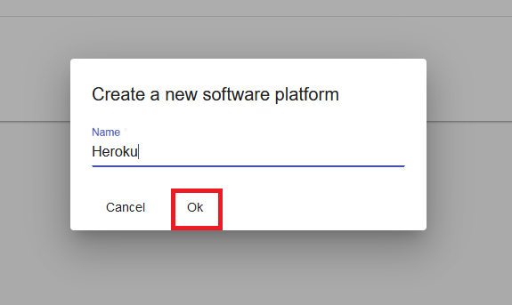
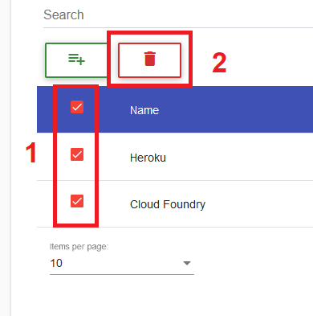
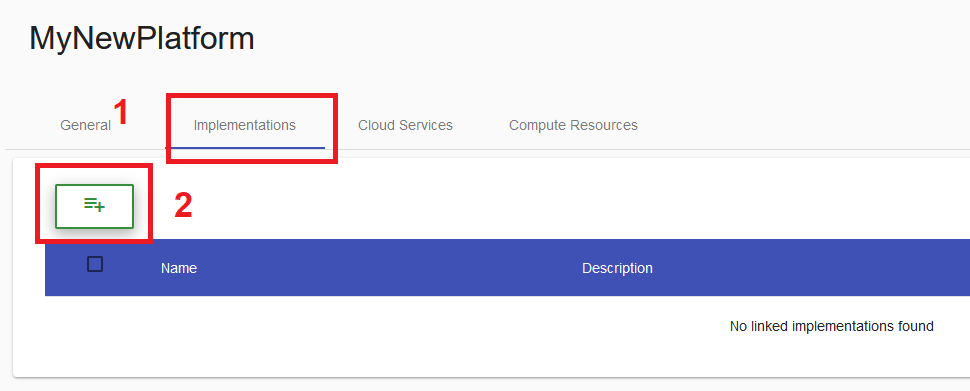
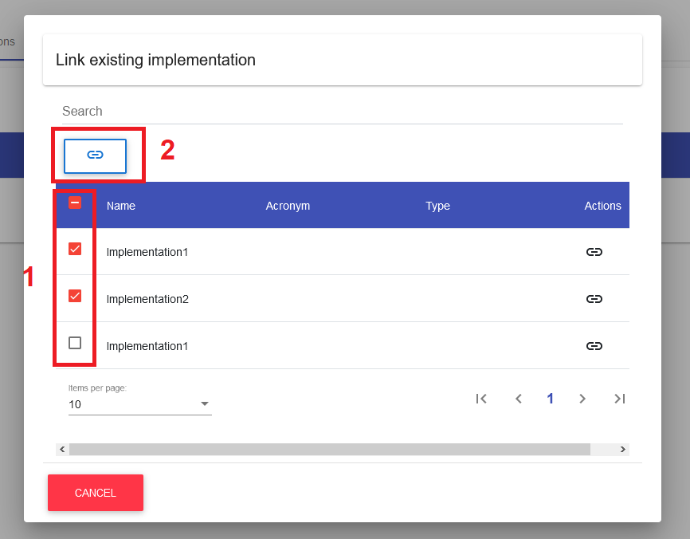
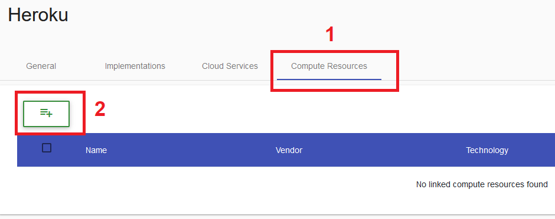
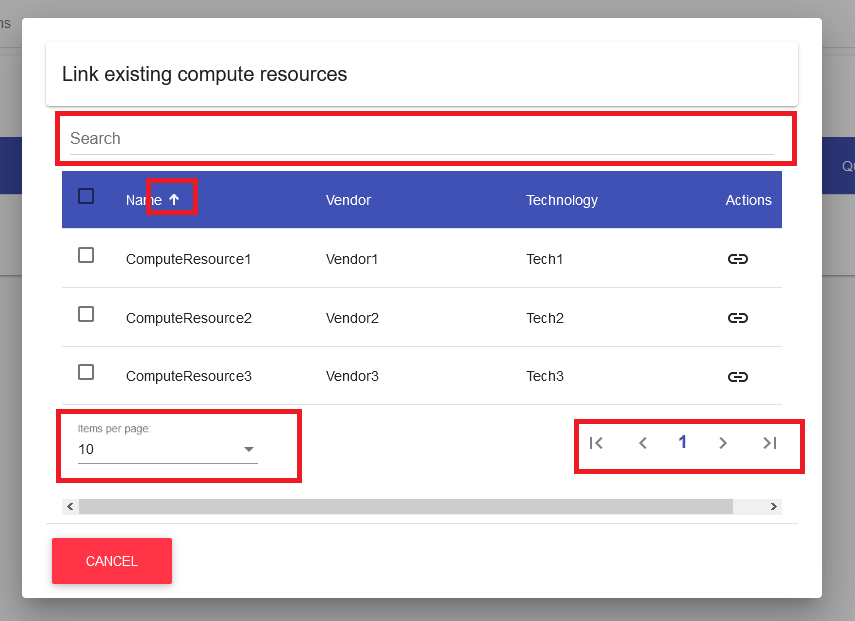
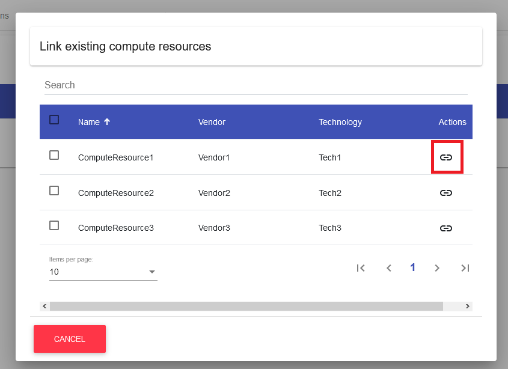
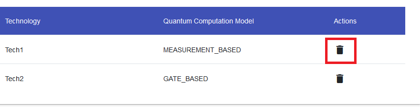

## Software Platform 
### Create Software Platform

To create a software platform the user has to navigate to the ``Execution Environment List View`` by using the navigation sidebar.

While in the ``Execution Environment List View``, the navigation sidebar will display sub menus for different kinds of execution environments. To create a software platform, the user has to navigate to the ``Software Platform List View``.

Inside the ``Software Platform List View``, the user can click on the ``Plus Button`` to initiate the creation of a new software platform inside a separate ``Creation Dialog``.

Within the ``Creation Dialog``, the user will have to enter all important information of the software platform he wants to create.

!!! note 
    Currently the only required information is the **name** of the software platform.
	

After entering the name of the software platform, the user has to confirm the creation by clicking on the ``OK Button``.

In case the creation was successful, the user will be redirected to the ``Software Platform View`` of the newly created software platform.

### Delete Software Platform

!!! info 
    To perform the deletion of a software platform, the user has to be in the ``Software Platform List View``.
	
To remove a specific software platform, the user has to simply click on the ``Delete Button`` in the ``Actions Column`` of the data table.

The user can also remove multiple software platforms at once by selecting them using the check-boxes of the data table. After the user has made his selection he can press the ``Master Delete Button`` at the top of the data table.

!!! note 
    The delete button will only appear after at least one software platform has been selected by the user.

To confirm the deletion of the selected software platform(s), the user has to click on the ``YES Button`` of the ``Confirmation Dialog``.

!!! note 
    **Names** of the software platforms that will be deleted are displayed in the body of the dialog and should be checked before confirming the deletion.

")

### Update Software Platform Information

!!! info 
    To update the basic information of a software platform, the user has to be in the ``Software Platform View`` which can be reached by clicking on a software platform in the ``Software Platform List View``.
	
Updating basic software platform information is done in the ``General Tab`` of the ``Software Platform View``. To update a property, the user has to simply use the ``Input Fields``, ``Check-Boxes`` or ``Selection Drop-Downs`` to add new property values or adjust existing ones.

If a value of a property is changed, a ``Save Button`` will be displayed next that specific input field. Also, a ``Master Save Button`` will appear at the right side of the screen. To save the changes of each input field individually, the user can click on the ``Save Button`` next to any updated input field. Alternatively the user can save all changes by clicking the ``Master Save Button``.

!!! note 
    * The user can also hit ``Enter`` on the keyboard to save the changes of a single field in most cases. In some cases, it may be necessary to focus the ``Save Button`` by hitting ``TAB`` on the keyboard and then confirming with ``Enter``.
    * Some fields are links to other sites. Those can easily be detected by their ``Open Button``. On click or on ``Enter``, it will open the link in a new tab.
	

### Reference Implementations

!!! info 
    To reference implementations in a software platform, the user has to be in the ``Implementations Tab`` of the ``Software Platform View``, which can be reached by clicking on a software platform in the ``Software Platform List View``.
	
To initiate the linking of an implementation, the user has to click on the ``Plus Button`` in the ``Implementation Tab``.

This will open a new dialog containing a page-able table of available implementations. This table can be searched or sorted using the given input fields and buttons.

To reference a implementation simply click on the ``Link Button`` in the ``Actions Column`` of the implementation.

Alternatively use the check-boxes to select multiple implementations and then click on the ``Master Link Button`` to link multiple implementations.

!!! note 
    The ``Master Link Button`` will only appear if at least one implementation is selected.
	

!!! info 
    Successfully referenced implementations will now be visible in the ``Implementations Tab`` of the ``Software Platform View``.
	
### Dereference Implementations

!!! info 
    To dereference implementations, the user has to be in the ``Implementations Tab`` of the ``Software Platform View``, which can be reached by clicking on a software platform in the ``Software Platform List View``.
	
To remove a reference from a implementation, the user has to simply click on the ``Delete Button`` in the ``Actions Column`` of the data table.

Alternatively use the check-boxes to select multiple implementations and then click on the ``Master Delete Button`` to unlink multiple implementations.

!!! note 
    The ``Master Delete Button`` will only appear if at least one implementation is selected.
	

### Reference Cloud Services

!!! info 
    To reference cloud services in a software platform, the user has to be in the ``Cloud Services Tab`` of the ``Software Platform View``, which can be reached by clicking on a software platform in the ``Software Platform List View``.
	
To initiate the linking of a cloud service, the user has to click on the ``Plus Button`` in the ``Cloud Services Tab``.

This will open a new dialog containing a page-able table of available cloud services. This table can be searched or sorted using the given input fields and buttons.

To reference a cloud service simply click on the ``Link Button`` in the ``Actions Column`` of the cloud service.

Alternatively, use the check-boxes to select multiple cloud services and then click on the ``Master Link Button`` to link all selected cloud services.

!!! note 
    The ``Master Link Button`` will only appear if at least one cloud service is selected.
	

!!! info 
    Successfully referenced cloud service(s) will now be visible in the ``Cloud Services Tab`` of the ``Software Platform View``.
	
### Dereference Cloud Services

!!! info 
    To dereference cloud services, the user has to be in the ``Cloud Services Tab`` of the ``Software Platform View``, which can be reached by clicking on a software platform in the ``Software Platform List View``.
	
To remove a reference from a cloud service, the user has to simply click on the ``Delete Button`` in the ``Actions Column`` of the data table.

Alternatively, use the check-boxes to select multiple cloud services and then click on the ``Master Delete Button`` to unlink all selected cloud services.

!!! note 
    The ``Master Delete Button`` will only appear if at least one cloud service is selected.
	

### Reference Compute Resources

!!! info 
    To reference compute resources in a software platform, the user has to be in the ``Compute Resources Tab`` of the ``Software Platform View``, which can be reached by clicking on a software platform in the ``Software Platform List View``.
	
To initiate the linking of a compute resource, the user has to click on the ``Plus Button`` in the ``Compute Resources Tab``.

This will open a new dialog containing a page-able table of available compute resources. This table can be searched or sorted using the given input fields and buttons.

To reference a compute resource simply click on the ``Link Button`` in the ``Action Columns`` of the compute resource.

Alternatively, use the check-boxes to select multiple compute resources and then click on the ``Master Link Button`` to link all selected compute resources.

!!! note 
    The ``Master Link Button`` will only appear if at least one compute resource is selected.
	

!!! info 
    Successfully referenced compute resource(s) will now be visible in the ``Compute Resources Tab`` of the ``Software Platform View``.
	
### Dereference Compute Resources

!!! info 
    To dereference compute resources, the user has to be in the ``Compute Resources Tab`` of the ``Software Platform View``, which can be reached by clicking on a software platform in the ``Software Platform List View``.
	
To remove a reference from a compute resource, the user has to simply click on the ``Delete Button`` in the ``Actions Column`` of the data table.

Alternatively, use the check-boxes to select multiple compute resources and then click on the ``Master Delete Button`` to unlink all selected compute resources.

!!! note 
    The ``Master Delete Button`` will only appear if at least one compute resource is selected.
	
