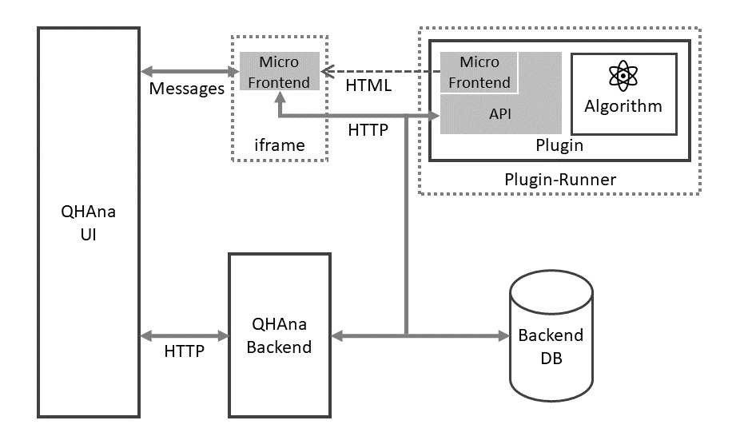

# QHAna User Guide

QHAna - The **Q**uantum **H**umanities **Ana**lysis Tool is a toolset of Machine Learning techniques for classical and quantum hardware, designed for the use with the [MUSE Repository](https://www.iaas.uni-stuttgart.de/publications/INBOOK-2018-05-MUSE.pdf).
It comprises a rich set of techniques, mostly for categorical data.

The new version of QHAna is developed in three seperate repositories:

 *  [qhana-ui](https://github.com/UST-QuAntiL/qhana-ui):
    The user interface of QHAna.
    It allows the user to create "Experiments" to analyse data with the available algorithms or test algorithms with the available data.
 *  [qhana-backend](https://github.com/UST-QuAntiL/qhana-backend):
    The backend stores the experiment data for the user interface.
 *  [qhana-plugin-runner](https://github.com/UST-QuAntiL/qhana-plugin-runner):
    A small wrapper for QHAna plugins that provides useful common functionality like robust background tasks.
    Plugins can be developed without the plugin runner, but using the plugin runner can speedup development of new plugins.

