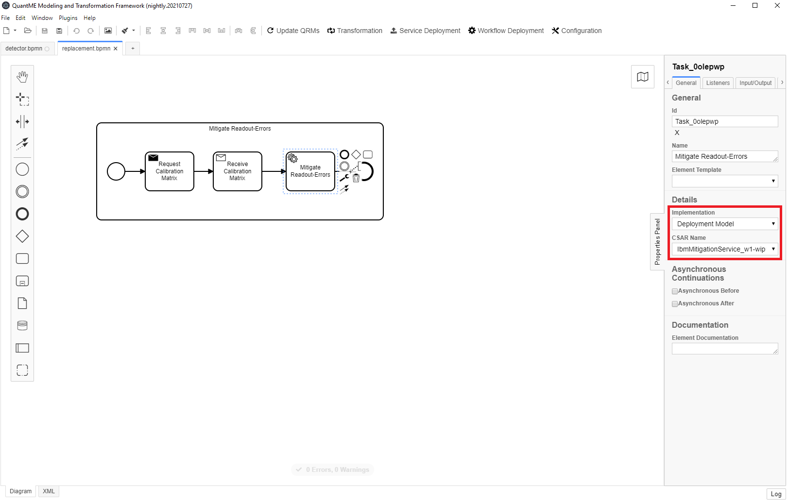
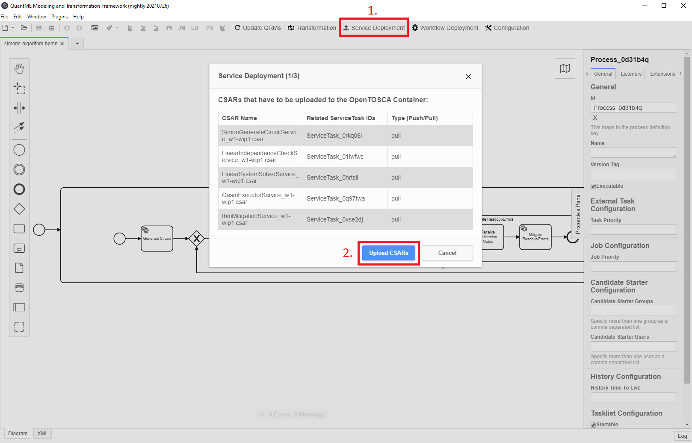
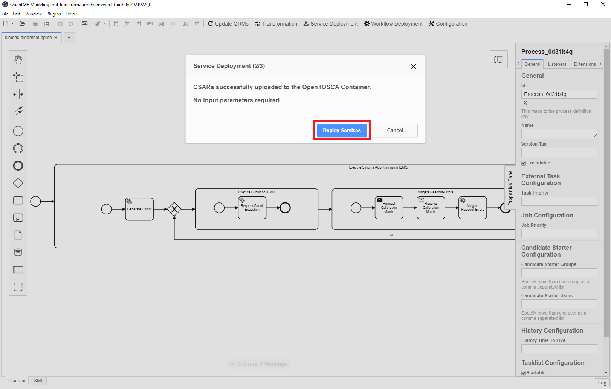
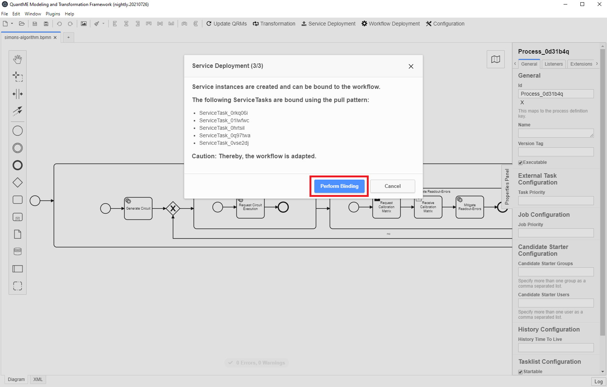

## Service Deployment

To automate the deployment of required services for quantum workflows, as well as their binding, the MODULO framework utilizes the capabilities of the [OpenTOSCA ecosystem](https://github.com/OpenTOSCA).
Thus, especially quantum experts without deployment expertise are not required to perform these time-consuming and error-prone tasks.
For this, the QuantME transformation framework allows attaching deployment models to service tasks within a workflow model.
These deployment models are then used to create and bind a corresponding service instance, which is invoked by the service task.
The figure below shows how the deployment models can be attached:

{: style="width:900px" .center}

Thereby, the new implementation type `Deployment Model` is introduced for service tasks.
When selecting this implementation type, the list of available deployment models is automatically retrieved from a running [Winery](https://github.com/eclipse/winery) instance.
Afterwards, the available deployment models are listed in a drop-down menu and can be selected.

For the deployment of all required services for a certain workflow, the `Service Deployment` button in the toolbar can be used as displayed below:

{: style="width:900px" .center}

This opens a pop-up, guiding the user through the deployment steps.
First, the deployment models, which are packaged as so-called Cloud Service Archives (CSARs), are uploaded to the OpenTOSCA Container.
The OpenTOSCA Container interprets the deployment model and generates a corresponding build plan to provision a service instance.
In the second step, further input data for the build plan is requested from the user if required.
This can be, e.g., a password for the deployment in a private cloud or an endpoint for a target machine.
However, in this example, all required input parameters are already defined in the deployment model, and thus, no additional data has to be provided as shown below:

{: style="width:900px" .center}

Afterwards, the deployment can be initiated.
Once all services are successfully deployed, the final modal of the service deployment pop-up is displayed:

{: style="width:900px" .center}

The modal lists all created service instances, which have to be bound with the workflow in the last step.
This is done by clicking on the `Perform Binding` button.
Then, the workflow model is updated with the endpoint information about the service instances and can be uploaded to a workflow engine for execution.
