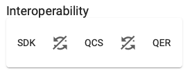
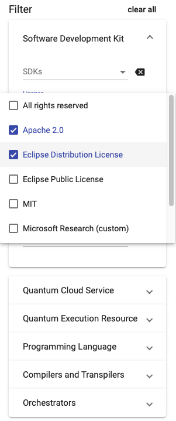

# Qverview User Guide
[Qverview](https://github.com/UST-QuAntiL/Qverview) is a comparison framework for different tools, services, and techniques for quantum application development.
It presents information about different technologies in a table-styled manner.
It enables searching and filtering over all tables in order to analyze and compare different technologies.
The interoperability feature further allows to identify interoperabilities between different kinds of technologies.

## Search All
This feature provides a central search field over all available tables.
You can find it in the left sidebar.
In order to find certain entries in any table, just start typing and they will be searched over all attributes.
Notice that this feature is still in beta – in combination with the other filters, the search all feature sometimes does not work as expected.
Reload the page in order to reset all filters.

## Interoperability
Also in the left sidebar, find the Interoperability-Feature.
Activating this, you can identify interoperabilities between Software Development Kits (SDKs), Quantum Cloud Services (QCSs), and Quantum Execution Resources (QERs).
This feature is turned off by default but can be switched on the 'synchronization'-buttons.
See the following figures – in the left picture the interoperability feature is disabled and the right picture shows the interoperability feature active.

 

E.g., when filtering the quantum cloud services to just a single entry, the comparison framework automatically exposes all interoperable SDKs, when this feature is activated between SDK and QCS.
This also works the other way around, since only such SDKs will be shown that are interoperable with the current selection of QCSs.
This feature can be used in combination with further filters in order to find specific and compatible tools and services.

## Filter
Qverview also provides filtering over all attributes of all tables.
For each table there is a separate filter.
Following figure shows the filtering for certain Licenses in the SDK table.
'Apache 2.0' and 'Eclipse Distribution License' have been selected as valid options, resulting in the SDK table filtering out all SDKs that do not support any of the two licenses.

## Data
Qverview provides an overview of different tools and services.
All data is stored in the /data folder in different JSON files.
Below is a listing of the tables and their attributes.

### Software Development Kits
- Name
- License
- Programming Language
- Compiler Input Languages
- Compiler Output Languages
- Compiler Optimization Strategies
- Supported Quantum Cloud Services
- Active Development
- Local Simulator

### Quantum Cloud Services
- Name
- Access Methods
- Service Model
- Resources
- Assembly Language

### Quantum Execution Resources
- Name
- Execution Type
- Computation Model
- Vendor

### Programming Languages
- Name
- Type
- Syntax Implementation
- Standardization

### Compiler & Transpiler
- Name
- Input Language
- Output Language
- Optimization Strategies

### Orchestration
- Name
- License
- Programming Languages
- Active Development
- Production Ready
